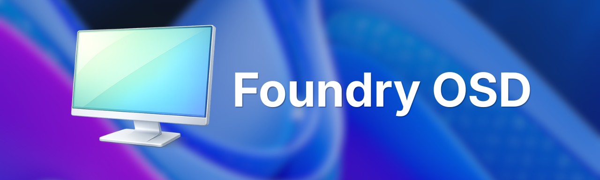

# Foundry OSD documentation

Foundry OSD is a Windows deployment tool: you prepare deployment media on a workstation, start a device from it, and Foundry installs Windows on that device through a guided workflow.

<figure>
  
</figure>

## Choose your task

| I want to ... | Go to |
| --- | --- |
| Start from the beginning: requirements, installation, how a deployment works | [Get started](start-here/README.md) |
| Create my first media and deploy one test device | [Quick start](start-here/quick-start.md) |
| Configure networking, Windows Autopilot, Domain Join or Windows customization | [Foundry OSD](foundry-osd/README.md) |
| Connect a device that has started from the media | [Foundry Connect](foundry-connect/README.md) |
| Choose the disk, Windows and drivers, then deploy | [Foundry Deploy](foundry-deploy/README.md) |
| Fix a problem | [Troubleshooting](troubleshooting/README.md) |
| Look up versions, network endpoints or privacy details | [Reference](reference/README.md) |

## How Foundry works

You work with three applications. Only the first one is installed; the other two start on the target device from the deployment media.

| Application | Runs on | Used by | What it does |
| --- | --- | --- | --- |
| Foundry OSD | Administrator workstation | Administrator | Holds your deployment settings and creates an ISO or a USB drive. |
| Foundry Connect | Target device, in Windows PE | Technician | Checks that the device has network access, with Ethernet or Wi-Fi. |
| Foundry Deploy | Target device, in Windows PE | Technician | Guides the choice of disk, Windows and drivers, then installs Windows. |

Two components run without input from you: the Windows PE startup, which prepares Windows PE and starts Foundry Connect and Foundry Deploy, and the post-installation step, which finishes the configuration after the device restarts into Windows. [Deployment workflow](start-here/deployment-workflow.md) shows where each one fits.


Creating a USB drive erases that drive, and deploying Windows erases the disk you select on the target device. Check both selections before you confirm.

