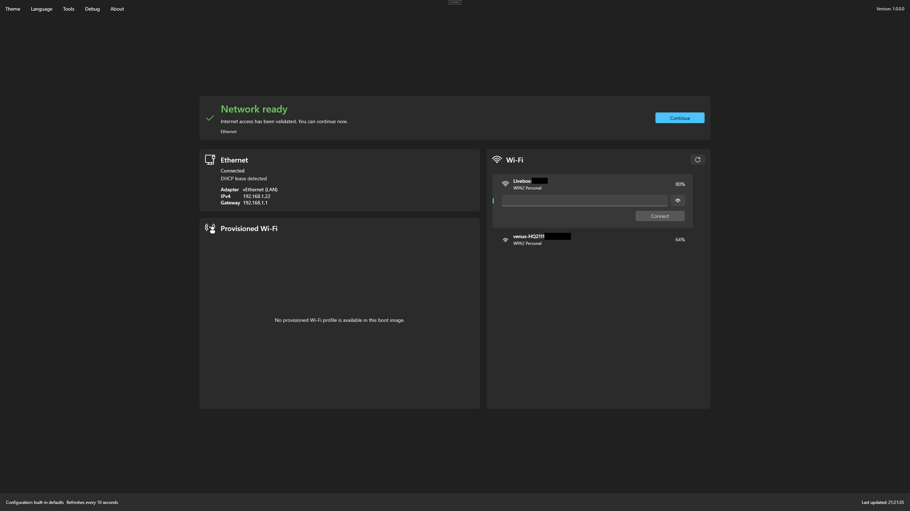

# Network readiness

Foundry Connect validates that the deployment environment can use the network before Foundry Deploy continues.

<figure>
  
  <figcaption>Review the ready state and available network connections before continuing.</figcaption>
</figure>

## Ethernet

Review:

- Adapter detection.
- Cable and link state.
- IPv4 address.
- Default gateway.
- DHCP or static configuration state.

## Wi-Fi

When Wi-Fi is enabled, you can:

- Refresh visible networks.
- Select a network.
- Enter or reveal a passphrase when required.
- Use a provisioned profile.
- Connect or disconnect.

## Common waiting states

- No supported network adapter.
- Ethernet cable disconnected.
- Waiting for DHCP.
- No visible Wi-Fi networks.
- Incorrect wireless password or network settings.
- Provisioned profile unavailable.
- Network present but required services unreachable.

Use the available refresh or retry action after correcting the cause. See [Network and Foundry Connect troubleshooting](../troubleshooting/network.md) when readiness does not complete.

Do not close Foundry Connect as a workaround. Closing the application aborts the bootstrap workflow.
