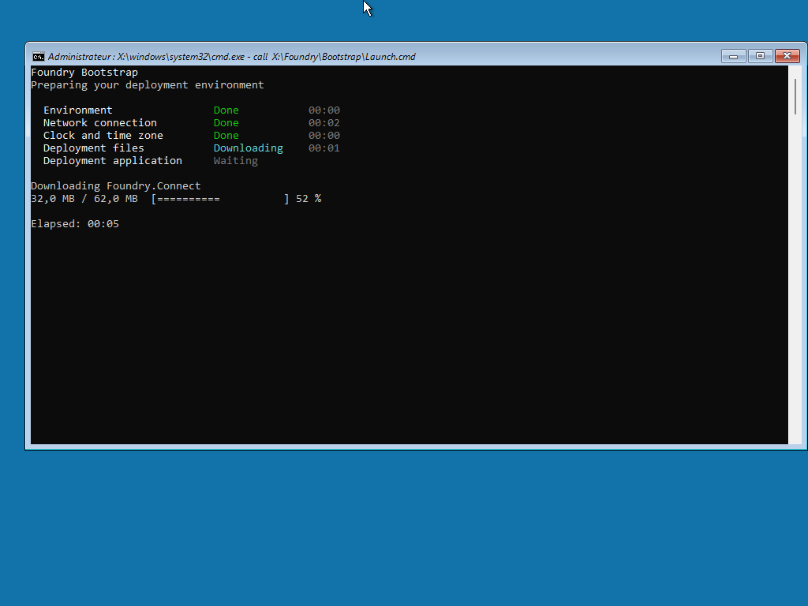

# Windows PE startup

When a target device starts from deployment media, a console titled **Foundry Bootstrap** prepares Windows PE, opens Foundry Connect, then downloads and opens Foundry Deploy. You only watch it: this page says what each line means and which waits are normal.

<figure>
  
  <figcaption>The five stages, the current action with its progress bar, and the elapsed time.</figcaption>
</figure>

## What you see, in order

The console lists five stages. Each goes from **Waiting** to **In progress**, then **Done**. The line under the list says what is happening now.

| Stage | Line under the list | What happens |
| --- | --- | --- |
| **Environment** | "Preparing network access" | Windows PE starts its wired and Wi-Fi services. |
| **Network connection** | "Preparing Foundry Connect", then "Waiting for Foundry Connect" | Foundry Connect opens. The stage stays **In progress** until you continue from [Foundry Connect](README.md). |
| **Clock and time zone** | "Preparing the system clock and time zone" | The clock is set from the Internet and the time zone is applied. |
| **Deployment files** | "Preparing the deployment application", then "Preparing Foundry PostInstall" | Foundry Deploy and the post-installation application are downloaded. The status reads **Downloading**, **Verifying**, then **Extracting**, with a progress bar. |
| **Deployment application** | "Starting Foundry Deploy" | Foundry Deploy opens. |

Startup is complete when the last stage shows **Ready** and the line under the list reads "Continue in Foundry Deploy." The console window stays open.

## Waits that are normal

- **Network connection**: up to 5 seconds on "Preparing Foundry Connect" when the device has no network yet, then as long as you need in Foundry Connect.
- **Clock and time zone**: up to 50 seconds on a network that filters the clock and time zone lookups (five lookups of 10 seconds).
- **Deployment files**: it depends on the connection. A download can run for 15 minutes and is tried 3 times.
- **Deployment application**: up to 2 minutes before the Foundry Deploy window appears.

On a device with no cable, the console cannot reach the Internet before Foundry Connect. Two yellow lines can then appear and stay until the end:

- "Warning: Internet clock could not be resolved. Boot will continue without clock correction."
- "Warning: Online runtime verification failed. Continuing with the original application provisioned on the boot media."

Both are expected on a Wi-Fi-only device. **Environment** and **Network connection** end with **Done (warning)**, and the final screen adds a `Session:` line and a `Log:` line. No action is needed when the last stage ends with **Ready**.

## What needs Internet access

- **Foundry Connect** is on the media and starts without a network.
- **Foundry Deploy** is not on the media. It is downloaded from GitHub at every start, with the post-installation application. Without access to GitHub, startup stops at **Deployment files**.
- On a USB drive, **Deployment files** can also download a newer Foundry Connect for the next start.

See [Network endpoints](../reference/network-endpoints.md) for the hosts and [What each media type carries](../foundry-osd/media/README.md#what-each-media-type-carries) for the content of the media.

## When the clock and the time zone are set

Both are set at **Clock and time zone**, after Foundry Connect. The time zone comes from the [Windows PE time zone](../foundry-osd/general.md#windows-pe-time-zone) setting of the media. With automatic detection, it is the time zone of the public IP address of the network, and UTC when the lookup gets no answer.

## If startup stops

A stage that shows **Failed** or **Cancelled** ends the startup, and the line under the list gives the reason. Find that text in [Windows PE startup troubleshooting](../troubleshooting/windows-pe-startup.md).

## Next step

[Network readiness](network-readiness.md) describes what to do in Foundry Connect.
