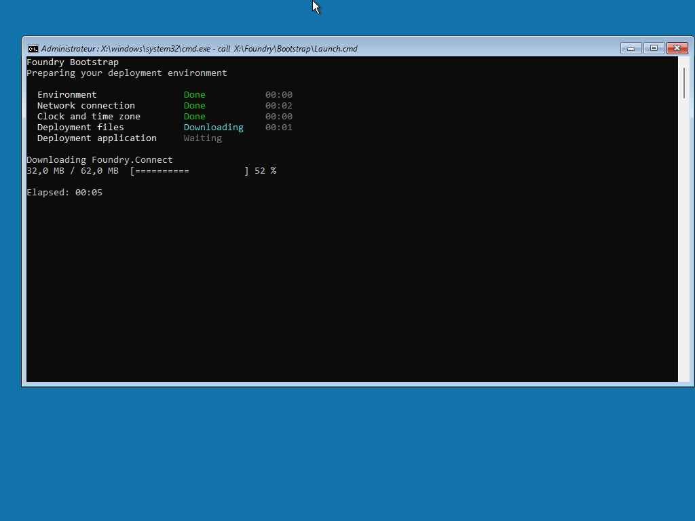

# Windows PE startup

When a target device starts from deployment media, a console titled **Foundry Bootstrap** prepares Windows PE, opens Foundry Connect, then gets Foundry Deploy and opens it. You only watch it: this page says what each line means and which waits are normal.

<figure>
  
  <figcaption>The five stages, the current action with its progress bar, and the elapsed time.</figcaption>
</figure>

## What you see, in order

Each of the five stages goes from **Waiting** to **In progress**, then **Done**. The line under the list says what is happening now.

| Stage | Line under the list | What happens |
| --- | --- | --- |
| **Environment** | "Preparing network access" | Windows PE starts its wired and Wi-Fi services. |
| **Network connection** | "Preparing Foundry Connect", then "Waiting for Foundry Connect" | Foundry Connect opens from the copy on the media. The stage stays **In progress** until you continue from [Foundry Connect](README.md). |
| **Clock and time zone** | "Preparing the system clock and time zone" | The clock is set from the Internet and the time zone is applied. |
| **Deployment files** | "Preparing the deployment application", then "Preparing Foundry PostInstall" | Foundry Deploy is downloaded, or taken from the USB drive that kept it, with the post-installation application when the media does not carry it. |
| **Deployment application** | "Starting Foundry Deploy" | Foundry Deploy opens. |

During a download, the status reads **Downloading**, **Verifying**, then **Extracting**, with a progress bar. Startup is complete when the last stage shows **Ready** and the line under the list reads "Continue in Foundry Deploy."

## Waits that are normal

- **Network connection**: a few seconds on "Preparing Foundry Connect", longer when its copy on the media must be [repaired](#which-version-runs), then as long as you need in [Foundry Connect](network-readiness.md).
- **Clock and time zone**: up to 50 seconds on a network that filters the lookups (five lookups of 10 seconds).
- **Deployment files**: a download can run for 15 minutes and is tried 3 times.
- **Deployment application**: up to 2 minutes before the Foundry Deploy window appears.

On a device with no cable, the Internet is out of reach before Foundry Connect. A yellow line can then appear and stay until the end: "Warning: Internet clock could not be resolved. Boot will continue without clock correction."

It is expected on a Wi-Fi-only device. **Environment** ends with **Done (warning)** and the final screen adds a `Session:` and a `Log:` line. No action is needed when the last stage ends with **Ready**.

## Which version runs

The media runs Foundry Connect, Foundry Deploy and the post-installation application of the Foundry OSD version that created it, never a newer one. To use newer versions, update Foundry OSD, then recreate the ISO or the PXE files, or [update the USB drive](../foundry-osd/media/update-usb.md).

If an application on the media is missing or damaged, the console downloads the same version again from the Foundry release that created the media and shows a yellow line such as "Warning: Foundry.Connect was repaired from release v26.11.2.1." Foundry Connect is checked before the network is set up, so its repair works only when the device already has network access within a few seconds. Without a valid copy, startup stops: see [This boot stage could not be completed](../troubleshooting/windows-pe-startup.md#boot-stage-not-completed).

When a newer Foundry release is published, Foundry Connect and Foundry Deploy show a notice next to their version. It blocks nothing: see [New version available](../troubleshooting/network.md#new-version-available).

## What needs Internet access

- **Foundry Connect** is on the media and starts without a network.
- **Foundry Deploy** is never on the media. It is downloaded from GitHub, from the release that created the media, with the post-installation application, which the media carries only with Domain Join. An ISO, PXE files and a USB drive created without cache download it at every start. A USB drive created with cache keeps Foundry Deploy on its **Foundry Cache** partition and reuses it at the next starts; it downloads it again only after the drive was updated to another version. When Foundry Deploy cannot be obtained, startup stops at **Deployment files**.

See [Network endpoints](../reference/network-endpoints.md) for the hosts. What the media carries, and where, is in [What each media type carries](../foundry-osd/media/README.md#what-each-media-type-carries).

## When the clock and the time zone are set

The clock is corrected from the Internet before Foundry Connect when the network already works, otherwise at **Clock and time zone**. The time zone is applied at that stage, from the [Windows PE time zone](../foundry-osd/general.md#windows-pe-time-zone) setting of the media: a fixed zone, or the zone of the public IP address of the network, with UTC when that lookup gets no answer.

## If startup stops

A stage that shows **Failed** or **Cancelled** ends the startup, and the line under the list gives the reason. Find that text in [Windows PE startup troubleshooting](../troubleshooting/windows-pe-startup.md).
