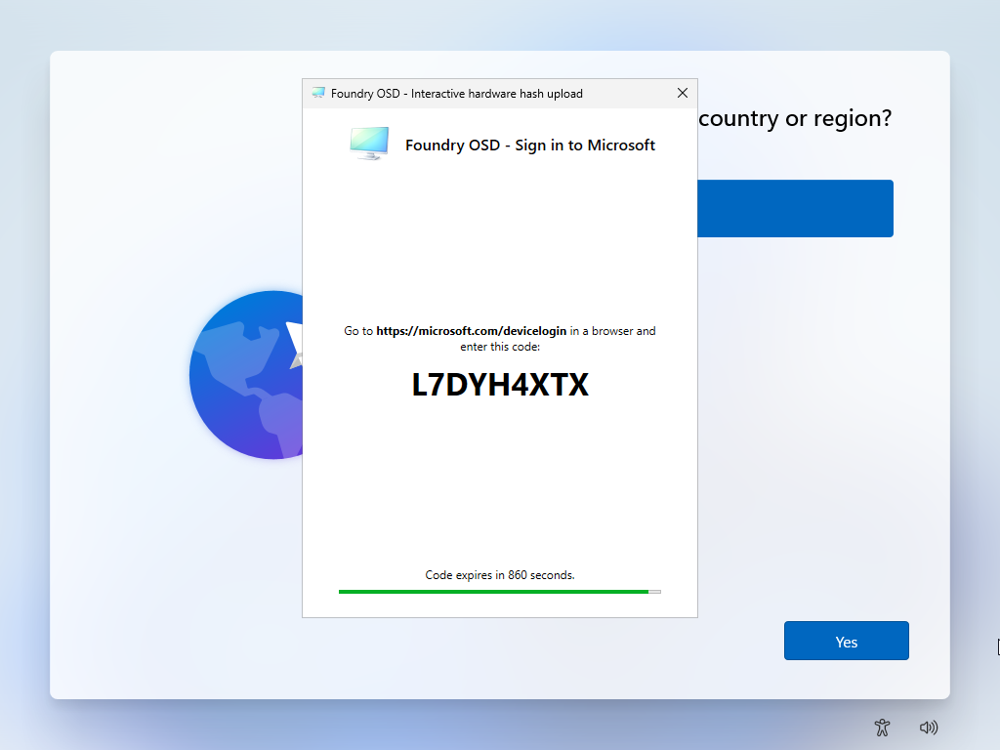

# Windows Autopilot step

On media prepared for Windows Autopilot, Foundry Deploy shows an **Autopilot** step between **Drivers** and **Summary**, then does the Autopilot work near the end of the deployment. With the interactive mode there is no wizard step: you upload the hardware hash yourself after the restart.


**Screenshot required**

- **File:** `foundry-deploy-autopilot-01-step.png`
- **Capture:** Show the **Autopilot** step of a release build on zero-touch media: the "Zero-touch hardware hash upload" card, **Ready to upload hardware hash**, the **Group tag** list with a demonstration tag, and **Configuration details** collapsed. The menu bar must not show a Debug menu.


## Which mode the media uses

**Provisioning method**, under **Autopilot** on **Summary**, names the mode. When the wizard has an **Autopilot** step, the card at its top names it too.

| Mode | In the wizard | In **Steps**, during the deployment |
| --- | --- | --- |
| JSON profile | **Autopilot** step: choose the profile | **Copy Autopilot profile** copies the profile into the installed Windows. |
| Zero-touch hardware hash upload | **Autopilot** step: check the status and choose the group tag | **Register Autopilot device** reads the hardware hash, uploads it, then waits for the device to appear in the tenant. |
| Interactive hardware hash upload | No step | **Prepare Autopilot assistant** prepares the window that opens after the restart. Nothing is uploaded yet: you [upload after the restart](#upload-the-hardware-hash-after-the-restart). |

## Complete the step

1. **JSON profile:** in **Profile**, keep the preselected profile or choose another profile of the media.
2. **Zero-touch:** read the status, then choose the **Group tag**. Keep **None** only for a device that must have no tag: on a device that is already registered, **None** removes its current tag. You cannot type a tag.
3. Select **Next**.

| What you see | Meaning |
| --- | --- |
| **Ready to upload hardware hash** | The upload will be attempted at the end of the deployment. |
| **Hardware hash upload unavailable** | The certificate of the media has expired or is incomplete, and the **Group tag** list is hidden. You can deploy, but the device will not be registered. Tell the administrator. |
| **Configuration details** | **Tenant ID** and **Certificate expiration** of the media. |
| "No embedded Autopilot profiles were found on this media." | The media has no profile and **Next** stays unavailable. The administrator must create the media again. |

When Foundry Deploy could not read the group tags from the tenant at startup, the list holds only the tags saved on the media. This does not stop the deployment.

## During the deployment

In **Steps**, the Autopilot step is the last one before **Finalize deployment**. Windows is already on the disk when it runs.

**Register Autopilot device** can last 10 minutes while it reads "Waiting for Autopilot device visibility..." with a countdown, and up to 10 more to confirm the group tag or the computer name. Keep the network connected.

- **When Register Autopilot device is skipped**, a skipped icon appears next to its name in **Steps** and the deployment still ends on **Deployment complete**. Windows is installed, but the device is not registered, or is registered without its group tag or name. Point at the step to read the reason in a tooltip, and note it before the restart.
- **When the step fails**, the deployment stops on **Deployment failed**, which reads "Failed step: Provision Autopilot" for the three modes. For **Register Autopilot device** this happens when the file `PCPKsp.dll` of the installed Windows is missing, cannot be copied or cannot be loaded. **Copy Autopilot profile** and **Prepare Autopilot assistant** are never skipped: any problem there stops the deployment.

Each reason is explained in [Windows Autopilot troubleshooting during deployment](../troubleshooting/autopilot/during-deployment.md).

## Upload the hardware hash after the restart

Interactive mode only. At the start of Windows setup (OOBE), a window titled **Foundry OSD - Interactive hardware hash upload** opens in front; a command prompt may flash first. The window is in English. Do not go through Windows setup behind it: the device restarts when the upload succeeds.

<figure>
  
  <figcaption>Enter the code on another device. The code shown here is an example.</figcaption>
</figure>

1. Check the network. While the window reads "Waiting for network connectivity.", connect the device: it retries by itself.
2. On another device, open `https://microsoft.com/devicelogin`, enter the code shown in the window and sign in with your account. "Code expires in \<n> seconds." counts down; an expired code is replaced by a new one, so always use the code on screen.
3. When the window changes to **Foundry OSD - Upload hardware hash**, choose the **Group tag**: **None**, a tag already used in the tenant, or **Custom** to type one in **Custom group tag**. As in the wizard, **None** removes the tag of a device that is already registered.
4. Select **Upload**.
5. Wait while the window reads "Waiting for device registration in Microsoft Intune.", for up to 15 minutes.
6. When it reads "Restarting in 10 seconds.", the upload has succeeded. The device restarts by itself, and the window does not open again afterwards.


**Screenshot required**

- **File:** `foundry-deploy-autopilot-03-upload.png`
- **Capture:** Show the second screen of the window, **Foundry OSD - Upload hardware hash**, with the **Group tag** list, the **Custom group tag** box, "Ready to upload." and the **Upload** button. Use a demonstration tag.


If the upload fails, the reason stays in the window and **Upload** becomes available again: correct the cause, then select **Upload** again. See [Windows Autopilot troubleshooting after the restart](../troubleshooting/autopilot/after-the-restart.md).

Next: [Review and deploy](review-and-deploy.md) in the wizard, and [After the restart](after-the-restart.md) for everything else that happens after the restart.
