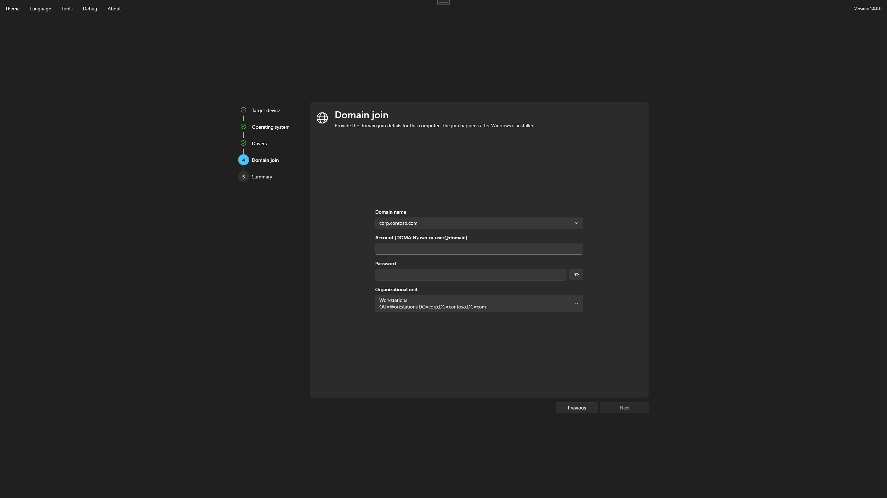
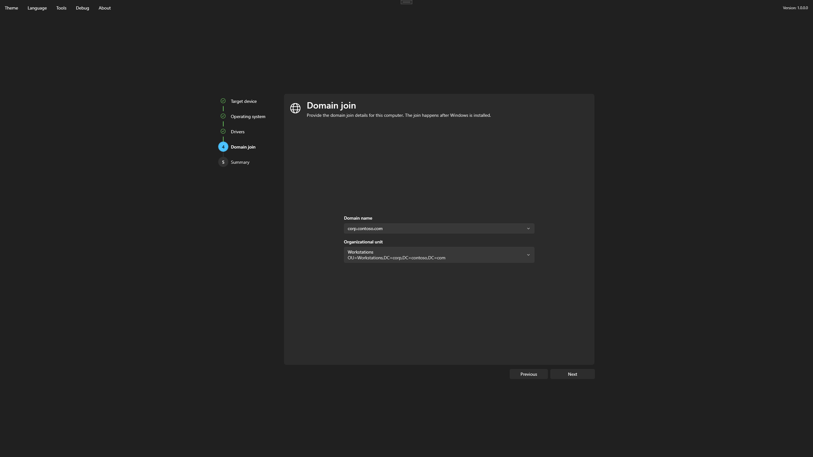

# Domain Join during deployment

This page is for the technician who deploys a computer with media configured for [Interactive](../foundry-osd/domain-join/interactive.md) or [Zero-touch](../foundry-osd/domain-join/zero-touch.md) Domain Join.

The wizard only collects what the join needs. The join itself runs later, in installed Windows, and needs the domain to be reachable at that moment.

## Before you start

- Know which domain and OU the computer belongs to, and its computer name. For Interactive media, also have the join account and its password.
- Confirm the [target disk and computer name](target.md). The computer name identifies the computer account in the domain, so check it carefully when a machine is redeployed under the same name.
- Select the intended Windows image and edition. Windows Home editions cannot join a domain: the wizard skips the step and the summary says so, while the installation continues.

## Complete the Domain join step

The **Domain join** step sits between **Drivers** and **Summary**. It appears only when there is something to enter or choose, and **Next** stays unavailable until the entries are valid.

**Domain name**

| Media | What you do |
| --- | --- |
| Several domains listed | Choose the domain. The default is preselected. |
| One domain listed | Nothing. The domain is shown and cannot be changed. |
| Interactive media with no domain listed | Type the domain name, such as `corp.example.test`. |

**Account and password**

| Media | What you do |
| --- | --- |
| Interactive | Enter the **Account**, as `DOMAIN\user` or `user@domain`, and its **Password**. Changing the domain keeps what you typed. |
| Zero-touch | Nothing. The media carries the account, unlocked by the technician password you entered at startup. |

**Organizational unit**

| OUs listed for the chosen domain | What you do |
| --- | --- |
| Several | Choose the **Organizational unit**. The default, if there is one, is preselected; **Next** requires a choice. |
| One | Nothing. That OU is used. |
| None, Interactive media | Optionally enter **OU distinguished name (optional)**, starting with `OU=` and inside that domain. Leave it empty to use the domain's default location. |
| None, Zero-touch media | Nothing. The domain's default location is used. |

Changing the domain replaces the OU choices with those of the new domain.


The wizard does not contact the domain. A mistyped account or password is accepted here and only shows later, in installed Windows, as a failed join.


<figure>
  
  <figcaption>Interactive media: choose the domain, enter the join account and its password, then choose the OU.</figcaption>
</figure>

<figure>
  
  <figcaption>Zero-touch media: only the domain and the OU are left to choose.</figcaption>
</figure>

## Review and start

On **Summary**, the **Domain join** category shows the domain and the OU the join will use; choose its edit action to return to the step. The account and the password are never shown, neither here nor in **Confirm disk erase**.

When the deployment ends successfully in WinPE, the join has been prepared, not yet performed.

## What happens in Windows

After the restart, during Windows setup and before the first sign-in, a Foundry console shows the post-installation actions. The join runs after drivers and network settings are applied:

1. Foundry waits until a domain controller answers, for up to two minutes.
2. It joins the computer to the domain with the join account. A refused account or password is not retried, so the account cannot be locked out.
3. If an OU applies, the computer account is created in that OU. An account that already exists under the same name is reused and moved to the OU, without being deleted.
4. When the join succeeds, Windows restarts once. Foundry then checks that the computer is a member of the expected domain under the expected name.

The console summarizes the outcome on one line, for example:

`Domain - Join: Succeeded; Placement: Succeeded; Membership: Succeeded; Restart: Completed; Cleanup: Disposed`

| Part | Meaning |
| --- | --- |
| Join | The computer was added to the domain. |
| Placement | The computer account is in the intended OU. **Skipped** when no OU applies. |
| Membership | After the restart, Windows confirms it belongs to the expected domain. |
| Restart | The restart required by the join. |
| Cleanup | The temporary copy of the join credentials was deleted (**Disposed**). |

A failed join or placement does not stop the installation: the remaining actions run and Windows setup continues.

## What you see at the end

| Outcome | First screen |
| --- | --- |
| The join is confirmed | The Windows sign-in screen. Sign in with a domain account. No local account is needed; add one on the [OOBE page](../foundry-osd/customization/oobe.md) of Foundry OSD if you want local access. |
| The join failed or could not be confirmed | Windows asks **Who's going to use this device?** Create a local account to reach the desktop, then see [Domain Join troubleshooting](../troubleshooting/domain-join.md). |

With a [custom answer file](../foundry-osd/customization/unattend.md), that file decides which setup screens and accounts appear; Foundry does not change them.

## Before handing over the computer

Check [deployment verification](verify-deployment.md#domain-join): sign in with a domain account, and confirm with your Active Directory administrator that the computer account is in the intended OU. If the console reported anything other than **Succeeded** for the join, the placement or the membership, see [Domain Join troubleshooting](../troubleshooting/domain-join.md).
