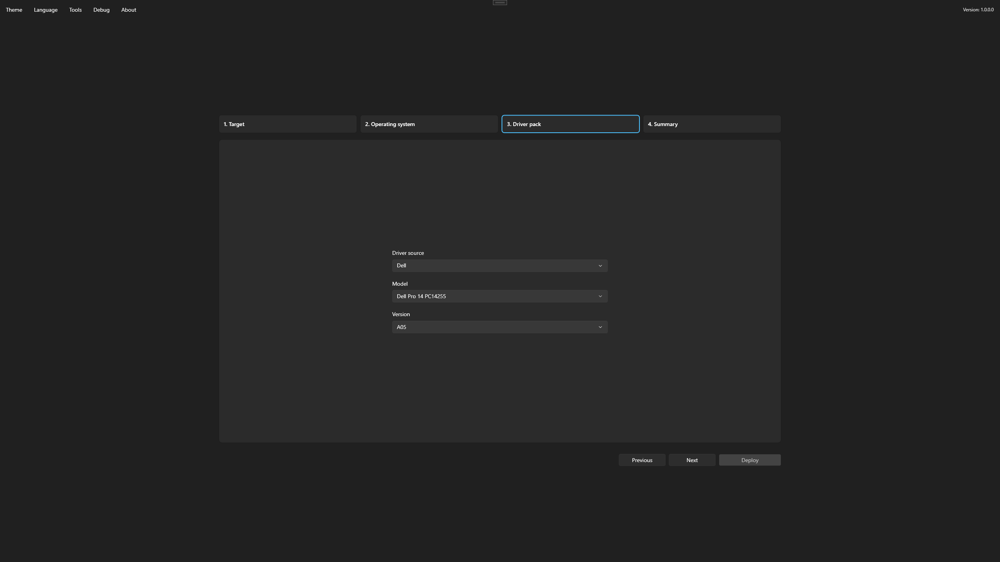

# Select a driver pack

The Driver pack step selects hardware drivers compatible with the target device and Windows selection.

## Make a selection

1. Choose **None** when Windows inbox drivers or separately managed drivers are sufficient.
2. Choose **Microsoft Update Catalog** when the deployment should obtain applicable device drivers from that source.
3. Choose an available manufacturer catalog when the device requires a supported OEM driver pack.
4. For a manufacturer catalog, confirm the detected or selected model and choose the appropriate package version.
5. Review package details before continuing.

<figure>
  
  <figcaption>Select the driver pack that matches the target hardware and Windows selection.</figcaption>
</figure>

Foundry uses catalog metadata to identify supported models, operating-system targets, architecture, package format, and available hashes. If no suitable pack appears, see [Catalogs](../reference/catalog.md) and [Windows deployment troubleshooting](../troubleshooting/deployment.md).

## Driver downloads and storage

When you select **Microsoft Update Catalog**, Foundry uses `Cache/MicrosoftUpdateCatalog/Drivers` on USB media when the cache has enough space for the download size reported by the catalog. Otherwise, it uses the target disk. ISO deployments use the target disk. Drivers are extracted on the target disk, and only drivers selected for the current deployment are installed.

Foundry checks downloaded and cached driver files against the catalog hash when one is supplied. Drivers without a catalog hash are downloaded again for each deployment to temporary storage on the prepared target disk. Keep the device connected to the network and leave enough space for driver downloads and extraction.
