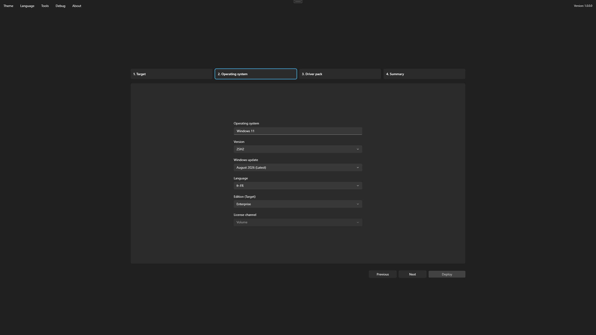

# Select Windows

The Operating system step selects the Windows media applied to the target.

## Make a selection

1. Select the Windows release.
2. Select available media for that release.
3. Select the language.
4. Select the edition.
5. Select the license channel when more than one is available.

<figure>
  
  <figcaption>Select a compatible Windows release, language, edition, and license channel.</figcaption>
</figure>

Available releases, languages, editions, architectures, and license channels come from the current [operating-system catalog](../reference/catalog.md) and any restrictions configured during media authoring. The catalog can update independently of the application. Confirm that the selection matches licensing and application compatibility requirements.
