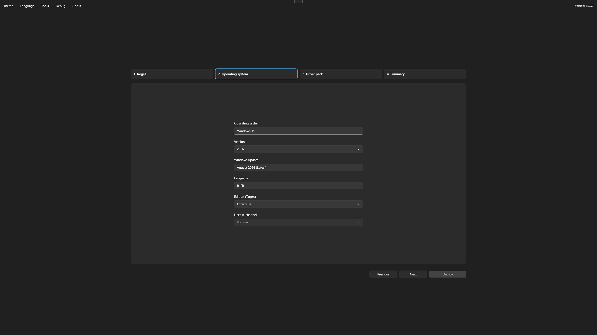

# Select Windows

The Operating system step selects the Windows media applied to the target.

## Make a selection

When **Image source** is shown, choose **Windows catalog** for the steps below, or follow [Custom images](#custom-images). This selector appears when custom images are enabled on the media.

1. Select the Windows release.
2. Select available media for that release.
3. Select the language.
4. Select the edition.
5. Select the license channel when more than one is available.

<figure>
  
  <figcaption>Select a compatible Windows release, language, edition, and license channel.</figcaption>
</figure>

Available releases, languages, editions, architectures, and license channels depend on the current [operating-system catalog](../reference/catalog.md), the running Deploy version, and any restrictions configured during media authoring. The catalog can update independently of the application. Confirm that the selection matches licensing and application compatibility requirements.


**Windows 11 releases and automatic fallback**

Foundry supports Windows 11 24H2, 25H2, and 26H2.

Deploy keeps the configured release restriction while any allowed release is available for the deployment architecture. If every allowed release is unavailable, Deploy automatically offers the supported releases available for that architecture. A profile allowing 25H2 and an unavailable release still offers only 25H2 when it is available.

Deploy preserves a valid operator selection. When it needs an initial or replacement selection, it prefers an available configured default, then its supported default, 26H2, then the newest available supported release. Language, edition, and license-channel policies are evaluated independently. Confirm all selections before continuing.

The running Deploy application must support 26H2; a catalog update alone cannot add that support to an older runtime. See [Application and boot media updates](../reference/supported-versions.md#application-and-boot-media-updates).


## Custom images

Media authored with [Custom Windows images](../foundry-osd/customization/custom-windows-images.md) enabled offers a custom image source alongside the catalog. The authoring profile can select the initial source and a preferred image/index; these remain separate choices.

1. Choose **Custom image** under **Image source**.
2. Select the image. Its source drive is shown beside its name.
3. Select **Image index**, or confirm the preferred index already selected. An image with only one index selects it automatically.
4. Review the index details before continuing to drivers.

Selection uses the exact numeric WIM index. Identical edition names do not identify the same index.

Below the image and index selectors, read-only fields show the selected index's version (including its revision), edition, architecture, and language. These values update when you select a different index.

Foundry Deploy discovers images automatically at startup and when you choose **Custom image**. If you add a manual WIM to the USB cache during the session, switch to **Windows catalog**, then back to **Custom image** to discover it.

The profile's enabled customizations apply to custom images. Catalog release restrictions do not determine which custom WIM can be used. Keep the source media connected throughout deployment, and resolve missing explicit preferences rather than expecting an automatic replacement. Internet access and Foundry Connect are still required.
