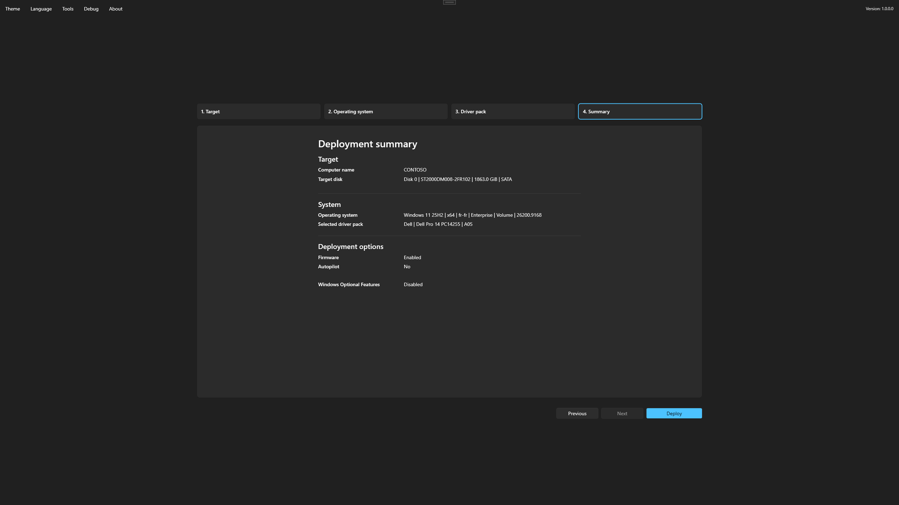
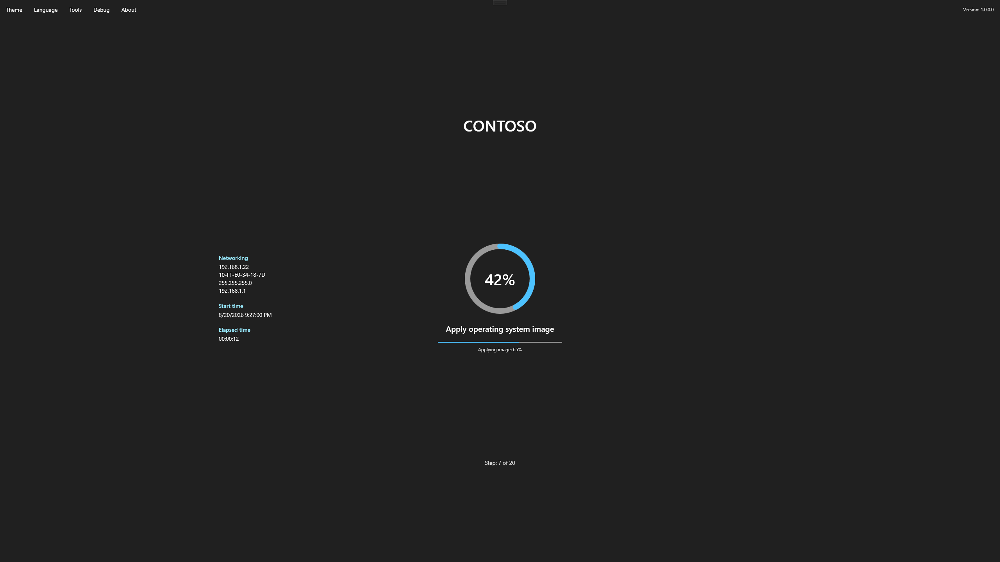

# Review and deploy

The Summary step is the final opportunity to validate the deployment choices.

## Review the summary

Confirm:

- Target disk and computer name.
- Windows release, language, edition, and license channel.
- Driver pack.
- Firmware options.
- Windows Autopilot method and, for zero-touch hardware hash upload, the configured group tag.
- Optional features and other deployment customization.

<figure>
  
  <figcaption>Review every deployment choice before starting the destructive operation.</figcaption>
</figure>

## Start deployment

Start only when every value is correct. Foundry opens **Confirm disk erase** before crossing the destructive boundary. Verify the disk number, model, bus, size, and selected operating system before accepting.


Accepting the confirmation allows Foundry to clean and repartition the selected disk. Existing data on that disk will be lost.


Do not power off the device, disconnect required networking, or remove deployment media while Foundry is working.

The progress page reports the current step, completed-step count, and overall progress when the operation can be measured.

<figure>
  
  <figcaption>Follow the current step and overall deployment progress.</figcaption>
</figure>
