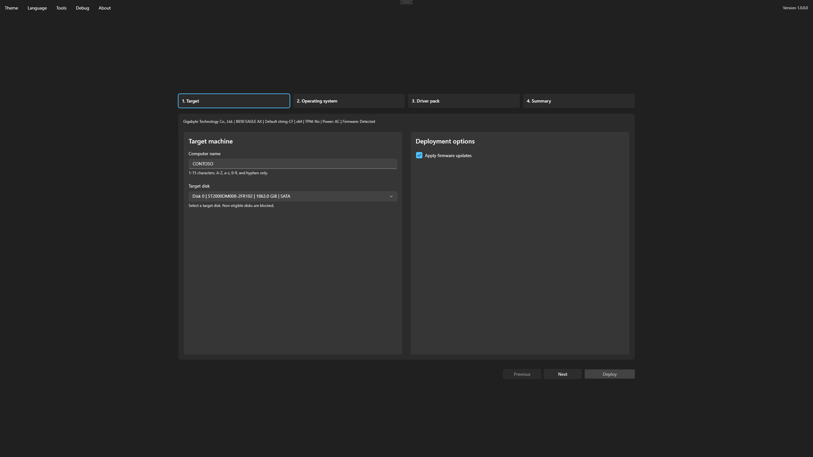

# Select the target

The Target step identifies the device and selects where Windows will be installed.

## Review the device

Confirm the displayed hardware information matches the physical device. Review firmware, Windows Autopilot, and other options enabled by the media configuration.

## Set the computer name

Enter a name from 1 to 15 characters using letters, numbers, or hyphens. Follow the organization’s naming policy and avoid a name already assigned to another device.

The policy authored in Foundry OSD can request a complete manual name or compose one from fixed text, device data, and random text. A composed name can be locked or made editable as a complete value. A name that meets Windows character rules can still be rejected when it does not satisfy the configured component policy.

Foundry Deploy resolves serial number, manufacturer, model, asset tag, and system UUID from the current device. Deployment is blocked when a required value is unavailable or contains a known firmware placeholder.

## Select the disk

Choose the intended internal target disk. Foundry excludes disks connected over USB and blocks system, boot, read-only, and offline disks.

<figure>
  
  <figcaption>Verify the device and select the intended deployment disk.</figcaption>
</figure>


All data on the selected target disk will be lost. Capacity alone is not enough to identify a disk; verify its model and position when available.

