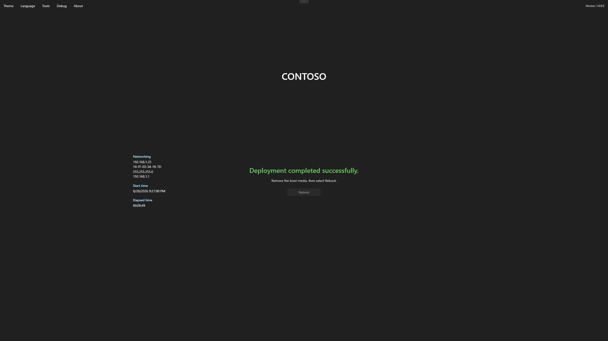
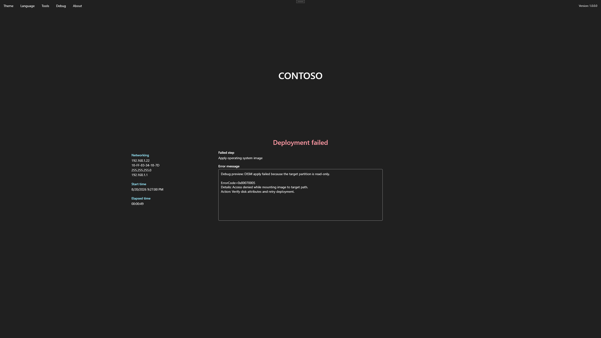

# Verify deployment

Foundry Deploy finishes with a success or error state.

## Success

Review the completion message and session summary. Use the reboot action or follow the displayed reboot instruction.

<figure>
  
  <figcaption>Confirm deployment success before rebooting the device.</figcaption>
</figure>

After reboot:

- Confirm that Windows starts from the target disk.
- Confirm the expected computer name.
- Confirm network and required device drivers.
- Verify Windows Autopilot registration or staged profile when configured.
- Complete the organization’s acceptance checks before handoff.

## Error

The error page identifies the failed deployment step and displays details.

<figure>
  
  <figcaption>Record the failed step and error details before troubleshooting.</figcaption>
</figure>

Do not immediately retry a destructive deployment. Record the failed step and error, then collect [logs and support information](../troubleshooting/logs-and-support.md).
