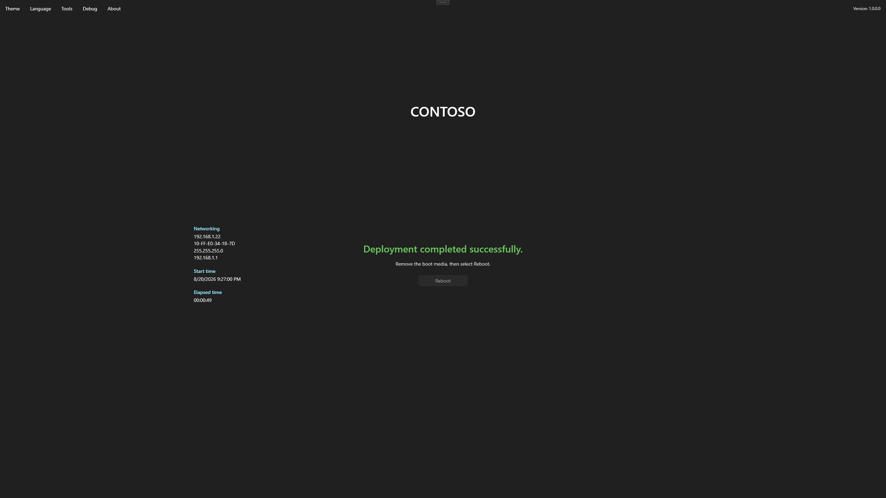
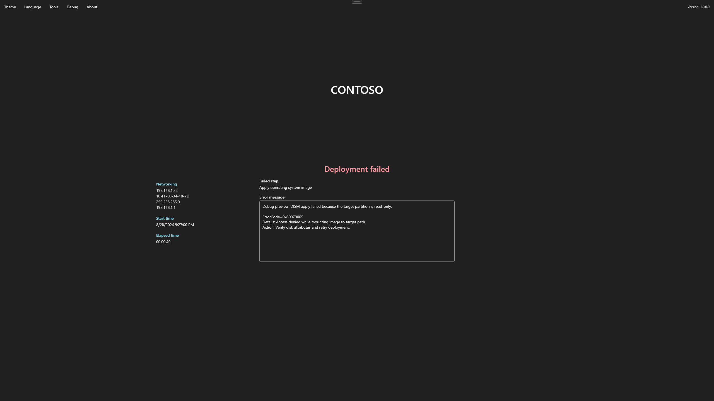

# Verify deployment

Foundry Deploy finishes with a success or error state.

## Success

Review the completion message and session summary when the configured reboot policy allows it. Foundry OSD can configure a manual reboot, an immediate automatic reboot, or an automatic reboot after a displayed countdown. Configure a manual reboot or sufficient delay before creating media when technicians must inspect results or collect logs.

<figure>
  
  <figcaption>Confirm deployment success before rebooting the device.</figcaption>
</figure>

After reboot:

- Confirm that Windows starts from the target disk.
- Confirm the expected computer name.
- When local accounts are configured, verify the expected account type and password sign-in, including built-in Administrator activation if enabled.
- Confirm network and required device drivers.
- Verify Windows Autopilot registration or staged profile when configured.
- Complete the organization’s acceptance checks before handoff.

When using a [custom answer file](../foundry-osd/customization/unattend.md), verify that its settings and commands produced the intended Windows configuration and work with the other enabled Foundry options. Foundry success confirms deployment completed; it does not prove that Windows has consumed every setting. Keep the target Panther answer file until the required setup passes finish, then follow your sensitive-file cleanup process.


**Review step outcomes**

Review informational **Skipped** entries and their reasons as well as successful entries. A cache-related skip is expected reuse, but another skip can explain why requested optional work was not completed.

**Stage driver installer**, **Stage firmware update**, **Prepare setup tasks**, and **Prepare Autopilot assistant** describe preparation. Confirm the corresponding driver, firmware, customization, or registration result after Windows starts. A successful Deploy session does not establish that those later actions succeeded.


## Post-installation actions

When using [Post-installation](../foundry-osd/customization/post-installation.md), a successful Deploy session means Windows is ready to run those actions. Follow the Post-installation console through any planned restarts and confirm that Windows reaches OOBE. Review failed actions even when **Continue on error** allowed the sequence to finish. An interrupted action is not automatically retried.

Verify that the installed applications work after cleanup. If they need source files for repair or updates, confirm that those files remain available. Keep the [PostInstall results and logs](../troubleshooting/logs-and-support.md#postinstall-diagnostics) when investigating a problem.

## Domain Join

A successful Deploy session confirms domain-work staging only. Follow PostInstall through its controlled restart, then verify the expected Windows name and local AD domain membership. Review the requested OU and directory readback independently: local membership alone does not prove placement or policy application.

Inspect [the domain result and execution journal](../troubleshooting/logs-and-support.md#domain-join-evidence). Successful join with failed placement still restarts and verifies. **Unknown** mutations are never automatically repeated and stay Unknown even if membership later succeeds; **Unverified** needs administrator confirmation. Resolve warned outcomes and **Cleanup Pending** before organizational handoff. A known WinPE skip has only Deploy's summary/logs. See [Domain Join troubleshooting](../troubleshooting/domain-join.md).

## Automatic Windows activation

For standard RETAIL deployments of supported Windows Home and Pro editions, Foundry automatically attempts to activate Windows after reboot using a compatible OEM product key stored in the device firmware. Online activation requires Internet access and a valid key for the installed Windows edition.

Foundry preserves existing activation and explicitly configured licensing. It skips this attempt for VOLUME deployments and deployments using a custom answer file. An ordinary licensing failure does not stop Windows setup. In the PostInstall workflow, a timeout or an activation process whose completion cannot be confirmed stops the sequence for investigation. Before handing over the device, check **Settings > System > Activation** to confirm its activation status.

## Error

The timeline identifies the failed deployment step. Select **View error details** on the error page to inspect the failure details.

<figure>
  
  <figcaption>Record the failed step and error details before troubleshooting.</figcaption>
</figure>

Do not immediately retry a destructive deployment. Record the failed step and error, then collect [logs and support information](../troubleshooting/logs-and-support.md).

Foundry Deploy does not roll back or resume a failed deployment. A failure after disk preparation can leave the target partially deployed and unable to boot. After correcting the cause, retrying starts the destructive workflow from the beginning.
