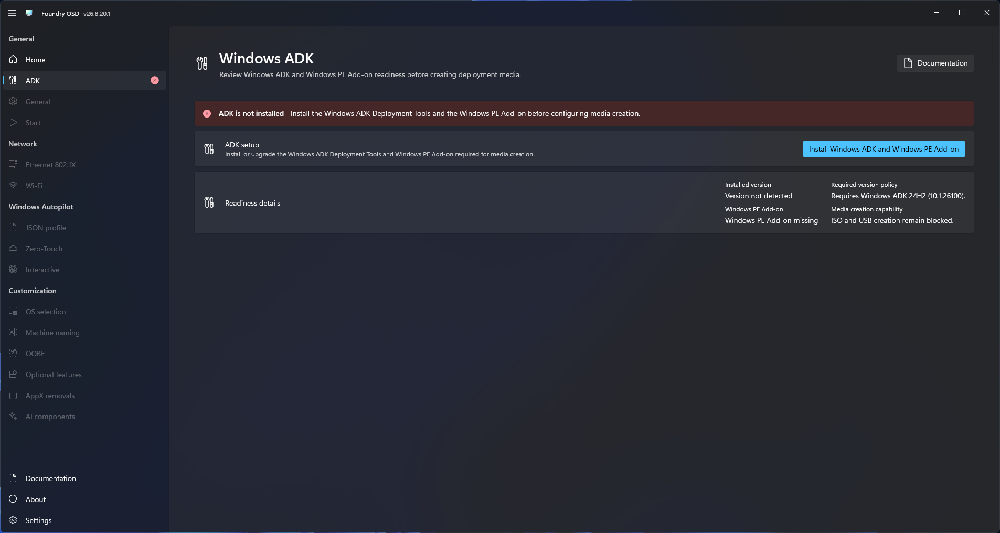
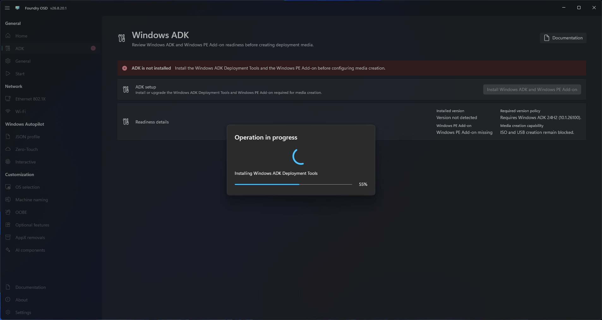

# Windows ADK and Windows PE

Foundry OSD requires the Windows ADK `10.1.26100` release, revision `2454` or later, with a matching Windows PE Add-on and the required files for the selected architecture to build deployment media.

## What Foundry checks

The ADK page detects:

- Whether the Windows ADK is installed.
- Whether the Windows PE Add-on is installed.
- The installed ADK component version.
- Whether the ADK meets the supported release and minimum revision.
- Whether the installed Windows PE components match the ADK release and the image, optional-component and boot files are available for the selected architecture.

<figure>
  
  <figcaption>Foundry identifies each required component that is not ready.</figcaption>
</figure>

## Install missing components

1. Open **ADK** in Foundry OSD.
2. Review the detected status and version information.
3. Select the ADK setup action.
4. Approve elevation when Windows requests administrator permission.
5. Keep Foundry OSD open while the installer is downloaded and executed.
6. Wait for Foundry to finish checking the component status.

<figure>
  
  <figcaption>Install the supported ADK and Windows PE Add-on directly from Foundry OSD.</figcaption>
</figure>


The automatic installation downloads and installs Windows ADK `10.1.26100.2454` first, followed by Windows PE Add-on `10.1.26100.2454`.


## Repair Windows PE readiness

The readiness details show whether the WinPE files are available for **x64** and **ARM64**. The separate media creation capability indicates whether the ADK and WinPE prerequisites are met. Missing files for one architecture block that target; a complete other architecture remains available.

- If the matching add-on is already installed but files are missing, use its installer to **Repair** it.
- If its version differs from the ADK, uninstall the Windows PE Add-on first, then install the matching `10.1.26100.2454` add-on from [Microsoft's ADK downloads](https://learn.microsoft.com/windows-hardware/get-started/adk-install).
- Restart Foundry after repairing or replacing the add-on outside the app so it checks the installation again.

Foundry's ordinary install action is for missing components. Repair or replacement of a registered add-on is performed through its installer.

## When the page reports ready

Continue to [general configuration](general.md). WinPE language and media creation options remain blocked until the required components are ready.

## Installation does not complete

- Confirm that Foundry OSD is running with administrator permissions.
- Confirm Internet access and proxy policy.
- Close another ADK installer that may already be running.
- Retry the action after Windows Installer completes any pending operation.
- Review [media creation troubleshooting](../troubleshooting/media-creation.md) if detection remains incorrect after installation.
