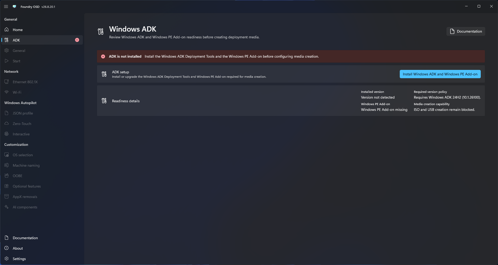
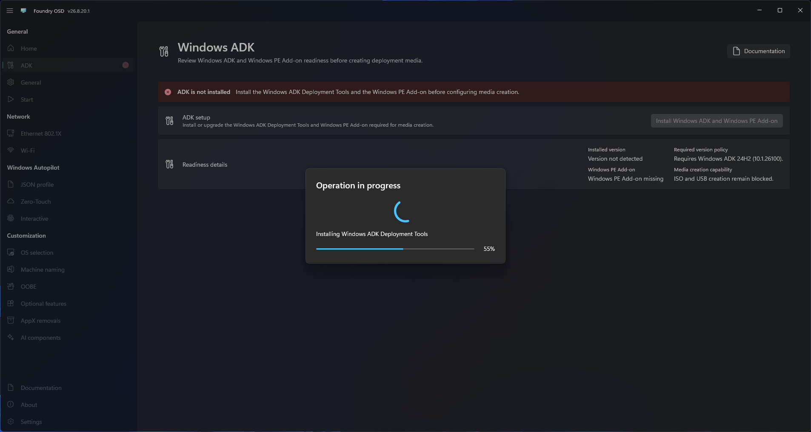

# ADK

The ADK page checks and installs the Windows ADK and the Windows PE add-on that Foundry needs to build media. Until it reports **ADK is ready**, every page except **Home**, **ADK** and **Settings** is disabled.

<figure>
  
  <figcaption>On a new workstation the page reports that the ADK is not installed and offers one button to install both components.</figcaption>
</figure>

## Before you start

- The workstation needs Internet access to Microsoft's download site. A proxy set in [Settings](settings.md#proxy) is used for this download.
- Let any other Windows installation finish first.

## Install the components

1. In the navigation pane, under **General**, open **ADK**.
2. Read the status bar at the top of the page. The table below tells you what each status means.
3. In the **ADK setup** card, select the button. Its label depends on what Foundry OSD found.
4. If Windows shows an elevation prompt for the Microsoft installer, approve it.
5. Wait. A dialog titled **Operation in progress** shows the current step and locks the window. The operation cannot be cancelled.
6. When the dialog closes, check that the status bar shows **ADK is ready**.

<figure>
  
  <figcaption>While setup runs, the dialog shows the step and the navigation pane is disabled.</figcaption>
</figure>

| Status | Button offered | What the button does |
| --- | --- | --- |
| **ADK is not installed** | **Install Windows ADK and Windows PE Add-on** | Downloads both installers, installs the ADK Deployment Tools, then the add-on. |
| **ADK version is unsupported**, older version installed | **Upgrade Windows ADK and Windows PE Add-on** | Removes the installed add-on and ADK, then installs the supported version of both. |
| **ADK version is unsupported**, newer version installed | **Downgrade Windows ADK and Windows PE Add-on** | Same as **Upgrade**: the newer ADK and add-on are removed first. |
| **Windows PE Add-on is missing** | **Install Windows ADK and Windows PE Add-on** | Installs only the add-on; the ADK is left as it is. |
| **Windows PE Add-on needs repair** | None | Repair or reinstall the add-on with Microsoft's installer, then restart Foundry OSD. See [troubleshooting](../troubleshooting/foundry-osd.md). |

**Upgrade** is also offered when Windows still lists an ADK whose files are no longer on disk.

Which versions count as supported is stated once, in [Supported versions](../reference/supported-versions.md#windows-adk).

## Check the result

The **Readiness details** card shows four values:

| Value | What to expect when ready |
| --- | --- |
| **Installed version** | The version of the installed ADK. |
| **Required version policy** | The version Foundry OSD requires. |
| **Windows PE Add-on** | **Windows PE Add-on installed**, followed by the state of each architecture, for example `(x64: WinPE files available, ARM64: WinPE files available)`. |
| **Media creation capability** | **ISO and USB creation are available.** |

The **ADK** item in the navigation pane shows the badge **ADK ready** and the other pages become available. Continue with [General](general.md).

When the files of only one architecture are missing, the page still reports **ADK is ready**, with a warning: you can create media for the complete architecture only.

## Limits

- Foundry OSD installs only the Deployment Tools feature of the ADK, which is the part it uses.
- The installers are downloaded once and kept in `%ProgramData%\Foundry\Cache\Installers`.
- Foundry OSD does not repair an add-on that is installed but damaged; use Microsoft's installer.

## Related

- [Supported versions](../reference/supported-versions.md#windows-adk)
- [Foundry OSD application troubleshooting](../troubleshooting/foundry-osd.md)
- [General](general.md)
