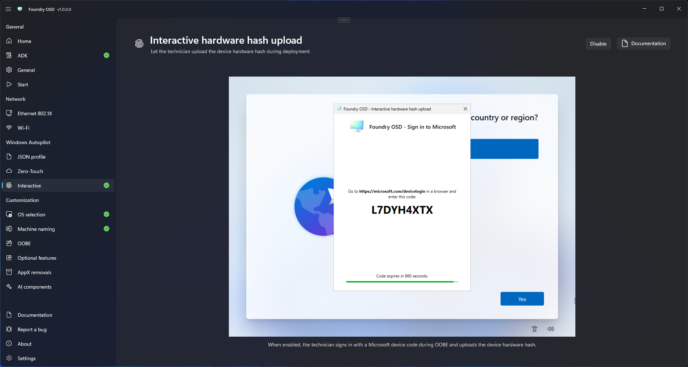

# Interactive hardware hash upload

Interactive upload stages an assistant that asks a technician to authenticate during Windows OOBE, after Windows deployment completes.

## Prerequisites

- An authorized technician account.
- Microsoft Graph delegated permissions required by the workflow.
- Network access to Microsoft authentication and Autopilot services.
- A process for selecting the correct group tag during the OOBE assistant.

## Configure interactive upload

1. Open **Windows Autopilot > Interactive hardware hash upload**.
2. Enable the interactive workflow.
3. Return to **Start** and confirm Autopilot readiness.

For this workflow, the readiness result confirms only that interactive upload is enabled. It does not test the technician account, delegated Microsoft Graph permissions, Conditional Access, Microsoft service connectivity, or group-tag access. Validate these requirements before distributing the media.

<figure>
  
  <figcaption>Enable the interactive registration assistant for use during Windows OOBE.</figcaption>
</figure>

## During deployment

Foundry Deploy provisions the interactive registration assistant during Windows deployment. After Windows starts in OOBE, the assistant presents device-code sign-in, group-tag selection, hardware hash capture, and upload. The technician completes authentication in a browser, returns to the deployment device, and waits for registration to finish.

Do not share device codes or authentication screenshots. If registration fails, collect the stage and error details described in [Autopilot troubleshooting](../../troubleshooting/autopilot.md).
