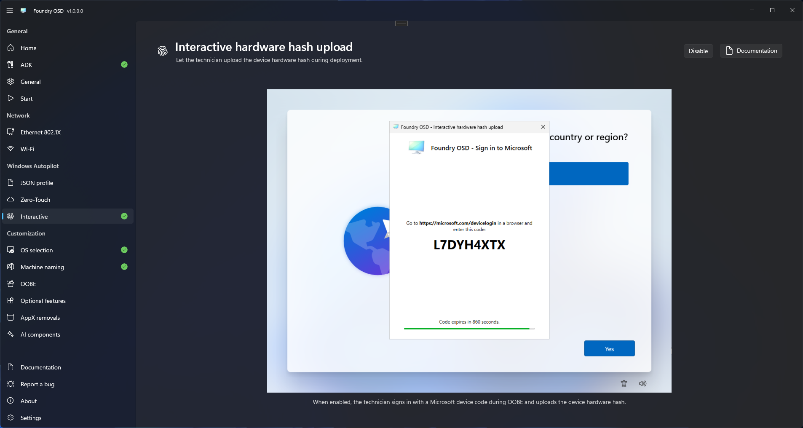

# Interactive hardware hash upload

**Interactive hardware hash upload** lets the technician register the device in Windows Autopilot with their own account. After the restart, a Foundry window opens at the start of Windows setup (OOBE); the technician signs in with a code on another device and uploads the hardware hash. The deployment media carries no tenant data and no secret.

<figure>
  
  <figcaption>The page has one control, the <strong>Enable</strong> or <strong>Disable</strong> button in the header. Its picture shows the window the technician gets; the code in it is an example.</figcaption>
</figure>

## Before you start

Foundry OSD cannot test any of these from the workstation. Check them with one real deployment.

- **A technician account in your tenant.** The window signs the technician in to Foundry's own Microsoft Entra application and asks for one delegated Microsoft Graph permission, `DeviceManagementServiceConfig.ReadWrite.All`. Foundry does not check that the account may use it. Check with your tenant administrator that this application and this account are allowed to register Windows Autopilot devices.
- **Sign-in with a code on another device.** The technician opens `https://microsoft.com/devicelogin` on a phone or another computer. Check with your tenant administrator that this kind of sign-in is allowed.
- **Network after the restart.** The window runs in installed Windows, not in Windows PE. The device must then reach the Microsoft sign-in and Microsoft Graph hosts listed in [Network endpoints](../../reference/network-endpoints.md).

## Configure interactive upload

1. Open **Windows Autopilot > Interactive** and select **Enable**.
2. Create or update the deployment media from [Start](../media/README.md).

There is nothing else to set: the group tag is chosen by the technician at each deployment.

## What the technician sees

Foundry Deploy shows no **Autopilot** step in this mode; the deployment only runs **Prepare Autopilot assistant**. After the restart, the window **Foundry OSD - Interactive hardware hash upload** asks the technician to sign in, to choose a group tag and to select **Upload**. The device restarts by itself 10 seconds after a successful upload. See [Windows Autopilot step](../../foundry-deploy/autopilot.md) for the procedure.

## Check the result

- On **Start**, the **Interactive** row of the **Windows Autopilot** card reads "Enabled: interactive hardware hash upload". This only confirms that the mode is enabled.
- After a deployment, find the device by its serial number among the Windows Autopilot devices of your tenant, with the group tag the technician chose.
- On the device, `C:\Windows\Temp\Foundry\State\AutopilotRegistration\registration-result.json` holds `"status": "completed"` or `"failed"` with the message.

## Limits

- **The device restarts before you can check the tenant.** Foundry waits up to 15 minutes for the device to be listed, not for a profile to be assigned. Windows setup can therefore start again before your tenant has assigned a profile.
- **The technician chooses the group tag**, including **None**. [Windows Autopilot step](../../foundry-deploy/autopilot.md) says what each choice does to a device that is already registered.
- **The window opens once.** After a successful upload it does not open again on that installation.
- **The window is in English**, whatever the language of Windows.
- **The window needs the command prompt of Windows setup.** It opens it with Shift+F10 to come to the front; if that prompt is not available in your image, the window does not appear.
- To send the computer name as well, turn on **Upload computer name to Autopilot** on [Machine naming](../customization/machine-naming.md). The name is assigned after the technician selects **Upload**, once the device is listed.

## Related

- [Windows Autopilot step](../../foundry-deploy/autopilot.md)
- [Windows Autopilot](README.md), for the rules shared by the three modes
- [Network endpoints](../../reference/network-endpoints.md)
- [Windows Autopilot troubleshooting](../../troubleshooting/autopilot.md)
