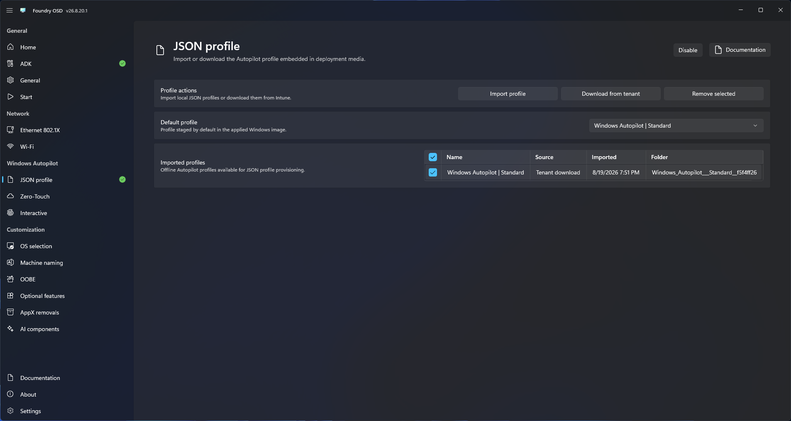

# JSON profile

Use a local Autopilot JSON profile when the deployment should stage profile settings without uploading the device hardware hash.

## Configure the profile

1. Open **Windows Autopilot > JSON profiles**.
2. Import a supported local profile or connect to the tenant and download an available profile.
3. Review the profile information displayed by Foundry OSD.
4. Select the profile that should be included in deployment media.
5. Return to **Start** and confirm Autopilot readiness.

<figure>
  
  <figcaption>Import or download a profile, then select the profile to include in deployment media.</figcaption>
</figure>

## Protect the profile on deployment media

Enable deployment password protection from [General configuration](../general.md) before creating the media when the Autopilot profile must not remain readable on the ISO or USB drive.

When protection is enabled, Foundry stores the selected profile on the deployment media using AES-256-GCM encryption. The readable JSON file is not stored alongside the encrypted profile. Foundry Deploy asks for the technician password, unlocks the deployment key, and decrypts the profile before staging it in the Windows installation.


Without deployment password protection, the Autopilot JSON profile is stored in readable form on the deployment media. Restrict access to the ISO or USB drive and recreate the media if it is lost or copied without authorization.


## Expected result

Foundry stages the selected profile for the deployed Windows installation. Hardware registration remains a separate administrative responsibility.

## Replace a profile

Import the updated profile, select it, and recreate or update the deployment media. Remove profiles that are no longer approved for deployment.
