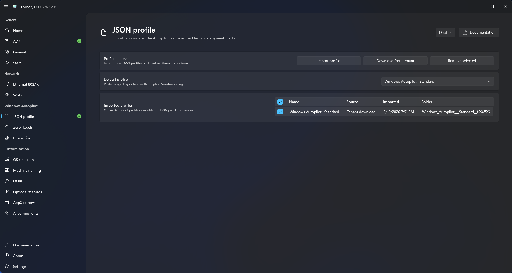

# JSON profile

**JSON profile** places a Windows Autopilot profile in the installed Windows, as the file `AutopilotConfigurationFile.json`. Foundry does not upload the hardware hash in this mode: the device is not added to the Windows Autopilot devices of your tenant.

<figure>
  
  <figcaption>Import or download profiles, then choose the default one.</figcaption>
</figure>

## Before you start

- Have a profile to add, from one of two sources:
  - a `.json` profile file on the workstation;
  - an account that can read the Windows Autopilot deployment profiles of your tenant. **Download from tenant** signs you in and asks for the Microsoft Graph permissions `DeviceManagementServiceConfig.Read.All` and `User.Read`.
- Decide whether the profiles may be readable on the media. They are stored as readable files unless **Password protection** is on. See [Password protection](../general.md#password-protection).

## Configure the profiles

1. Open **Windows Autopilot > JSON profile** and select **Enable**. The buttons of the page stay unavailable until you do.
2. Add profiles under **Profile actions**:
   - **Import profile**: choose a `.json` file. Foundry accepts a file that is not empty, is valid JSON and contains only ASCII characters. It does not check that the content is an Autopilot profile.
   - **Download from tenant**: complete the sign-in in the browser. In **Select Autopilot profiles**, select the profiles to keep, then **Import**.
3. Check the **Imported profiles** list: **Name**, **Source** (**Manual import** or **Tenant download**), **Imported** and **Folder**.
4. In **Default profile**, choose the profile that Foundry Deploy preselects.
5. Remove what must not travel with the media: select the rows, then **Remove selected**. Every profile in the list is copied to the media, not only the default one.
6. Create or update the deployment media from [Start](../media/README.md).

An imported file is named after its `Comment_File` value. Without one, it takes the file name, or the name of its folder when the file is called `AutopilotConfigurationFile.json`.

To replace a profile, download it again: the new copy replaces the old one. A file you changed and import again is added as a second entry, so remove the old entry.

## What the technician sees

Foundry Deploy shows an **Autopilot** step with a **Profile** list. The default profile is preselected and the technician can choose any other profile of the media. The deployment then runs the step **Copy Autopilot profile**. See [Windows Autopilot step](../../foundry-deploy/autopilot.md).

## Check the result

- On **Start**, the **JSON profile** row of the **Windows Autopilot** card reads "Enabled: \<name> (\<folder>)". A row marked **Needs attention** gives the reason: see [Windows Autopilot troubleshooting](../../troubleshooting/autopilot.md).
- On a deployed device, the profile chosen in Foundry Deploy is in `C:\Windows\Provisioning\Autopilot\AutopilotConfigurationFile.json`.

## Limits

- A profile file with a non-ASCII character, such as an accented letter in a comment, is refused.
- A profile downloaded from the tenant is written by Foundry from the settings of the tenant profile. It can differ from a file produced by another tool for the same profile.
- The device is not registered: a group tag and **Upload computer name to Autopilot** do not apply to this mode.
- The rules shared by the three modes are on [Windows Autopilot](README.md).

## Related

- [Windows Autopilot step](../../foundry-deploy/autopilot.md)
- [Password protection](../general.md#password-protection)
- [Windows Autopilot troubleshooting](../../troubleshooting/autopilot.md)
