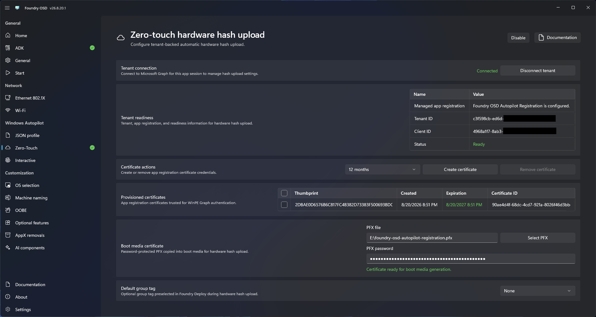

# Zero-touch hardware hash upload

Zero-touch upload registers a device without requiring a technician to sign in during deployment.

## Prerequisites

- Microsoft Entra tenant information.
- A dedicated tenant application registration approved for the deployment workflow.
- Required Microsoft Graph application permissions and administrator consent.
- A plan to create a Foundry-managed certificate after connecting the tenant, or an approved password-protected PFX containing the certificate and private key.
- A credential-rotation process that covers certificate expiration.

## Configure zero-touch upload

1. Open **Windows Autopilot > Zero-touch hardware hash upload**.
2. Select **Connect tenant** and complete the Microsoft sign-in flow.
3. Allow Foundry OSD to create or adopt the dedicated tenant application registration used for upload.
4. Review application registration, Microsoft Graph permissions, administrator consent, and service-principal readiness.
5. Create a Foundry-managed certificate or select an approved password-protected PFX containing the certificate and private key, then provide its password.
6. Configure the group tag when required by the organization.
7. Return to **Start** and confirm Autopilot readiness.

<figure>
  
  <figcaption>Confirm tenant, application, permission, and certificate readiness.</figcaption>
</figure>


Protect the certificate private key and generated media. Revoke or rotate the credential if its confidentiality is uncertain.


## Permissions and authentication

Foundry uses two separate application identities. The permissions granted to the interactive setup identity are not available to the application used by the deployment media.

### During tenant setup

**Foundry OSD** signs the administrator in interactively through the Foundry bootstrap public client. This identity is used only for tenant setup and is not used by zero-touch upload during deployment.

The bootstrap client requests these delegated Microsoft Graph permissions:

- `Application.ReadWrite.All` to create, adopt, and configure the tenant application registration.
- `AppRoleAssignment.ReadWrite.All` to assign the required Microsoft Graph application permission to its service principal.
- `DeviceManagementServiceConfig.Read.All` to review Autopilot configuration and available group tags.
- `User.Read` for the signed-in user context.

These delegated permissions require a signed-in administrator and remain subject to that administrator's Microsoft Entra roles, Conditional Access, and tenant policy.

Foundry OSD then creates or adopts a single-tenant application registration named `Foundry OSD Autopilot Registration`. When Foundry creates this application, it configures only the Microsoft Graph application permission `DeviceManagementServiceConfig.ReadWrite.All`, with administrator consent. This permission allows the application to import device identities and check import results.

If Foundry adopts an existing application with this name, it does not remove permissions that are already configured. Review the application and service principal before using them and remove permissions unrelated to Autopilot upload.

### During media creation

Foundry stores the tenant ID, application client ID, and the selected certificate PFX in the deployment configuration. It does not store the administrator's credentials or interactive access token on the media.

### During deployment

**Foundry Deploy** uses the PFX private key to authenticate as `Foundry OSD Autopilot Registration`. The resulting app-only token contains the application permissions consented for that service principal. It cannot use the bootstrap client's delegated permissions, including `Application.ReadWrite.All`, and cannot use them to create or modify other application registrations. No technician sign-in is required.

Treat the tenant application and its PFX private key as privileged deployment credentials. Anyone who obtains the private key can use the application's consented permissions until the certificate expires or is revoked.


Use a dedicated application registration for Foundry deployment media. Do not reuse a certificate or application registration that grants unrelated access.


## How credentials are protected

Foundry places the certificate PFX and its PFX password in the deployment configuration. Both values are encrypted with AES-256-GCM, which also detects whether the encrypted data has been modified.

Enable **Protected deployment** from [General configuration](../general.md) before creating the media.

Foundry generates a random 256-bit deployment key for each media-creation operation. When Protected deployment is enabled:

1. Foundry derives a key from the deployment password using PBKDF2-HMAC-SHA-256, 600,000 iterations, and a random 128-bit salt.
2. The password-derived key protects the random deployment key with AES-256-GCM.
3. The deployment key is not stored separately on the media.
4. Foundry Deploy asks for the password and unlocks the deployment key before it can use the certificate.

AES-GCM uses a unique 96-bit nonce and a 128-bit authentication tag for each encrypted value.

A copied ISO or USB drive therefore cannot reveal the PFX private key through the stored deployment key alone; the deployment password must also be obtained or recovered. This protection no longer applies after an authorized technician unlocks the media and Foundry Deploy starts using the credential.


Protected deployment does not encrypt the entire ISO, USB drive, or Windows installation content. It protects access to Foundry Deploy and the deployment secrets stored in its configuration.


If Protected deployment is disabled, the PFX and its password remain encrypted, but the deployment key is stored on the media so that deployment can start without a password. Anyone who obtains the media must therefore be treated as having access to its embedded deployment credentials.

Use a unique password of at least 12 characters for deployment media. Foundry accepts passwords from 8 characters, but warns when fewer than 12 characters are used. The password is not stored on the media. If it is lost, recreate the media.

## Operational security

- Restrict physical and administrative access to generated ISO and USB media.
- Where available, apply [Conditional Access for workload identities](https://learn.microsoft.com/en-us/entra/identity/conditional-access/workload-identity) to the `Foundry OSD Autopilot Registration` service principal. Restrict access to named locations that contain the public egress IP addresses of approved imaging networks, and validate proxy or NAT egress before enforcement.
- Use a short-lived certificate where organizational policy permits it.
- Record the certificate expiration date and rotate the certificate before it expires.
- Revoke the certificate and recreate all affected media after loss, theft, or suspected copying.
- Delete obsolete ISO files and securely retire USB media when they are replaced.
- Do not attach deployment configuration, certificates, or unredacted logs to public support requests.
- Verify that Conditional Access, proxy, firewall, and Microsoft Graph policies allow the deployment workflow before distributing media.

## During deployment

Foundry Deploy captures the hardware hash and uses the `Foundry OSD Autopilot Registration` application identity to upload it.


Windows deployment can succeed even when Microsoft Graph upload or registration polling fails. Review the Autopilot result and verify the device record in the tenant before handoff.

