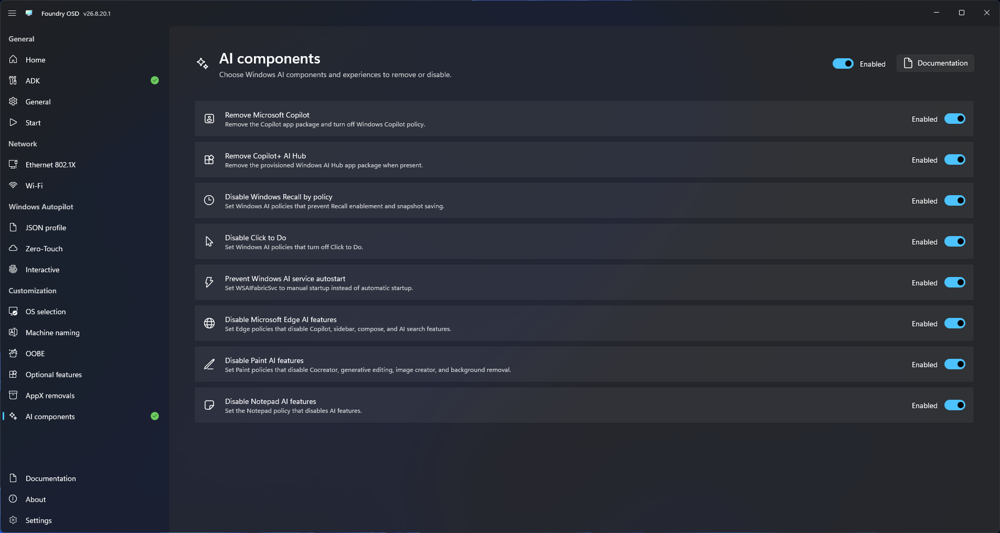

# AI components

Use AI components to control supported Windows AI-related components during deployment.

## Configure component actions

1. Open **Customization > AI components**.
2. Enable AI component customization. Foundry enables all available AI actions.
3. Disable any actions that are not approved for the deployment standard.
4. Return to **Start**.

<figure>
  
  <figcaption>Select which supported AI-related components Foundry removes during deployment.</figcaption>
</figure>

This page does not report per-release compatibility. Test the deployed Windows image after every change because component availability and servicing behavior can change between Windows releases.
