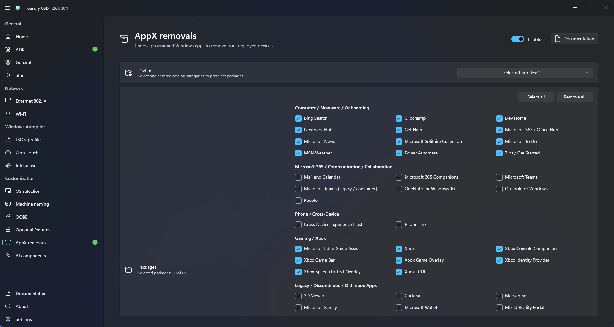

# AppX removals

Use AppX removals to remove selected provisioned Windows application packages during deployment.

## Configure removal

1. Open **Customization > AppX removals**.
2. Enable AppX removals.
3. Select only applications approved for removal.
4. Review dependencies and organizational application requirements.
5. Return to **Start**.

<figure>
  
  <figcaption>Select the AppX packages to remove during deployment.</figcaption>
</figure>


Removing provisioned applications can affect user experience, later servicing, and dependent workflows. Test every removal set against the target Windows release.

