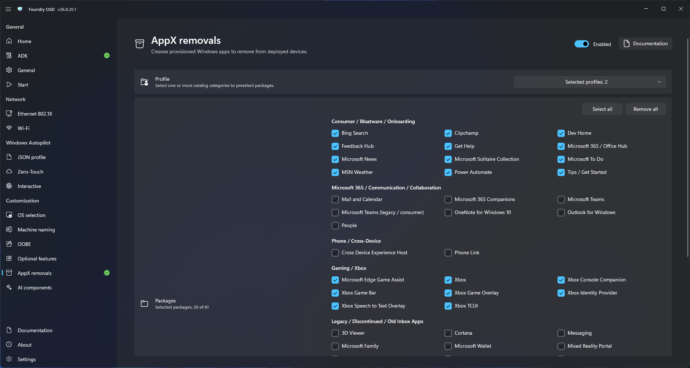

# AppX removals

**AppX removals** removes built-in Windows apps, such as Clipchamp, Xbox or Microsoft Teams, from the deployed Windows so that new users do not receive them.

<figure>
  
  <figcaption>Tick the apps to remove under Packages, or tick whole groups with Profile.</figcaption>
</figure>

## Select the apps to remove

1. Open **Customization > AppX removals** and turn the switch at the top right to **Enabled**.
2. Under **Packages**, tick each app to remove. **Select all** ticks all 61 apps and **Remove all** clears the selection.
3. To tick a whole group, open **Profile** and tick the group.
4. Check the counter under **Packages**, for example "Selected packages: 20 of 61".
5. Create or update the deployment media.

The list is built into Foundry OSD. You cannot add an app to it. To remove anything else, use a script in [Post-installation](post-installation.md).

### Groups and profiles

The 61 apps are sorted into seven groups, listed at the end of this section. A profile is one of these groups: ticking it in **Profile** ticks every app of the group, and clearing it clears them.

The **Profile** box summarizes the selection: **None**, the name of the group when exactly one whole group is ticked, **Selected profiles: 2** for several whole groups, or **Custom** when the ticked apps do not match whole groups.


**Utilities / Native Apps** contains Notepad, Calculator, Photos, Snipping Tool, Paint, Windows Terminal, Camera, Clock, Sound Recorder, Media Player, Sticky Notes and Quick Assist. **Select all** removes them too.


<details>

<summary>All 61 apps by group</summary>

| Group | Apps |
| --- | --- |
| Consumer / Bloatware / Onboarding | Bing Search, Clipchamp, Dev Home, Feedback Hub, Get Help, Microsoft 365 / Office Hub, Microsoft News, Microsoft Solitaire Collection, Microsoft To Do, MSN Weather, Power Automate, Tips / Get Started |
| Microsoft 365 / Communication / Collaboration | Mail and Calendar, Microsoft 365 Companions, Microsoft Teams, Microsoft Teams (legacy / consumer), OneNote for Windows 10, Outlook for Windows, People |
| Phone / Cross-Device | Cross Device Experience Host, Phone Link |
| Gaming / Xbox | Microsoft Edge Game Assist, Xbox, Xbox Console Companion, Xbox Game Bar, Xbox Game Overlay, Xbox Identity Provider, Xbox Speech to Text Overlay, Xbox TCUI |
| Legacy / Discontinued / Old Inbox Apps | 3D Viewer, Cortana, Messaging, Microsoft Family, Microsoft Wallet, Mixed Reality Portal, Mobile Plans, Movies & TV, Paint 3D, Print 3D, Skype, Windows Maps |
| Utilities / Native Apps | Calculator, Camera, Clock, Media Player, Notepad, Paint, Photos, Quick Assist, Snipping Tool, Sound Recorder, Sticky Notes, Windows Terminal |
| Microsoft First-Party / Optional | Microsoft Journal, Microsoft News, Microsoft PC Manager, Microsoft Remote Desktop, Microsoft Whiteboard, Network Speed Test, Power BI, Sway |

</details>

## What happens on the device

Foundry removes the apps at the first start of Windows, before the first sign-in, even when the Post-installation page is off. See [When each customization is applied](README.md#when-each-customization-is-applied).

- **What is removed.** Foundry removes the provisioned package, which is the copy Windows installs for each new user. It does so before anyone signs in.
- **An app the image does not contain is skipped.** Nothing is reported for it.
- **A failed removal does not stop the deployment.** Foundry records a warning and continues with the next app.
- **An app can come back.** Foundry sets no policy that blocks the app. Windows, the Microsoft Store or a later feature update can install it again.

## Check the result

After the restart, the Foundry Post-installation console lists the task `Remove AppX packages`. On the deployed device, sign in with a new user account and confirm that the apps are absent. If one is still there, read the removal log:

```text
C:\Windows\Temp\Foundry\Logs\PreOobe\appx-servicing.log
```

## Limits

- Microsoft Copilot is not in this list. Remove it on [AI components](ai-components.md).
- The selection is saved only while the page is **Enabled**. A selection left on a page that is **Disabled** is gone the next time Foundry OSD starts.

## Related

- [AI components](ai-components.md)
- [Post-installation](post-installation.md)
- [After the restart](../../foundry-deploy/after-the-restart.md)
- [After the restart troubleshooting](../../troubleshooting/after-the-restart.md)
