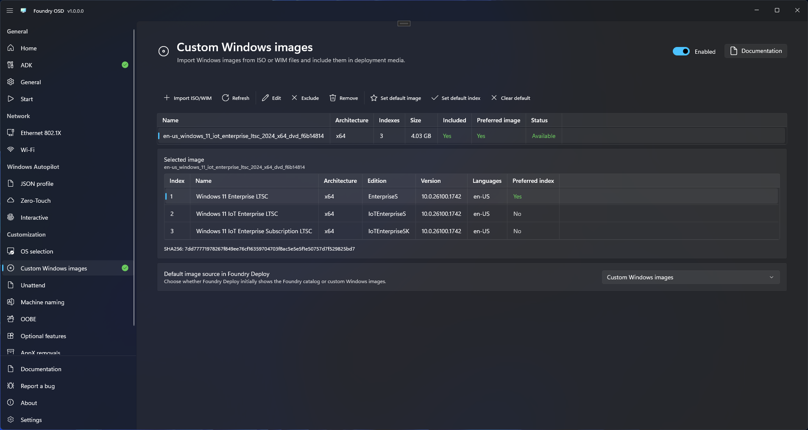

# Custom Windows images

Use **Customization > Custom Windows images** to import a Windows image, include it in deployment media, and choose the image source Foundry Deploy initially displays. Internet access remains required; Foundry Connect works as usual.

## Import an image

1. Enable **Custom Windows images**.
2. Select **Import ISO/WIM** in the command bar above the image table.
3. Browse to a `.wim` or `.iso` file, review the source summary, and enter a name unique within the active profile (up to 200 characters). If the ISO contains both installation WIM and ESD files, choose which one to import.
4. Select **Import ISO/WIM** and keep the source available until import completes. Use **Cancel** to stop an import.
5. Select the imported row to inspect its image indexes and metadata.

The progress bar appears during inspection and import, after a source has been selected.

The page's image controls are disabled while custom images are off. Select an image to display its indexes in a second table. Image actions require an image selection; **Set default index** also requires an index selection. All actions are in the command bar. In narrower windows, scroll the bar horizontally to reach the remaining actions. The default source remains **Foundry catalog** until you change it.

Foundry copies WIM content into its local library. An ISO provides `sources\install.wim`, or `sources\install.esd`, which Foundry exports to WIM. Every image index is retained. Split `.swm` sets are not supported by this import flow.

Import checks that image metadata can be read. It does not certify that the image will deploy successfully or that your selected customizations suit it. Windows versions, editions, and architectures are not restricted to the Foundry catalog. Metadata reported by the image is shown as supplied; an unknown field is not replaced with a catalog default. Index versions include the revision reported by DISM, for example `10.0.26100.4652` (`major.minor.build.revision`). This is image metadata, not a separate inspection of the installed update state inside each index.

<figure>
  
  <figcaption>Manage image inclusion and defaults from the command bar, inspect index metadata, and choose the initial image source for Foundry Deploy.</figcaption>
</figure>

Opening the page or selecting **Refresh** updates older three-part version metadata from available cached WIMs. No reimport is required to display the revision.

## Include images and choose defaults

The tables show inclusion and preferred image/index values in green when they are **Yes**. Image status is green for **Available** and red for **Missing**. Text labels remain visible alongside these signals. Defaults are shown in the tables and changed through the command bar.

Use these controls to manage images and deployment defaults:

| Control | Effect |
| --- | --- |
| Select an image row | Shows its indexes and enables image actions. |
| Include / Exclude | Adds or excludes the image from newly generated media. |
| Edit | Opens a dialog to change this profile's label without renaming the original file. |
| Default image source in Foundry Deploy | Chooses Foundry catalog or custom Windows images as the initial workflow. This setting is below the index card. |
| Set default image | Includes the selected image and makes it the preferred image, leaving its index for the operator to choose. |
| Set default index | Includes the selected image and records the selected table row as its preferred numeric WIM index, even when several indexes share an edition name. |
| Clear default | Clears the preferred image/index. |
| Enable custom Windows images | Enables the custom workflow and packaging of included images for this profile. |

When this page is enabled, creating or updating media requires at least one image included in the active profile, and every included image must be available locally. An empty library or a profile with all images excluded blocks media creation, even when the default source is **Foundry catalog**. Import and include an image, or disable the page to create catalog-only media. You can save an incomplete profile while preparing it.

The source defaults to **Foundry catalog**. Enabling custom images or setting a preferred image/index does not change that source. Choose **Custom Windows images** in **Default image source in Foundry Deploy** to start Deploy in custom mode.

An explicit preference that becomes unavailable requires attention. Foundry does not silently replace it with another image or the first index. Restore the source, change the preference, or clear it.

Reimporting the same WIM content restores a missing local copy. The import dialog requires an unused name in the active profile, even when restoring an existing reference. If that profile already references the content, it keeps its existing label, inclusion, and preferences. Reimport does not replace another profile's source choice.

## Remove an image

**Remove** removes the image from the current profile and deletes Foundry's local image copy after confirmation. Other profiles referencing that content show it as missing and need the source restored. Original files and existing ISO/USB media are unchanged.

Content in use by a media build cannot be deleted; if deletion fails, the profile reference is retained. Removing or excluding the preferred image clears its image and index preferences in the current profile. Excluding an image keeps its local copy.

The local library is under `%LOCALAPPDATA%\Foundry\Images\Custom`. Profile export and synchronization transfer image references and defaults, not WIM bytes. On another PC, import the same image content to satisfy those references. See [Deployment profiles](../deployment-profiles.md).

## Find images on generated media

Included WIMs use the same path on ISO and USB media, outside `boot.wim`:

| Output | Location |
| --- | --- |
| ISO | `Cache\OperatingSystems\Custom\<SHA256>\image.wim` on the ISO filesystem |
| USB | `Cache\OperatingSystems\Custom\<SHA256>\image.wim` on the NTFS data/cache partition |

These paths are relative to the source volume, whose drive letter can vary in Windows PE. The WIMs are not copied into the `X:` RAM drive.

Each image directory is named after the WIM's SHA256 content hash. On both outputs, the manifest binding the media to its images is stored in `Cache\OperatingSystems\Custom\manifests`. The `Custom` directory keeps imported images separate from catalog downloads in the operating-system cache. WIMs are not stored on the USB FAT32 BOOT partition. Allow space for all included images.

To add another image manually to authored USB media, place a regular `.wim` file directly in `Cache\OperatingSystems\Custom\` on the data partition. This supplements the included images; it does not replace the requirement to include at least one available library image when creating or updating media. Deploy does not recursively scan subfolders. Manual files are identified in the current session and are not used as substitutes for a missing managed default.

[USB updates](../media/update-usb.md) preserve manual files and unrelated cache data. New managed content is staged before the boot partition is refreshed. Old managed content may remain on the data partition and is not offered unless the current media manifest references it.

Copying only `sources\boot.wim` for [PXE](../media/pxe-deployment.md) does not carry these external images. This feature does not add a PXE or network-share image delivery mechanism.

## Deploy and validate

In [Foundry Deploy](../../foundry-deploy/operating-system.md), choose the custom source, image, and exact index. Enabled customizations, including [optional features](optional-features.md), still apply through the usual deployment workflow. You are responsible for checking that the image supports the selected customizations and for testing the result.

Before destructive deployment starts, Foundry verifies source identity and metadata while holding read locks, and protects the physical source disk from target selection. Keep USB or ISO media available throughout deployment.

Hash and metadata checks detect changed or missing sources. They do not prove that every compressed WIM resource is intact. DISM can still fail while applying or servicing an image, after target preparation has begun. Validate your images and customizations on representative hardware before production deployment.
