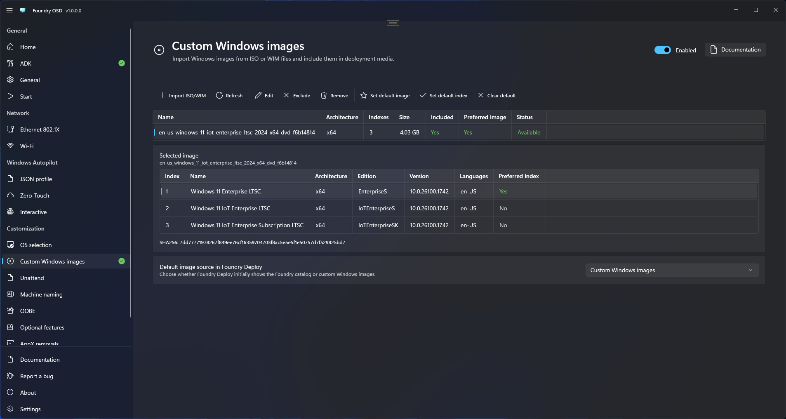

# Custom Windows images

**Custom Windows images** adds your own Windows images, from a WIM file or an ISO, to the deployment media, so the technician can deploy them instead of an image downloaded from the Foundry catalog.

<figure>
  
  <figcaption>The image library, the indexes of the selected image, and the source Foundry Deploy shows first. The current page also shows a PXE warning under its title.</figcaption>
</figure>

## Before you start

- **Source.** A `.wim` file, or an ISO that contains `sources\install.wim` or `sources\install.esd`. Split `.swm` images are not supported.
- **Disk space.** Foundry OSD copies the image into `%LOCALAPPDATA%\Foundry\Images\Custom`. That drive needs free space of at least the size of the WIM or, for an `install.esd`, the expanded size of all its indexes plus 1 GB.
- **Media type.** The page states: "Not available with PXE boot. Custom images require the full ISO or USB media."
- **Captured images.** Keep the recovery image in the capture, as described [below](#capture-an-image-that-keeps-windows-recovery).

## Import an image

1. Open **Customization > Custom Windows images** and turn the switch at the top right to **Enabled**.
2. Select **Import ISO/WIM** in the command bar.
3. Select **Browse** and choose the file. Foundry OSD lists the indexes of the image. If the ISO contains both `install.wim` and `install.esd`, choose one under "Choose the installation image in this ISO."
4. Check **Name**. It defaults to the file name, accepts up to 200 characters and must be unique in the current configuration.
5. Select **Import ISO/WIM** and keep the source available until the dialog shows "Import complete". **Cancel** stops the import.

Foundry OSD keeps every index of the image and converts `install.esd` to WIM. A new image is included in the media straight away: its **Included** column shows **Yes**.

## Choose what goes on the media

Select an image row to list its indexes under **Selected image**, then use the command bar.

| Action | Effect |
| --- | --- |
| **Refresh** | Reads the library again and updates the **Status** of each image. |
| **Edit** | Changes the name shown for the image. The file is not renamed. |
| **Include** / **Exclude** | Adds the image to the media you create next, or leaves it out. An excluded image stays in the library. |
| **Remove** | After confirmation, removes the image from the current configuration and deletes its copy from the library. |
| **Set default image** | Includes the image and marks it as **Preferred image**. The technician chooses the index. |
| **Set default index** | Includes the image and marks the selected index row as **Preferred index**. |
| **Clear default** | Clears the preferred image and index. |

Below the tables, **Default image source in Foundry Deploy** decides which source Foundry Deploy shows first: **Foundry catalog**, the default, or **Custom Windows images**. Setting a preferred image does not change it. The technician then chooses the image and the index, with your preferred ones preselected: see [Select Windows](../../foundry-deploy/operating-system.md).

- While the page is **Enabled**, Foundry OSD creates media only if at least one image is included and every included image shows the **Status** **Available**, even when the default source is **Foundry catalog**. To create media without custom images, switch the page off.
- Each media creation starts with the stage "Verifying custom image sources…", which checks every included image again and takes time with large images.
- Excluding or removing the preferred image clears the preference.
- **Remove** deletes the library copy for every configuration: the others show the image as **Missing**. The original file and existing media are not changed.

## Restore or move an image

[Settings backup and sync](../deployment-profiles.md) carries the list of images and their defaults, not the image files. On another PC, or after the library copy is lost, the image shows **Missing**.

Import the same `.wim` file again, under a name that is not yet used. Foundry OSD recognizes the image by the SHA-256 hash of the WIM, and the existing row keeps its name, inclusion and defaults. This is not guaranteed for an image converted from `install.esd`, because the conversion writes a new WIM file.

## Capture an image that keeps Windows recovery

A captured image should contain `Windows\System32\Recovery\winre.wim`. Before you capture the reference device, run `reagentc /disable` on it, so that Windows moves the recovery image back to that folder.

Without the file, Foundry Deploy marks the **Configure Windows recovery** and **Install recovery drivers** steps as skipped in its **Steps** list. Pointing at either step shows the reason: "The applied Windows image does not contain winre.wim." The deployment completes, and the deployed Windows has no recovery environment.

Also remove any answer file from `Windows\Panther\Unattend` on the reference device before you capture it. An image that carries one stops every deployment that has work to run after the restart: see ["Post-installation staging failed."](../../troubleshooting/deployment/after-disk-erase.md#post-installation-staging)

## Limits

- 256 images in the library, 1,024 indexes per image, 200 characters per name.
- Foundry OSD checks that it can read the image, not that the image deploys or suits your other customizations. Versions, editions and architectures are not limited to those of the Foundry catalog.
- .NET Framework 3.5 cannot be turned on in a custom image during deployment. See the limits of [Optional features](optional-features.md).
- For where the images sit on an ISO or a USB drive, see [What each media type carries](../media/README.md#what-each-media-type-carries).

## If something goes wrong

### "The image operation failed. Check the source, available space, and Foundry logs."

- **Where:** the import dialog, or the top of the page after an action.
- **Cause:** one message covers every failure. The three you can act on: an ISO without `sources\install.wim` or `sources\install.esd`, too little free space, or an image in use by a media build when you select **Remove**.
- **Fix:** check the source and the free space, then try again. The last "Custom image import failed.", "Custom image preview failed." or "Custom image library operation failed." entry in the log gives the exact cause.
- **Collect:** `%ProgramData%\Foundry\Logs\Foundry.log`. See [Logs and support information](../../troubleshooting/logs-and-support.md).

### The Import ISO/WIM button stays unavailable

- **Where:** the import dialog.
- **Cause:** the dialog shows "An image with this name already exists in this profile.", still shows "Reading image indexes…", or waits for your choice under "Choose the installation image in this ISO."
- **Fix:** change **Name**, wait for the indexes to appear, or choose the installation image.

### "Include at least one available Windows image in this profile. Restore missing included images and fix or clear the preferred image or index before creating or updating media."

- **Where:** the top of the page. **Start** shows **Custom Windows images** as **Needs attention** and media creation is blocked.
- **Cause:** no image is included, an included image shows **Missing**, the preferred image is excluded, or the preferred index no longer exists in the image.
- **Fix:** include an image whose **Status** is **Available**, import a **Missing** image again, or select **Clear default**. To build media without custom images, switch the page off.

A USB operation that ends with "Custom Windows image media preparation failed." is explained in [Content cannot be copied to the media](../../troubleshooting/media-creation/usb-drive-and-device-start.md#media-content). Messages under the image selectors of Foundry Deploy are in [Before the deployment starts](../../troubleshooting/deployment/before-deployment-starts.md#custom-image-selection).

## Related

- [Select Windows](../../foundry-deploy/operating-system.md)
- [Start: create deployment media](../media/README.md)
- [Media creation troubleshooting](../../troubleshooting/media-creation.md)
- [Windows deployment troubleshooting](../../troubleshooting/deployment.md)
