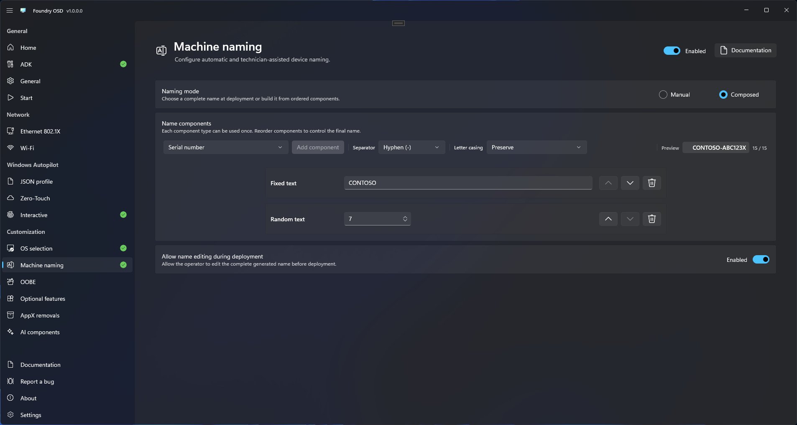

# Machine naming

Use Machine naming to define how a computer name is selected during deployment.

<figure>
  
  <figcaption>Choose a naming mode and configure the ordered components used to build the computer name.</figcaption>
</figure>

## Naming requirements

Foundry Deploy validates names as 1–15 characters containing letters, numbers, or hyphens. Underscores are not available because Windows computer names that use them are not DNS compatible.


Choose a naming method that prevents duplicate names and matches directory, inventory, and device-management requirements.


## Configure naming

1. Open **Customization > Machine naming**.
2. Enable machine naming.
3. Select **Manual** to let the deployment operator enter the complete name. You can optionally provide an initial value.
4. Select **Composed** to build the name from ordered components. Each component type can be used once:
   - Fixed text
   - Serial number
   - Manufacturer
   - Model
   - Asset tag
   - System UUID
   - Random text
5. Configure each component:
   - Enter the value for **Fixed text**.
   - For **Random text**, choose a length from 1 to 15 characters.
   - For device-data components, choose a maximum length from 1 to 15 characters and whether truncation keeps characters from the left or right. **Serial number** keeps characters from the right by default.
6. Use the arrow buttons to reorder components or the delete button to remove one. **Add component** becomes unavailable when no unused component can fit within the remaining budget.
7. Select either **No separator** or **Hyphen**, then choose whether to preserve, uppercase, or lowercase letters.
8. Keep the configured maximum within the 15-character budget shown on the page. Separators count toward this limit.
9. Decide whether the deployment operator can edit the complete generated name.
10. Return to **Start** and confirm customization readiness.

The preview uses representative values. Foundry Deploy resolves actual hardware values at deployment startup and applies casing and separators to the same component rules used in the preview. For random text, a random value is generated with the configured length during deployment startup.

Deployment is blocked if a required hardware value is missing, blank, or a known placeholder.
