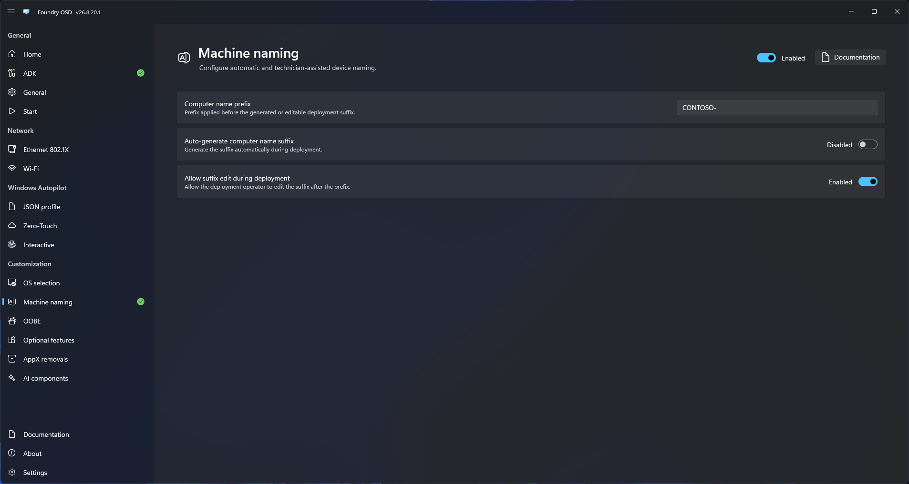

# Machine naming

**Machine naming** decides the computer name Foundry Deploy proposes for each device: a name the technician types, or a name built from device data such as the serial number.

<figure>
  
  <figcaption>Composed mode: the components in order, and the preview of the resulting name. The Upload computer name to Autopilot card sits below this area.</figcaption>
</figure>

## Configure naming

A computer name has 1 to 15 characters: letters, digits and hyphens. Foundry removes every other character, and refuses a name made only of digits.

1. Open **Customization > Machine naming** and turn the switch at the top right to **Enabled**.
2. Under **Naming mode**, choose **Manual** or **Composed**, then follow the matching section.

### Manual

The technician types the name in Foundry Deploy. To prefill it, enter a name in the **Manual** box.

### Composed

Foundry Deploy builds the name from components, in the order of the list. Each type can be used once.

1. Under **Name components**, choose a type and select **Add component**. Foundry OSD adds **Serial number** for you the first time.
2. Set each component: its text, or its length from 1 to 15 and the end to keep.
3. Reorder the components with the arrow buttons, or remove one with the delete button.
4. In the two lists beside **Add component**, choose the separator, **None** or **Hyphen (-)**, and the letter casing: **Preserve**, **Uppercase** or **Lowercase**.
5. Check the preview on the right of that row. Component lengths and separators cannot add up to more than 15, and **Add component** is unavailable when nothing more fits.
6. **Allow name editing during deployment** is **Enabled** by default: the technician can replace the generated name. Turn it off to lock the name.

In a wide window, the row also shows the labels **Separator**, **Letter casing** and **Preview**, and a counter such as `9 / 15` after the preview.

| Component | Value used on the device | Default length |
| --- | --- | --- |
| **Fixed text** | The text you type, `PC` by default. | Length of the text |
| **Serial number** | Serial number from the firmware. | 15, **Keep characters from the right** |
| **Manufacturer** | Manufacturer name, shortened to `HP`, `Dell`, `Lenovo` or `Microsoft` for these vendors. | 15 |
| **Model** | Model name from the firmware. | 15 |
| **Asset tag** | Asset tag from the firmware. | 15 |
| **System UUID** | Firmware UUID, hyphens included. | 15 |
| **Random text** | Random capital letters and digits, drawn again at each start of Foundry Deploy: a redeployed device gets a new name. | 6 |

Components other than **Serial number** start with **Keep characters from the left**. A default length is reduced to what still fits.

## How device values become a name

Foundry Deploy reads each value from the device, removes every character that is not a letter, a digit or a hyphen, then cuts the result to the component's length. It joins the components with the separator and applies the letter casing last.

| Component | Value on the device | Length, end kept | Result |
| --- | --- | --- | --- |
| **Model** | `OptiPlex 7010 (SFF)` | 8, left | `OptiPlex` |
| **Manufacturer** | `Dell Inc.` | 15, left | `Dell` |
| **Serial number** | `AB12 34567X` | 6, right | `34567X` |
| **System UUID** | `11111111-2222-3333-4444-555555555555` | 10, left | `11111111-2` |
| **System UUID** | the same UUID | 12, right | `555555555555` |
| **Asset tag** | `No Asset Tag` | 15, left | `NoAssetTag` |

With **Fixed text** `PC`, **Serial number** (6, right), **Hyphen (-)** and **Uppercase**, that device is named `PC-34567X`.

Plan for these cases:

- **The preview uses sample values, not your hardware.** Its sample UUID has no hyphens, a real one has four. For **System UUID**, keep 12 characters from the right: that part has no hyphen.
- **Placeholder values give duplicate names.** Foundry Deploy refuses an empty value, `Unknown`, `Default string`, `To Be Filled By O.E.M.` and a UUID made only of zeros or of the letter F. Any other filler, such as `No Asset Tag`, counts as a real value.
- **A serial number made only of digits** cannot be a name on its own. Add a **Fixed text** component that contains a letter.

## What the technician sees

Foundry Deploy proposes the name on **Target device**, next to the device values it read. In **Manual** mode without a prefilled name, or when this page is **Disabled**, it proposes the name of the Windows already on the device, otherwise the Windows PE name such as `MININT-123ABC`, otherwise `PC`. The technician can change the name unless **Composed** is selected with **Allow name editing during deployment** off. See [Select the target](../../foundry-deploy/target.md).

When a component cannot be used, Foundry Deploy shows its name followed by "Unavailable", for example "Asset tag: Unavailable", and proposes no name. The technician types one when editing is allowed. When the name is locked, the deployment cannot start: fix the value in the device firmware, or change this page and update the media.

## Upload the computer name to Autopilot

**Upload computer name to Autopilot** assigns the name confirmed in Foundry Deploy to the Windows Autopilot device. The switch is **Disabled** by default and is available only when Machine naming and a hardware hash upload method are both enabled. See [Windows Autopilot](../autopilot/README.md).

## How this works with other features

- **Domain Join** uses the confirmed name to find or create the computer account. See [Domain Join](../domain-join/README.md).
- **A custom answer file** sets the computer name itself, and this page does not apply. See [What a custom answer file overrides](unattend.md#what-a-custom-answer-file-overrides).

## If something goes wrong

### "Review the component settings. The maximum computer name length is 15 characters."

- **Where:** under the name box or the component list. **Start** shows **Machine naming** as **Needs attention**.
- **Cause:** any invalid setting, not only the length: a prefilled name made only of digits, **Composed** without a component, an empty **Fixed text**, or lengths and separators that add up to more than 15.
- **Fix:** correct that setting. The message disappears and **Start** shows **Configured**.

## Related

- [Select the target](../../foundry-deploy/target.md)
- [Windows Autopilot](../autopilot/README.md)
- [Domain Join](../domain-join/README.md)
- [Troubleshooting: Windows deployment](../../troubleshooting/deployment.md)
