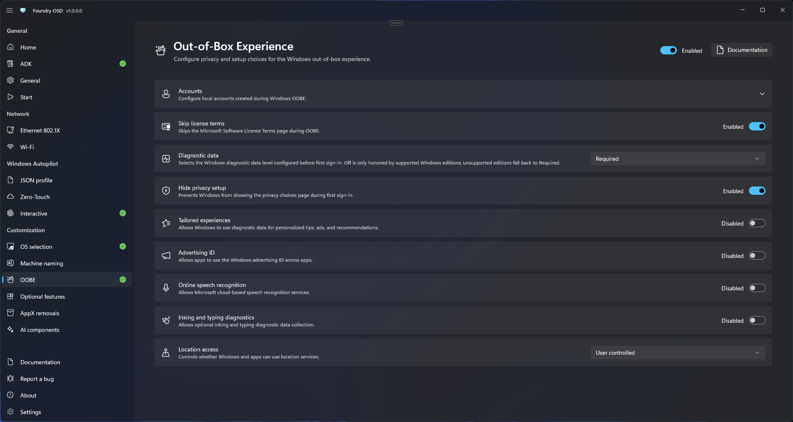

# Out-of-box experience

Use OOBE settings to control the Windows out-of-box experience after deployment.

## Configure OOBE behavior

1. Open **Customization > OOBE**.
2. Review each available OOBE option.
3. Enable only settings approved by the organization.
4. Return to **Start** and confirm customization readiness.

<figure>
  
  <figcaption>Select the OOBE behavior approved for the deployment standard.</figcaption>
</figure>

Test the result with the same Windows edition and provisioning method used in production. Windows release changes can alter OOBE behavior.

## Configure local accounts

Foundry can prepare local accounts as part of the unattended Windows setup. Built-in Administrator settings remain available with Windows Autopilot. Foundry blocks combining additional local accounts with Autopilot because its current unattend provisioning method skips account creation and hides online account screens, which can interfere with enrollment. This is a Foundry compatibility restriction, not a general Windows prohibition on local accounts.

When Autopilot is enabled, remove any configured additional accounts or disable Autopilot before creating media. Existing accounts remain editable and removable. Validate Administrator activation and the complete enrollment flow with your organization's Autopilot profile before production deployment.

### Built-in Administrator

Enable **Built-in Administrator** to activate the Windows built-in Administrator account. The **Set a password** option is enabled by default when the account is activated.

- Keep **Set a password** enabled and enter the same value in both fields to assign a predefined password.
- Turn **Set a password** off to assign an intentional blank password. Turning it off clears any password entered during the current session.

Foundry enables this account during the Windows `specialize` phase using a PowerShell command embedded in `unattend.xml`. The command identifies the account by its SID ending in `-500`, so it works regardless of the Windows display language or account name. Windows applies its configured password through `UserAccounts/AdministratorPassword` during `oobeSystem`.


A blank Administrator password provides substantially less protection. Use it only when the deployment standard explicitly requires it and the device is secured by other controls.


### Additional local accounts

Select **Add account** for each additional local account required on the device, then configure:

- A unique Windows local username.
- The account type: **Standard user** or **Administrator**.
- Whether to set a predefined password. **Set a password** is enabled by default for new accounts; turn it off to assign an intentional blank password.

Edit or remove an account from the account list before creating the deployment media.

Windows unattend account names cannot exceed 256 characters or contain `/`, `\`, `[`, `]`, `:`, `|`, `<`, `>`, `+`, `=`, `;`, `,`, `?`, `*`, `%`, or `@`. Foundry also rejects quotation marks, trailing periods or spaces, duplicate names, and reserved names such as `NONE` and the built-in Windows accounts. See the [Microsoft unattend username reference](https://learn.microsoft.com/en-us/windows-hardware/customize/desktop/unattend/microsoft-windows-shell-setup-useraccounts-localaccounts-localaccount-name).


If you configure only Standard accounts and leave built-in Administrator disabled, a clean installation may have no enabled administrator account. Foundry displays a non-blocking warning: enable built-in Administrator, add an Administrator account, or ensure another administration method is available.


## Account creation during OOBE

When at least one additional local account is configured, Foundry automatically skips the OOBE account-creation flow. The indicator is read-only because this is a consequence of creating accounts through `UserAccounts/LocalAccounts` in the answer file, not a requirement of every account-provisioning method. Foundry also hides online account screens in this configuration. See [Microsoft's description of the account-creation behavior](https://learn.microsoft.com/en-us/windows-hardware/customize/desktop/unattend/microsoft-windows-shell-setup-autologon).

Enabling only the built-in Administrator account does not guarantee that Windows client OOBE will skip account creation. In that configuration, Windows may still show its normal account-creation experience.

Foundry does not configure AutoLogon and does not request account passwords during deployment. It does not force every OOBE flow to end at the sign-in screen: Windows may proceed to the desktop when a user completes an interactive OOBE sign-in. See [Microsoft's OOBE sign-in walkthrough](https://learn.microsoft.com/en-us/entra/identity/devices/device-join-out-of-box).

## Password protection

Non-empty local account passwords require [Protected deployment](../general.md#protected-deployment). This is a Foundry security requirement, not a Windows Setup requirement. Foundry keeps authoring passwords only for the current session and encrypts them in the deployment configuration written to the media.

During deployment, Foundry decrypts the passwords for Windows Setup and writes them to `unattend.xml` using reversible encoding with `PlainText=false`. This hides the values but does not encrypt them. Treat answer files and their copies as sensitive data; media protection does not provide end-to-end encryption of the Windows Setup answer file. See [Microsoft's guidance on hidden answer-file passwords](https://learn.microsoft.com/en-us/windows-hardware/customize/desktop/wsim/hide-sensitive-data-in-an-answer-file).

If a predefined account password is enabled while Protected deployment is disabled, Foundry blocks media creation and marks both **OOBE** and **Password protection** as needing attention. Enable Protected deployment and configure its technician password, or turn off the predefined account password to use an intentional blank password.

Foundry saves whether each account requires a predefined password, but it never saves the password itself in the authoring configuration. After restarting Foundry OSD, re-enter and confirm every required account password before creating deployment media. Foundry marks the OOBE configuration as needing attention until those passwords are available again.

The **Accounts** header shows **Needs attention** even when collapsed if an account setting is invalid, a required password is missing, or deployment protection is required. Autopilot only causes this attention indicator when additional local accounts are also configured. The Standard-only warning is advisory and does not block media creation.

Blank passwords do not require Protected deployment because no password secret is stored. Apply the organization's password and device-access policies before using this option.
