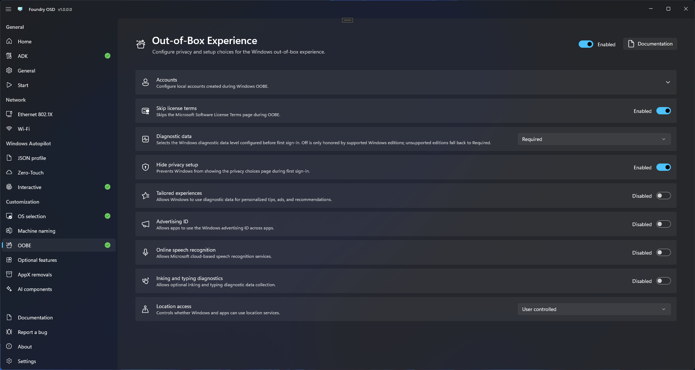

# OOBE

**OOBE** sets what Windows asks during its first-run setup, the out-of-box experience: the license terms page, the privacy choices, and the local accounts Foundry creates. In the app, the page is titled **Out-of-Box Experience**.

<figure>
  
  <figcaption>The eight setup and privacy options with their default values. Local accounts are in the Accounts section, collapsed here.</figcaption>
</figure>

## Configure OOBE

1. Open **Customization > OOBE** and turn the switch at the top right to **Enabled**.
2. Set the setup and privacy options below.
3. Expand **Accounts** to add local accounts. See [Local accounts](#local-accounts).
4. Create or update the deployment media.

| Option | Default | Effect on the deployed Windows |
| --- | --- | --- |
| **Skip license terms** | **Enabled** | Windows does not show the Microsoft Software License Terms page. |
| **Diagnostic data** | **Required** | Sets the diagnostic data level to **Required**, **Optional** or **Off**. **Off** is honored only by the Windows editions that support it; the others fall back to **Required**. |
| **Hide privacy setup** | **Enabled** | Windows does not show the privacy choices page at the first sign-in. |
| **Tailored experiences** | **Disabled** | When **Disabled**, Windows does not use diagnostic data for personalized tips, ads and recommendations. |
| **Advertising ID** | **Disabled** | When **Disabled**, apps cannot use the Windows advertising ID. |
| **Online speech recognition** | **Disabled** | When **Disabled**, Microsoft cloud-based speech recognition is turned off. |
| **Inking and typing diagnostics** | **Disabled** | When **Disabled**, optional inking and typing diagnostic data is not collected. |
| **Location access** | **User controlled** | **User controlled** leaves location to the user. **Force off** denies location access to apps. |

Foundry Deploy writes these choices into the installed Windows in Windows PE, in the **Configure Windows setup** step. The privacy choices are written as policies: a Group Policy or Intune setting applied later replaces them.

## Local accounts

Expand **Accounts** on the page.

- **Built-in Administrator account** (**Disabled** by default) enables the Windows built-in Administrator account.
- **Additional local accounts**: select **Add account**, then enter the **Username** and choose the **Account type**, **Standard** or **Administrator**. Use **Edit** and **Remove** on an account row to change it.

Each account has a **Set a password** switch, **Enabled** by default. Leave it on and enter the password twice, or turn it off to give the account a blank password. Avoid a blank password on an administrator account.

A username has at most 256 characters, cannot contain `" / \ [ ] : ; | = , + * ? < > % @`, cannot end with a period or a space, and must be unique. The names `Administrator`, `DefaultAccount`, `Guest`, `HelpAssistant`, `NONE`, `WDAGUtilityAccount` and `WSIAccount` are reserved.

### What Windows does with the accounts

- **With at least one additional account**, Windows skips its account creation pages and the online account pages. The read-only row **Skip account creation during OOBE** shows this.
- **With only the built-in Administrator account**, Windows still shows its own account creation pages.
- Foundry does not configure automatic sign-in.

If every account is **Standard** and the built-in Administrator account is **Disabled**, the page warns: "Only standard accounts are configured. Ensure another administrator account or management method is available." The warning does not block media creation.

### Password protection

- **A predefined password needs a Deployment password.** Turn on [Password protection](../general.md#password-protection) on **General**. Without it, the **Accounts** section and **Start** show **Needs attention** and Foundry OSD cannot create media. A blank password does not need it.
- **Passwords are saved with the configuration** when **Remember passwords** is on, which is the default. When it is off, enter them again each time you start Foundry OSD. See [Settings backup and sync](../deployment-profiles.md).
- **On the device**, Windows Setup receives the password in its answer file, hidden but not encrypted. Treat copies of that file as sensitive. See [Security and credentials](../../reference/security-and-credentials.md).

## Limits

- **A custom answer file replaces this whole page.** When the technician selects one, Foundry applies none of the options above, including the local accounts. See [What a custom answer file overrides](unattend.md#what-a-custom-answer-file-overrides).
- **Windows Autopilot and additional local accounts exclude each other.** The page shows "Autopilot cannot be combined with additional local accounts." and **Add account** is unavailable. Existing accounts can still be edited or removed: remove them or turn Autopilot off. The built-in Administrator account stays available with Autopilot.

## Related

- [Password protection](../general.md#password-protection)
- [Unattend](unattend.md)
- [Review and deploy](../../foundry-deploy/review-and-deploy.md)
- [Troubleshooting: Windows deployment](../../troubleshooting/deployment.md)
