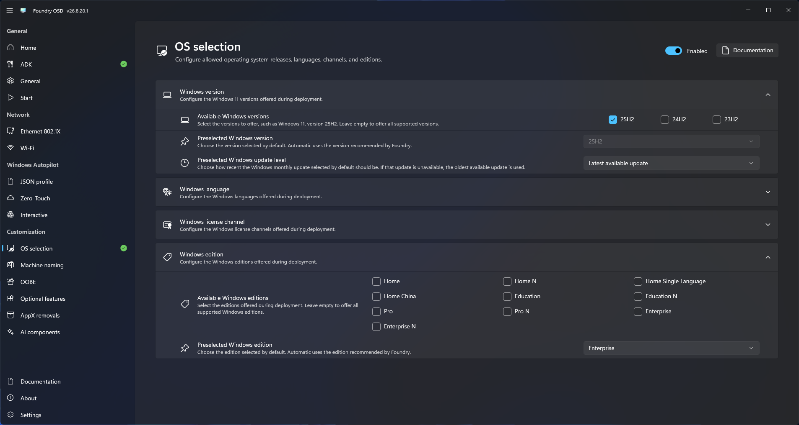

# Operating system

Use Operating system selection to control which Windows choices are available during deployment.

## Configure available Windows options

1. Open **Customization > OS selection**.
2. Select the Windows releases, languages, license channels, editions, and default media preference allowed by the deployment standard.
3. Review the resulting selection. Changes are saved automatically.
4. Return to **Start**.

<figure>
  
  <figcaption>Define the Windows choices available to the deployment technician.</figcaption>
</figure>

Foundry Deploy obtains available media from the configured catalog and presents compatible combinations to the technician.


**Unreleased: Windows 11 26H2 selection**

The next Foundry release supports Windows 11 24H2, 25H2, and 26H2, with 26H2 as the default. Review older profiles that allow only unavailable releases and select the releases intended for new deployments.

If at least one allowed release remains available for the deployment architecture, Deploy keeps that restriction. If none remains available, Deploy automatically offers the supported releases available for that architecture. This release fallback does not change language, edition, or license-channel policy. Review the final selection before deployment.


See [Catalogs](../../reference/catalog.md) for field definitions and [Select Windows](../../foundry-deploy/operating-system.md) for the runtime workflow.

## Custom Windows images

The settings on this page constrain catalog selection. Use [Custom Windows images](custom-windows-images.md) to import your own WIMs and choose custom image defaults independently. Catalog restrictions do not filter custom WIM indexes.
