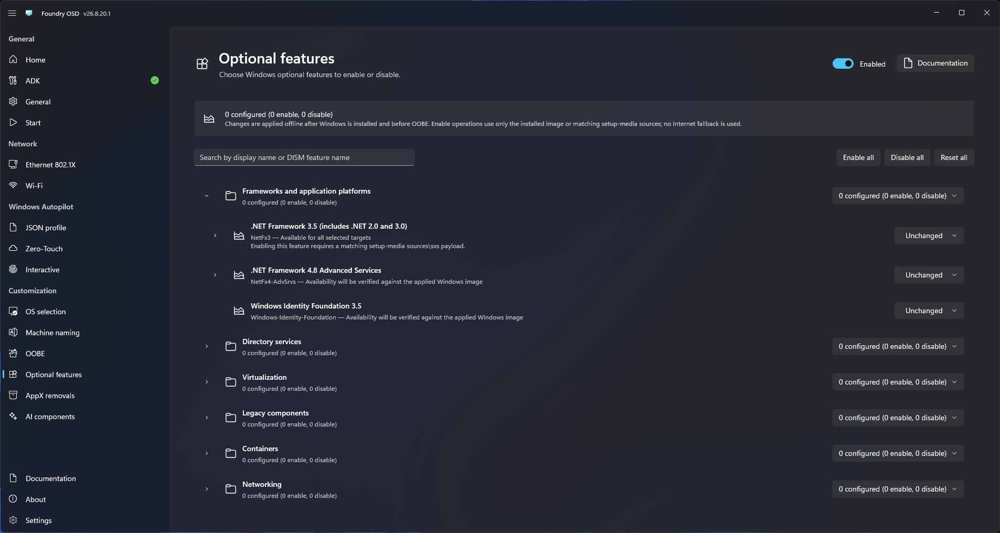

# Optional features

Use Optional features to enable or disable supported Windows optional features during deployment.

## Select features

1. Open **Customization > Windows Optional Features**.
2. Enable optional-feature customization.
3. Select the required feature actions.
4. Review the compatibility details shown by Foundry OSD. Validate features marked partially available, unavailable, or requiring runtime verification against the target Windows image.
5. Return to **Start**.

<figure>
  
  <figcaption>Select optional-feature actions and review their compatibility status.</figcaption>
</figure>

Feature availability depends on the selected Windows release and edition. Validate the deployed state before using the media broadly.
