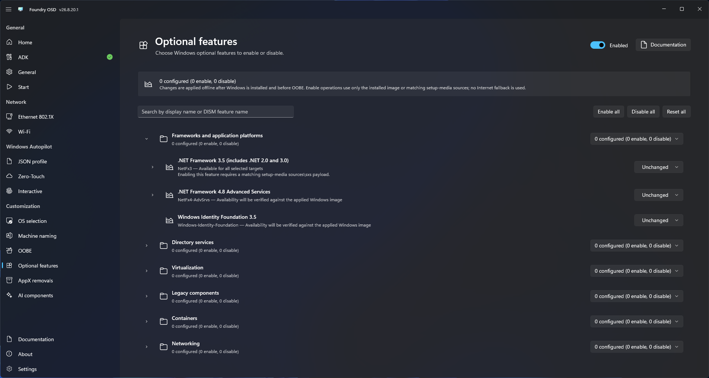

# Optional features

**Optional features** turns Windows optional features on or off in the deployed Windows, for example .NET Framework 3.5, Hyper-V or Windows Sandbox. A feature you do not set stays as the Windows image has it.

<figure>
  
  <figcaption>Each feature has a state menu. The line under its name gives the DISM feature name, its availability and any warning.</figcaption>
</figure>

## Configure features

1. Open **Customization > Optional features** and turn the switch at the top right to **Enabled**.
2. Find the feature. Expand a category, or type in the search box: it matches the display name or the DISM feature name, such as `NetFx3`.
3. Read the line under the feature name. It gives the availability and warnings such as "Requires compatible virtualization hardware and firmware settings."
4. Open the menu on the feature's row and choose a state.
5. Create or update the deployment media.

| State | Effect on the deployed Windows |
| --- | --- |
| **Unchanged** (default) | Foundry does not touch the feature. |
| **Enable** | Foundry turns the feature on. |
| **Disable** | Foundry turns the feature off. |

A state applies to the feature and to all its sub-features. Choosing **Enable** on a sub-feature whose parent is set to **Disable** resets the parent to **Unchanged**.

The page lists 131 features in 19 categories. The card at the top counts your choices, for example "3 configured (2 enable, 1 disable)".

To change several features at once:

- **Enable all**, **Disable all** and **Reset all** act on every feature listed and on their sub-features. With a search active, they act on the search results only. **Reset all** returns the features to **Unchanged**.
- The menu on a category row offers **Enable visible items**, **Disable visible items** and **Reset visible items** for that category.
- When a button changes 10 features or more, Foundry OSD asks "This will update \<number> affected features, including descendants. Do you want to continue?"

Availability labels

The label compares the feature with the versions and editions ticked on [OS selection](operating-system.md), or with all supported ones when that page is off.

| Label | Meaning |
| --- | --- |
| **Available for all selected targets** | Every ticked version and edition has the feature. |
| **Available for some selected targets** | Only some of them have it. |
| **Not available for the selected targets** | None of them has it. |
| **Availability will be verified against the applied Windows image** | Foundry OSD cannot tell in advance. Foundry Deploy checks on the device. |

The labels describe catalog images. Foundry does not evaluate them for a custom Windows image.

## What happens on the device

Foundry Deploy applies the changes in Windows PE, in the **Configure Windows features** step, after Windows is applied to the disk. It works offline. The page says so: "Enable operations use only the installed image or matching setup-media sources; no Internet fallback is used."

| Situation in the applied Windows | Result |
| --- | --- |
| The feature is already in the state you asked for | Nothing to do. Counted as "already satisfied". |
| **Enable**, and the image does not know the feature | The feature is skipped and the deployment continues. Counted as "unavailable". |
| **Disable**, and the image does not know the feature | Counted as "already satisfied". |
| **Enable**, and the image knows the feature but no longer contains its files | The deployment stops, except for the .NET Framework 3.5 features below. |

The step ends with "Windows optional features configured (\<number> changed, \<number> already satisfied, \<number> unavailable)." An "unavailable" count above zero means a feature you asked for was not turned on, although the deployment succeeded. The Foundry Deploy log then contains "Skipped \<number> unavailable Windows optional feature enable action(s)." When no feature needed a change, the **Steps** list marks the step as skipped, and pointing at it shows the same line with 0 changed.

## Limits

- **No download.** A feature whose files are not in the Windows image cannot be turned on. Add it after deployment, with Internet access.
- **.NET Framework 3.5 needs a catalog image.** Five features carry the line "Enabling this feature requires a matching setup-media sources\sxs payload.": **.NET Framework 3.5 (includes .NET 2.0 and 3.0)**, its two **Windows Communication Foundation** activation features, **.NET Extensibility 3.5** and **ASP.NET 3.5**. Foundry Deploy takes their files from the Windows image it downloads from the Foundry catalog.
- **Recall.** The **Recall** feature adds or removes the Windows component. **Disable Windows Recall by policy** on [AI components](ai-components.md) is a separate setting.
- **Windows Subsystem for Linux.** The feature installs the Windows component only, not a Linux distribution.


**.NET Framework 3.5 and custom Windows images**

A [custom Windows image](custom-windows-images.md) does not carry the files these five features need. If one of them is set to **Enable** and is not already on in the image, the deployment stops at **Configure Windows features**, after the disk has been erased, with "Setup-media image '\<path>' must contain exactly one image named 'Windows Setup Media'." Turn the feature on inside the image before you capture it, or leave it **Unchanged**.


## Related

- [OS selection](operating-system.md)
- [Custom Windows images](custom-windows-images.md)
- [Review and deploy](../../foundry-deploy/review-and-deploy.md)
- [Troubleshooting: Windows deployment](../../troubleshooting/deployment.md)
