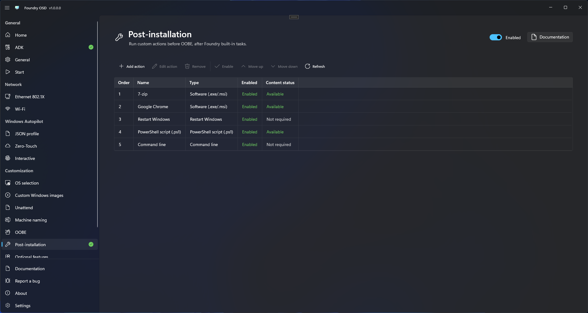
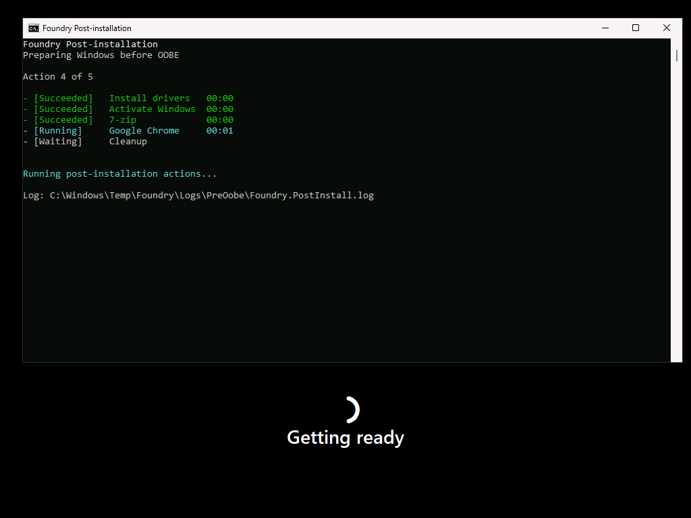

# Post-installation

Use **Customization > Post-installation** to run your own scripts, commands and application installers after Windows installation and before OOBE. The separate [OOBE page](oobe.md) configures the Windows first-run experience.

Foundry runs selected built-in tasks first, then your enabled actions in the order shown, followed by cleanup. Built-in tasks cannot be moved or deleted from the custom action list. The interactive Autopilot registration assistant runs separately during OOBE.

To add Windows, driver or BIOS updates, provide your own script or vendor package as a custom action.

<figure>
  
  <figcaption>Manage custom actions and their execution order from the Post-installation page.</figcaption>
</figure>

## Add and order actions

1. Enable the page using its header switch.
2. Select **Add action** in the CommandBar and choose **PowerShell script (.ps1)**, **Command line**, **Software (.exe/.msi)** or **Restart Windows**.
3. Give the action a recognizable name. For scripts and applications, import a file or a folder containing all required files.
4. Select the script or installer and enter its arguments. For **Command line**, enter the complete command; imported content is optional. Leave **Working directory** empty to use the imported content folder.
5. Review the execution settings and **Command preview**, then select **Save**. For **Restart Windows**, set the delay in seconds; `0` restarts immediately.
6. Select a row and use **Move up**, **Move down**, **Edit action**, **Enable/Disable** or **Remove**.
7. Resolve missing-content or validation messages before creating media.

When the page is enabled, add at least one enabled action and resolve any validation or missing-content messages before creating media. Restart actions and commands without imported files do not need package content.

Disabling the page keeps your configuration but excludes custom actions from newly created media. Selected built-in tasks still run.

Removing an action deletes its cached content only when no remaining action or saved local profile uses it. Original source files are never deleted. If cached files cannot be removed, Foundry reports the problem.

To update a package, edit its action and import the changed source again. **Refresh** checks cached content availability; it does not import changes from the original source folder.

| Action | Configuration |
| --- | --- |
| PowerShell script (.ps1) | A `.ps1` file and optional sibling content, executed by Windows PowerShell 5.1. You supply host arguments and script arguments separately. |
| Command line | A command interpreted by `cmd.exe`; optionally import files it needs. |
| Software (.exe/.msi) | An EXE or MSI with your arguments, properties or transforms. Foundry supplies only the executable path or `msiexec.exe /i` launch command, plus optional MSI logging. Installer type is detected from the selected file and is read-only. |
| Restart Windows | An explicit restart at this position, optionally preceded by a countdown, followed by resumption at the next action. No process arguments or timeout. |

## Execution order

After the first boot into installed Windows, Foundry runs the following before OOBE. Only tasks required by the deployment configuration are included.

| Order | Task |
| --- | --- |
| 1 | Install deferred driver packages, such as supported Lenovo EXE and Surface MSI packages. Drivers injected offline are already installed during deployment. |
| 2 | Import configured certificates and wired/Wi-Fi profiles. |
| 3 | Domain Join (unreleased): join and independently place the computer account, perform a controlled restart when required, then verify local membership without credentials. |
| 4 | Remove selected Copilot and AI Hub application packages. Other AI settings may already have been applied during deployment. |
| 5 | Remove the selected provisioned AppX packages. |
| 6 | Attempt OEM activation when eligible. This is skipped for custom answer files and volume-licensed deployments. |
| 7 | Run your enabled custom actions in the order shown, including any Restart Windows actions. |
| 8 | Perform cleanup of temporary deployment content, retaining execution results and logs. |

Required restarts can occur during this sequence. A planned restart resumes the remaining work; any deferred restart is handled before final cleanup. The interactive Autopilot assistant remains separate and appears during OOBE when configured.

The unreleased [Domain Join workflow](../domain-join/README.md) runs when active even without custom actions. Successful joining still restarts and verifies when OU placement fails. [Local membership and placement](../../troubleshooting/domain-join.md) are independent outcomes.

## Prepare content

Import a complete folder when the installer needs transforms, CAB files, configuration, scripts or other binaries. Preserve their relative paths. A single-file import includes only that file.

For example:

```text
ExampleApplication/
  ExampleApplication.msi
  Organization.mst
  Data1.cab
```

Create a **Software (.exe/.msi)** action, import that folder, choose `ExampleApplication.msi`, verify the detected **MSI** type, and add the property `TRANSFORMS="Organization.mst"` if that transform is supported by the package. Keep the working directory empty to use the content root. Supply any required silent installation and no-restart options yourself, for example `/qn /norestart` for an MSI. Foundry does not add or enforce these switches. Enable **Generate installation log** to append `/l*v "{LogRoot}\ExampleApplication.log"`. This option is off by default and available only for MSI installers; EXE logging arguments depend on the vendor.

An example sequence is:

1. A PowerShell action that performs your prerequisite configuration.
2. The application action above.
3. A Restart action.
4. A Command line action that performs your final machine configuration.

Packages must be suitable for unattended machine installation. EXE silent and no-reboot options depend on the vendor; Foundry cannot infer them. Installers must wait for their work to complete and return a meaningful exit code. Do not launch an independent background installer and immediately report success.

You are responsible for choosing scripts and installers compatible with the target Windows architecture. Choose content suitable for every device that will use this configuration.

Actions using identical imported content share a working copy on the target. File changes made by an earlier action remain visible to later actions, including after planned restarts. They do not change the authoring cache.

Imported content is temporary and is removed from the target during cleanup. If an application needs source files for repair or later updates, provide a permanent source as part of your package.

## Arguments and installer logs

Review **Command preview** before saving. Foundry preserves your arguments without adding quiet mode, profile suppression, execution-policy overrides or restart suppression. You are responsible for valid arguments, unattended execution and preventing installer-owned restarts.

- **PowerShell arguments** go before `-File "<script>"`; **Script arguments** go after it. For example, enter `-NoProfile -ExecutionPolicy Bypass` in the first field only if your script requires those host options.
- **Command line** supplies the complete command to `cmd.exe /c`. Include its arguments in the same field.
- **Software (.exe/.msi)** appends your arguments to the selected executable or `msiexec.exe /i "<installer>"`.

For **Command line**, **Package content (optional)** accepts any file type needed by that command. For example, import `settings.reg` and enter `reg import settings.reg`. Importing content alone does not run it. Importing a single `.cmd` or `.bat` file fills an empty command field with the filename, without adding quotes; an existing command is never overwritten. Review the command and add any required arguments or quoting before saving. Leave **Working directory** empty to run from the imported content folder.

Commands and argument fields must each contain a single line. Use a script file for multiple commands. `{ContentRoot}` and `{LogRoot}` in the preview stand for paths selected during deployment; they are not variables that Foundry expands in your arguments. Use paths relative to the configured working directory when referencing imported files.

**Generate installation log** adds MSI verbose logging using the installer name, for example `ExampleApplication.log`. Each action has its own log folder. Leave the checkbox off if you supply your own logging arguments. Foundry records script and command output regardless of this option; see [PostInstall diagnostics](../../troubleshooting/logs-and-support.md#postinstall-diagnostics).

## Execution and error policy

Actions run as SYSTEM during Windows setup. There is no signed-in user profile, guaranteed mapped drive or interactive desktop. Scripts requiring PowerShell 7 must arrange their own supported execution environment; Foundry uses Windows PowerShell 5.1 for PowerShell actions.

The default timeout is 1,800 seconds; the supported range is 1–86,400 seconds. Success defaults to exit code `0`. Applications also recognize `3010` as success requiring a controlled restart. Scripts and commands recognize additional restart codes only when you configure them. Success and restart lists must not overlap.

PowerShell scripts must return a failure explicitly when appropriate. Non-terminating PowerShell errors and failed native commands do not always become a failed process exit code automatically.

**Continue on error** is disabled by default: a failure stops later actions and prevents a successful handoff to OOBE. Enabling it permits later actions after an ordinary, fully observed failure, recording the sequence as completed with errors. It does not allow execution to continue when Foundry cannot determine whether an action finished safely, or after an installer-owned restart.

Unreleased Domain Join has a specific warning-and-continue policy for join, placement, controlled domain interruption and domain-only credential-cleanup failures. Uncertain join/move mutations are never automatically repeated. Unrelated uncertain actions, journal integrity and other sensitive-cleanup failures retain their stop policy. Review [domain results and pending cleanup](../../troubleshooting/domain-join.md) before handoff.

Keep secrets out of command arguments and normal output. Profile encryption does not make arbitrary script output or installer logs safe to share.

## Restarts and interrupted deployments

Use a Restart action or an installer restart-required code. Suppress installer-owned restarts. Foundry saves progress and resumes the remaining work after Windows restarts.

By default, a recognized restart-required result triggers a restart before the next action. **Defer restart** waits until the next explicit Restart or the end of the sequence. An explicit Restart runs even when no installer has requested one.

For an explicit Restart action, **Restart delay (seconds)** accepts `0` to `86400`. The default `0` adds no delay. A positive value shows a live countdown after progress has been saved. This setting does not change restarts requested by installers or built-in tasks.

Installer exit code `1641` means the installer initiated its own restart. Foundry stops the sequence in this case; configure the installer to let Foundry manage restarts instead.

After a planned restart, Foundry resumes from its saved progress. If power is lost while an action is running, Foundry does not automatically retry that action. Missing or damaged execution records also stop the sequence. Inspect the results and logs before deciding whether to redeploy; scripts and installers are not necessarily safe to repeat.

For unreleased domain operations, validated recovery can warn and continue without replaying joining or placement, with a conservative controlled restart when mutation may remain active. An earlier **Unknown** remains Unknown after read-only membership confirmation. Domain-only cleanup can remain Pending through finalization; see [domain recovery guidance](../../troubleshooting/domain-join.md#interrupted-work-or-restart-is-pending).

If an interrupted process might still be using files, Foundry retains them and reports cleanup as pending. This does not retry the interrupted action.

## Follow progress in Windows Setup

The **Foundry Post-installation** console shows the current action, progress, status and elapsed time. Colors distinguish running, successful and failed actions. Warnings and restart countdowns appear in yellow.

<figure>
  
  <figcaption>Follow the current action, completed results and elapsed times in the Post-installation console. Use the displayed log path to investigate an action.</figcaption>
</figure>

Like Bootstrap, the console uses English messages. Your custom action names appear as entered; the Foundry OSD configuration page remains translated. Script output and full command lines are not displayed in the progress screen; use the action logs for troubleshooting.

After a planned restart, the console restores completed results and indicates that execution is resuming. After success or completion with warnings, the final results remain visible for 10 seconds with a **Continuing Windows Setup** countdown. Windows Setup then continues and manages any remaining setup restarts. This final pause is separate from an explicit Restart action's delay.

## Cache, profiles and deployment media

Foundry keeps imported scripts and packages in a local library. [Profiles](../deployment-profiles.md) share action settings, but do not include those files. On another PC, import the same files and folder structure to restore missing content.

Required packages are included on the generated USB or ISO, outside `boot.wim`. Keep the complete media available until deployment finishes. A PXE boot image alone is insufficient; see [PXE deployment](../media/pxe-deployment.md#post-installation-content).

[Bootstrap](../../reference/bootstrap.md#postinstall-preparation) prepares PostInstall automatically at startup. No separate installation or manual runtime selection is needed. Standard release media requires Internet access for this step, even with a previous download in the cache.

Foundry copies the required files to Windows before the first boot. Your scripts may still need network access or other resources when they run.

## Custom answer files

Foundry automatically integrates Post-installation into the deployment copy of your [custom answer file](unattend.md) when needed. The imported original and your custom settings and command order are preserved. No manual launch command is required.

Custom answer files are an advanced option: you remain responsible for their settings and commands. Resolve reported conflicts and test the complete deployment. After editing a source file, use **Refresh source** on the Unattend page before rebuilding media.

## Verify and troubleshoot

Successful WinPE staging is not proof of successful post-installation. Follow [Verify deployment](../../foundry-deploy/verify-deployment.md) through first boot, any planned restarts and OOBE.

If an action fails, review the log path shown in the console and collect the [PostInstall diagnostics](../../troubleshooting/logs-and-support.md#postinstall-diagnostics) from the target PC. These logs are not included in Foundry OSD's diagnostic export. Remove sensitive information before sharing them.
