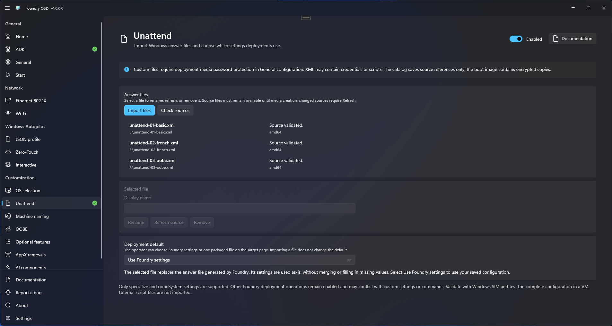

# Custom answer files (Unattend)

Embed one or more Windows answer files in the boot image, then let the technician choose one in Foundry Deploy. Windows uses the selected file in place of the answer file generated by Foundry. Foundry preserves its contents without merging files, adding settings, or filling in missing values.

## Prepare the files

Use answer files written for the Windows architecture, edition, and version you deploy. You can use Windows answer-file settings available in the supported `specialize` and `oobeSystem` passes, subject to the compatibility restrictions below. The file's scope is not limited to the options exposed in Foundry's interface.

Foundry applies the Windows image with DISM. Nonempty `windowsPE`, `offlineServicing`, `generalize`, `auditSystem`, and `auditUser` sections, root-level `servicing` instructions, and explicit audit-mode resealing are rejected. A complete Windows Setup `Autounattend.xml` may need to be adapted before import. Foundry does not silently remove unsupported sections.

Each file must be no larger than 4 MiB. DTDs and external entity resolution are prohibited. Foundry preserves the original XML bytes, encoding, and extension content. It does not convert architecture-specific components or install language resources requested by the file.

Validate the answer file with Windows System Image Manager for the target Windows image, then test a complete deployment in a representative VM. Import validation alone cannot establish that every Windows setting or custom command will work.

## Import and build media

1. Open **Customization > Unattend** in Foundry OSD and enable the feature using the switch in the page header. Its controls remain disabled while the feature is off. The documentation button beside the switch opens this guide.
2. Import one or more XML files. Review the validation results and give each file a recognizable display label.
3. Choose a default file, or keep **Use Foundry settings** as the default.
4. Enable [Protected deployment](../general.md#protected-deployment) and enter the media password. Protection is required for every custom file, even one that appears to contain no credentials.
5. Return to **Start**, resolve readiness errors, and [create deployment media](../media/README.md).

<figure>
  
  <figcaption>Unattend enabled with three validated answer files and Use Foundry settings as the deployment default. Select a file to enable its editing controls.</figcaption>
</figure>

Saved Foundry configurations contain source paths and content fingerprints, not the XML. Keep the original files accessible until media creation finishes. Built media contains encrypted copies and no longer needs those sources.

**Import files** and **Check sources** apply to the catalog and appear above the file list. Select a file to use **Rename**, **Refresh source**, or **Remove** in the **Selected file** section below the list. Its **Display name** field edits the label shown to the technician.

| Action | Scope | Effect |
| --- | --- | --- |
| **Check sources** | All imported files | Rechecks availability and validity against the saved fingerprints. It does not accept changed XML. |
| **Refresh source** | Selected file | Reimports and validates its current XML, then accepts the changes while retaining its display name and any deployment default pointing to it. |

For example, after editing an imported XML file, **Check sources** reports that its contents changed. Use **Refresh source** for that file to accept the edit before rebuilding media. A missing or changed source blocks media creation until corrected. Duplicate content is kept as one catalog entry.

You can rename display labels, remove files, and change the default. Disabling the feature retains the authoring catalog but excludes its files from newly generated media. Keep native Foundry settings valid because technicians can still select **Use Foundry settings**.

## Select a file during deployment

Unlock the media, then choose an **Answer file** on [Target](../../foundry-deploy/target.md#select-a-custom-answer-file). Review the active choice and compatibility messages in the deployment summary and confirmation.

Select a custom file to use its settings as-is. Select **Use Foundry settings** to use the configuration prepared in Foundry. A missing default or an invalid selected file blocks deployment; Foundry never silently substitutes another choice.

Foundry validates and retains the selected file before preparing the target disk. After applying Windows, it writes those exact bytes to `Windows\Panther\unattend.xml` on the target. Automatic discovery at a USB drive's root and runtime file browsing are not included; import files while preparing media.

## Precedence and compatibility

| Configuration area | When a custom file is selected |
| --- | --- |
| Windows answer-file configuration | The custom file replaces the Foundry-generated file in full. Its scope includes Windows settings supported by the target image and the allowed passes, beyond the options available in Foundry. |
| Foundry computer name, time zone, and OOBE settings | Are not applied, including Foundry's OOBE privacy policies and local account settings. Configure the required behavior in the custom file. |
| Settings omitted from the file | Foundry does not add them. Windows or image defaults remain where applicable. |
| Other Foundry deployment operations | Remain enabled according to the media configuration. Custom settings or commands can conflict with their effects. |
| Autopilot JSON profile or interactive registration | Known incompatible settings block deployment. Use a compatible file or change the authored Autopilot configuration. |
| Hardware hash upload from WinPE | Registration can continue. A successful upload does not guarantee Autopilot enrollment. |

A custom file does not disable every other Foundry feature. Test the file together with all enabled deployment options; do not assume arbitrary conflicts will be detected or resolved automatically.

Foundry detects known XML conflicts but cannot predict arbitrary scripts. Arrange access to scripts referenced by the file; importing XML does not bundle those external files or execute its commands in WinPE.

Some Foundry customizations depend on `SetupComplete.cmd`. Custom commands that replace setup hooks, reboot at the wrong time, or change enrollment and package state can disrupt them. Product-key and edition restrictions can also affect setup hooks. For dependent first-logon actions, use a single script that controls sequencing. Test the whole combination before production use.

## Protect sensitive content

The complete custom file is encrypted on deployment media using the existing Protected deployment key. Protection does not extend to the original source file or the decrypted copy Windows needs on the target.

Treat Panther answer files and their copies as sensitive. Windows password hiding is reversible, and custom commands or extensions can contain secrets that Windows will not automatically remove. Do not attach raw XML to support reports.

Do not remove the target answer file before `oobeSystem` has consumed it. Arrange cleanup after the required setup passes through your deployment process. Foundry preserves the file and does not insert a cleanup command. Follow the wider [security and credential guidance](../../reference/security-and-credentials.md).

## Resolve common problems

| Symptom | Action |
| --- | --- |
| Source changed or cannot be read | Restore access, then check sources. If edits were intentional, refresh that file before rebuilding. |
| A network-source check times out | Restore access to the source location and check again, or remove the unavailable entry. |
| Default file is missing from the catalog | In Foundry OSD, choose an available default or **Use Foundry settings**, then rebuild media. An invalid catalog default blocks deployment even if another runtime choice is available. |
| File is incompatible with selected Windows | Use a file with supported components for that architecture and validate it against the target image. |
| Autopilot conflict | Remove the incompatible settings from the source and refresh it, or change Autopilot configuration before rebuilding. |
| Deployment succeeds but Windows setup fails | Inspect Windows setup diagnostics without exposing secrets. Check the file against the selected image and test its commands and setup-hook dependencies. |

After deployment, [verify Windows through first boot and OOBE](../../foundry-deploy/verify-deployment.md). A successful Foundry deployment does not confirm that Windows has consumed every answer-file setting.
