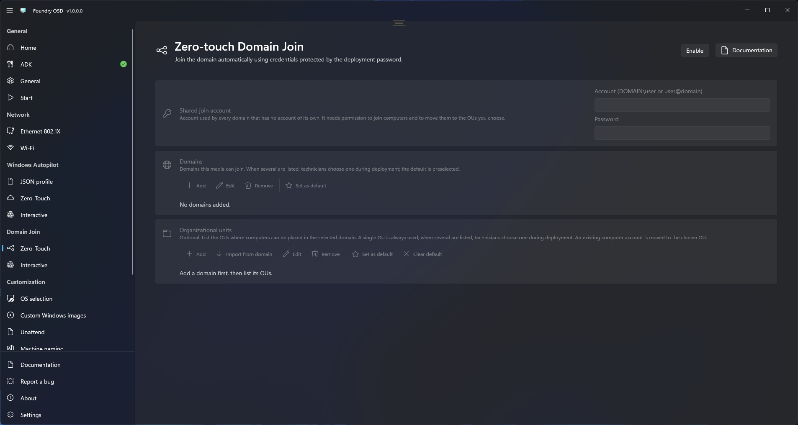

# Domains and OUs

The Zero-touch and Interactive Domain Join pages share two lists: the **Domains** the media can join and, for each domain, the **Organizational units** (OUs) where its computer account can be placed.

<figure>
  
  <figcaption>The Domains and Organizational units cards stay unavailable until you select Enable.</figcaption>
</figure>

## Before you start

- Select **Enable** on **Domain Join > Zero-Touch** or **Domain Join > Interactive**. Both pages edit the same lists.
- Have the DNS name of each domain, such as `corp.contoso.com`, and the distinguished name of each OU: its full path in the directory, such as `OU=Workstations,DC=corp,DC=contoso,DC=com`.

## Configure the domains

1. Under **Domains**, select **Add**.
2. Enter the **Domain name**, then select **Add domain**. A NetBIOS name such as `CONTOSO` is refused. On the Zero-touch Domain Join page the dialog also asks which join account the domain uses.
3. Repeat for each domain. The first one is the default; to change it, select another domain and select **Set as default**.

**Edit** changes the selected domain. **Remove** deletes it with its OUs, and the first remaining domain becomes the default if needed.

## Configure the OUs of a domain

OUs are optional. Without one, the computer account goes to the domain's default location, which is the container your directory assigns to new computer accounts.

1. Under **Domains**, select the domain.
2. Under **Organizational units**, select **Add**, enter a **Display name** of up to 120 characters and the **Distinguished name**, then select **Add OU**.
3. When the domain lists several OUs, select one and select **Set as default** to preselect it for technicians. **Clear default** removes the preselection.

The distinguished name must start with `OU=` and end with the `DC=` parts of the selected domain; a container such as `CN=Computers` is refused. An OU that is already listed is ignored: the dialog closes and nothing is added.

**Edit** changes the display name only, and a later import keeps your name. **Remove** deletes the selected OUs.

## Import OUs from the domain

The search uses your Windows account, not the join account, so it does not prove that the join account may use these OUs.

1. Select the domain under **Domains**.
2. Under **Organizational units**, select **Import from domain**. The button reads **Cancel search** while the search runs.
3. In **Import OUs from the domain**, select the OUs to keep, or use **Select all** and **Clear**. Nothing is selected for you, and OUs already listed are not offered.
4. Select **Add selected OUs**.

The workstation must reach a domain controller of that domain over LDAP (TCP 389), and your Windows account must be allowed to read the directory. The search stops after 60 seconds and returns at most 4,096 OUs; the dialog says when the list is incomplete.

## What the technician sees

The number of entries decides what Foundry Deploy asks on its [Domain Join step](../../foundry-deploy/domain-join.md).

| Domains listed | During deployment |
| --- | --- |
| None (Interactive only) | The technician types the domain name. |
| One | That domain is used and cannot be changed. |
| Several | The technician chooses one. The default is preselected. |

| OUs listed for the domain | During deployment |
| --- | --- |
| None | The domain's default location is used. On interactive media the technician may type an OU instead. |
| One | That OU is always used. |
| Several | The technician chooses one. The default, if you set one, is preselected; otherwise the technician must choose. |

## Existing computer accounts

When a computer account with the same name already exists in the domain, for example on a redeployed device, Foundry reuses it. If an OU applies, the account is moved to that OU; it is never deleted and created again. Without an OU, it stays where it is.

## Limits

- 32 domains, and 1,024 OUs per domain.
- The same domain cannot be listed twice; case and a trailing dot are ignored.
- A domain that lists OUs cannot be renamed. Remove its OUs first, or add the new domain and remove the old one.

## Related

- [Zero-touch Domain Join](zero-touch.md)
- [Interactive Domain Join](interactive.md)
- [Domain Join troubleshooting](../../troubleshooting/domain-join.md)
