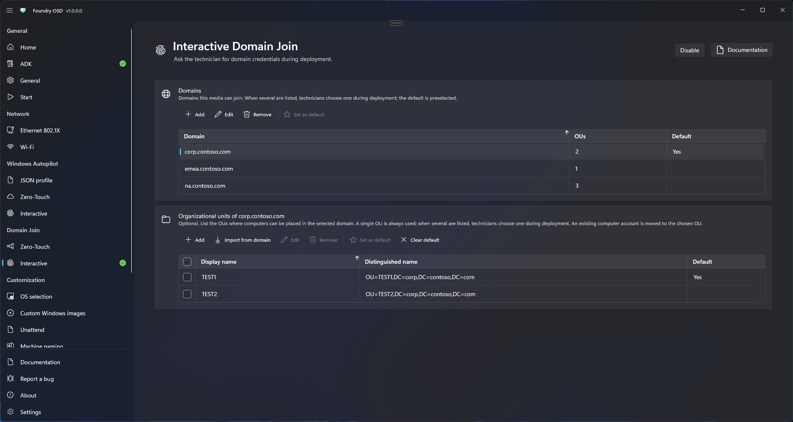

# Interactive Domain Join

Choose this mode when the media must not carry domain credentials: the technician enters a domain account and its password during each deployment.

## Prepare the media

1. Open **Domain Join > Interactive** and choose **Enable**. Confirm the replacement if another Domain Join or Autopilot mode is active.
2. Optionally [list the domains](README.md#list-the-domains) technicians may join. With at least one domain listed, the technician joins one of them and cannot type another; with none, the technician types the domain name during deployment.
3. Optionally [add or import OUs](README.md#list-the-ous-of-a-domain) for each domain. A single OU is always used; with several, technicians choose one and the default is preselected.
4. Resolve the messages shown on the page, then [create or update the media](../media/README.md).

Interactive Domain Join does not need [Password protection](../general.md#password-protection) and writes no join account or password to the media. Accounts and passwords entered on the Zero-touch page stay in your configuration for a later switch back, but are never written to Interactive media. Other options you enable, such as custom answer files, may still require Password protection.

Choose **Disable** to remove the join from new media. Your settings stay available for later.

<figure>
  
  <figcaption>Interactive mode lists domains and OUs only; no account or password is stored.</figcaption>
</figure>

## What the technician does

The Deploy wizard shows a **Domain join** step before **Summary**:

1. **Domain name**: choose it when the media lists several domains. With one listed domain it is shown and cannot be changed; with none, type it.
2. **Account** and **Password**: enter the join account, as `DOMAIN\user` or `user@domain`, and its password. For example, an administrator may supply `CORP\deployment-join` for `corp.example.test`.
3. **Organizational unit**: choose one when the domain lists several; the default, if you set one, is preselected. A domain that lists a single OU uses it without asking. For a domain without listed OUs, **OU distinguished name (optional)** accepts an OU of that domain; leave it empty to use the domain's default location.

Changing the domain replaces the OU choices with those of the new domain and keeps the account and password already typed.


The wizard does not contact the domain, so a mistyped password is not detected at this step. It shows later, in installed Windows, as a failed join.


The technician reviews the domain and the OU in the **Domain join** category of the summary before starting. See [Domain Join during deployment](../../foundry-deploy/domain-join.md) for the full procedure and for how to check the outcome.
