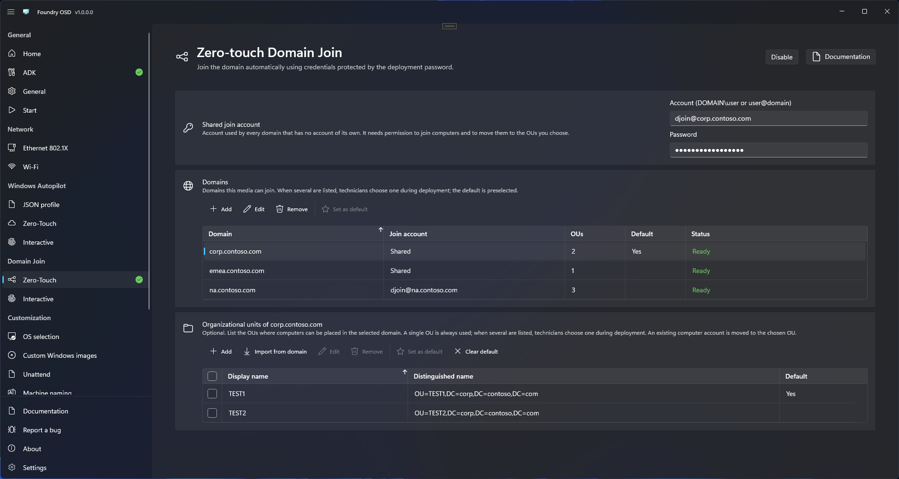

# Zero-touch Domain Join

**Zero-touch Domain Join** stores the join account on the deployment media, encrypted with the Deployment password, so a deployment joins the domain without anyone typing an account.

<figure>
  
  <figcaption>A shared join account, three domains that are Ready, and the OUs of the selected domain.</figcaption>
</figure>

## Before you start

- Turn on [Password protection](../general.md#password-protection) on **General** and set the **Deployment password**. This mode cannot be used without it.
- Get a join account from your Active Directory administrator, written as `DOMAIN\user` or `user@domain`, and its password.
- The device must reach a domain controller when the join runs, after the restart. The Windows edition must not be a Home edition, and each device needs its own computer name.

## Configure

1. Open **Domain Join > Zero-Touch** and select **Enable**. If another Domain Join or Windows Autopilot mode is active, confirm with **Change mode**.
2. Under **Shared join account**, enter the **Account (DOMAIN\user or user@domain)** first, then its **Password**. A password typed before a valid account is not kept.
3. Under **Domains**, select **Add**, enter the **Domain name**, such as `corp.contoso.com`, and select **Add domain**. The domain uses the shared account unless you select **Use a dedicated account** and enter another account and its password. Repeat for each domain.
4. Optional: select a domain, then under **Organizational units** select **Add**, enter a **Display name** and the **Distinguished name** of the OU, such as `OU=Workstations,DC=corp,DC=contoso,DC=com`, and select **Add OU**. **Import from domain** reads the OUs from the directory instead.
5. Check that every domain shows **Ready** in **Status**, and that no message remains under **Shared join account** or under **Domains**.
6. Open **Start** and create or update the media.

**Ready** only covers the account and password of that domain. Missing Password protection is reported under **Shared join account**, and an empty list under **Domains** ("Add at least one domain."): either one blocks media creation even when every domain is **Ready**.

A password belongs to its account: if you change an account, enter its password again. When you select **Edit** under **Domains** for a domain that has a dedicated account, an empty password keeps the current one.

## What the technician sees

The technician unlocks the media with the Deployment password and is never asked for the join account. With one domain and at most one OU for it, Foundry Deploy asks nothing about the domain. Otherwise its [Domain Join step](../../foundry-deploy/domain-join.md) asks only for the domain or the OU.

## Check the result

- On **Start**, **Zero-Touch** under **Domain Join** reads **Configured**, not **Needs attention**.
- On a deployed device, follow the hand-over checks of the [Domain Join step](../../foundry-deploy/domain-join.md).

## Limits

- Media keeps the accounts and passwords it was created with. Create or update it after you change one.
- A join password is limited to 2,560 bytes: 2,560 characters if all are plain ASCII; other characters count 2 to 4 bytes.
- A configuration exported to a file never contains the join passwords. See [Settings backup and sync](../deployment-profiles.md).

## Related

- [Domain Join](README.md): the two modes and their requirements
- [Domains and OUs](domains-and-ous.md)
- [Security and credentials](../../reference/security-and-credentials.md)
- [Domain Join troubleshooting](../../troubleshooting/domain-join.md)
