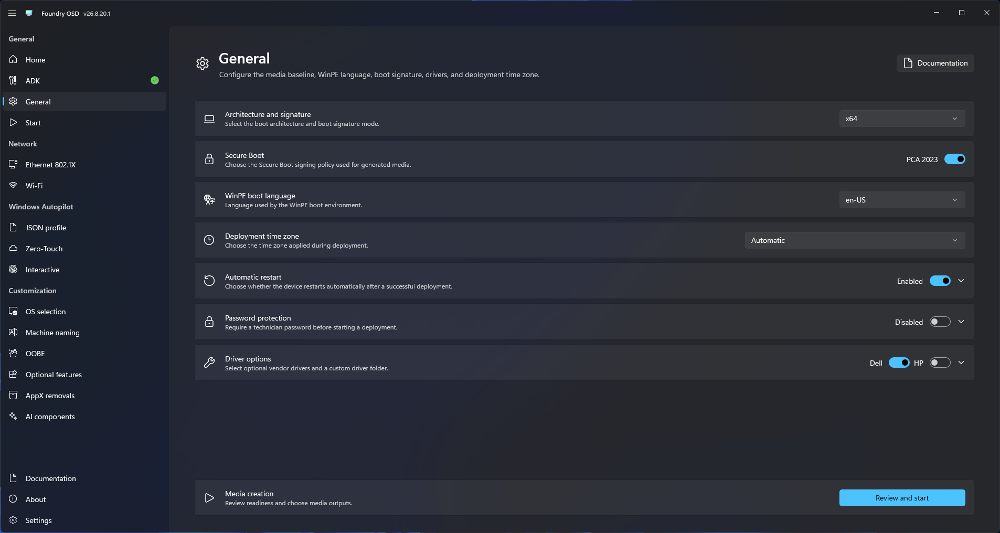

# General configuration

Use General configuration to define deployment behavior shared by the generated media.

## Platform and Windows PE

Configure:

- Target architecture.
- Secure Boot signing compatibility, including CA 2023 when required by the deployment environment.
- Windows PE language.
- Deployment time zone.

The selected Windows PE language remains unavailable until Windows ADK and Windows PE Add-on `10.1.26100.2454` are ready.

## Deployment completion

Choose whether Foundry Deploy reboots automatically after success and configure the displayed reboot delay when automatic reboot is enabled.

## Drivers

Enable the supported Dell or HP driver options required by the hardware fleet. Add a custom driver directory when Windows PE needs network or storage drivers that are not provided by the selected vendor options.

Validate custom drivers on representative hardware before using the media in production.

<figure>
  
  <figcaption>Configure platform, Windows PE, deployment completion, and driver settings.</figcaption>
</figure>

## Protected deployment

**Protected deployment** requires a technician password before Foundry Deploy initializes. Enable it when deployment media contains credentials, private keys, or Autopilot JSON profiles that must not remain directly accessible.

Foundry accepts passwords from 8 characters and recommends at least 12 characters. Use a unique password for each set of deployment media and store it using the organization’s approved credential-management process.

Foundry encrypts protected deployment data with AES-256-GCM and generates a random 256-bit deployment key for each media-creation operation. The technician password is processed with PBKDF2-HMAC-SHA-256 using 600,000 iterations and a random 128-bit salt. The resulting key protects the deployment key. Each AES-GCM encrypted value uses a unique 96-bit nonce and a 128-bit authentication tag.

Protected data can include Autopilot JSON profiles and certificate-based deployment credentials. Protection does not encrypt the complete ISO, USB drive, Windows image, or files staged into the installed Windows system.

When Protected deployment is disabled, Autopilot JSON profiles remain readable on the media. Other deployment secrets can remain encrypted, but their deployment key is stored on the same media so that deployment can start without a password. Treat possession of unprotected media as access to all embedded deployment information.


The technician password cannot be recovered from generated media. If it is lost, recreate the media with a new password.


Do not include the password in documentation, issue reports, screenshots, or deployment notes.

## Review readiness

Return to **Start** after saving the required settings. General configuration appears in the readiness summary and must be valid before media creation begins.
