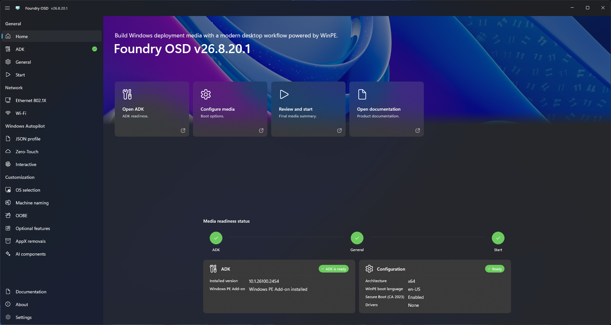

# Application home

Application home summarizes the Foundry OSD workflow and provides shortcuts to the next action.

## Main actions

- **Configure media** opens the authoring areas used to define deployment behavior.
- **Open ADK** opens Windows ADK and Windows PE readiness.
- **Open documentation** opens this documentation site.
- **Review and start** opens media readiness and creation.

The workflow indicator shows progress through configuration, readiness review, and media creation. Readiness cards highlight areas that still require attention.

<figure>
  
  <figcaption>Use the workflow and readiness cards to identify the next configuration action.</figcaption>
</figure>
