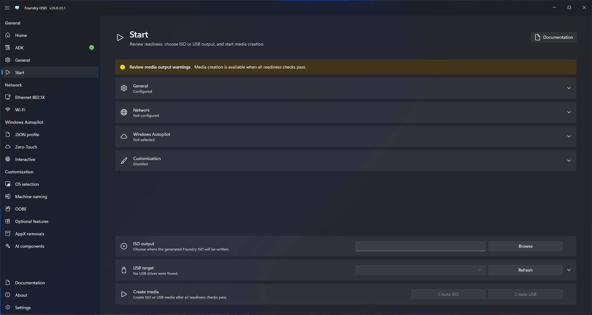

# Create deployment media

The Start page validates configuration and creates or updates Foundry deployment media.

## Review readiness

Resolve every blocking readiness item before starting. Checks cover Windows ADK and Windows PE, architecture, language, boot-image source, output paths, USB target, media options, drivers, networking, runtime configuration, secrets, customization, and Windows Autopilot.

<figure>
  
  <figcaption>Resolve every blocking item before creating or updating deployment media.</figcaption>
</figure>

## Choose an operation

| Consideration | ISO | USB |
| --- | --- | --- |
| Best for | Virtual machines, remote-management virtual media, or external imaging tools | Repeated deployment to physical devices |
| Boot method | Mount the ISO directly or write it with another tool | Boot directly from the prepared USB drive |
| Source cache | Windows sources are downloaded when required by the deployment workflow | A dedicated cache partition retains downloaded Windows sources for reuse |
| Time and bandwidth | Repeated deployments may download the same Windows sources again | Reuses cached sources to reduce deployment time and bandwidth consumption |
| Updating media | Create a new ISO | Update the boot partition while preserving the cache partition |
| Main trade-off | Portable file, but no persistent source cache | Requires a dedicated USB drive and its initial preparation erases the selected device |

Choose [Create an ISO](create-iso.md), [Create a USB drive](create-usb.md), or [Update an existing USB drive](update-usb.md).

During creation, Foundry reports workspace preparation, driver resolution, image customization, language and component processing, runtime payload provisioning, media creation, verification, and cleanup.
