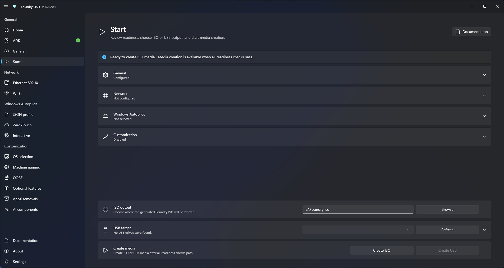

# Create an ISO

Create an ISO for virtual machines, remote-management virtual media, or a separate USB-writing process.

ISO creation is not limited by USB BOOT partition capacity. The [2 GiB custom-driver directory limit](../general.md#drivers) still applies.

## Create the file

1. Open **Start**.
2. Resolve all blocking readiness items.
3. Configure the architecture, Windows PE language, boot-image behavior, and required drivers under **General configuration**.
4. Return to **Start** and review readiness.
5. Choose an output path with sufficient free space.
6. Select **Create ISO**.
7. Keep Foundry OSD open until verification and cleanup complete.

<figure>
  
  <figcaption>Choose the ISO output path before creating the media.</figcaption>
</figure>

## Validate the ISO

Confirm that the output file exists and test boot it on representative hardware or a virtual machine before distribution.

## Include custom images (unreleased)

Enable and include images on [Custom Windows images](../customization/custom-windows-images.md) before creating the ISO. Their WIMs and optional source files are included in the ISO filesystem, outside `boot.wim`. The ISO grows by the included payload size, so allow enough working and output space. Use the full ISO for deployment.
