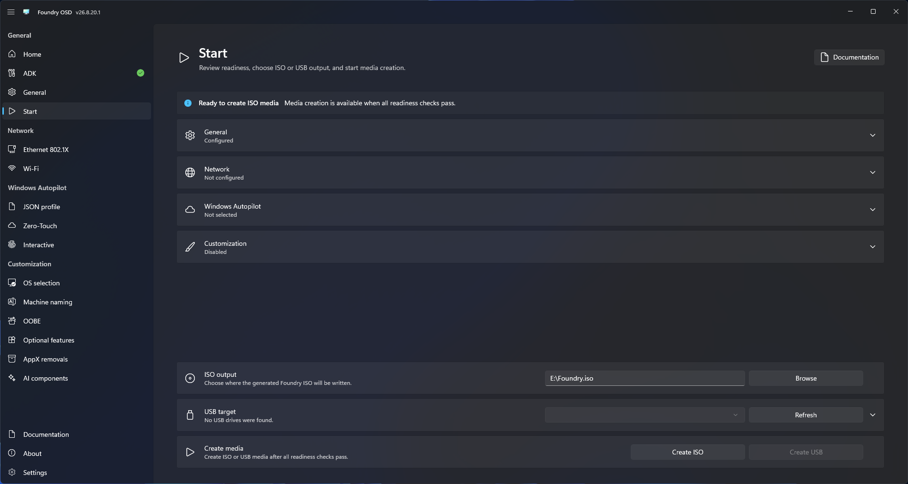

# Create an ISO

Create one `.iso` file to start virtual machines, to attach through a remote management console, or to take the boot image for a PXE server from. An ISO keeps no downloads: every deployment started from it downloads Windows and drivers again.

<figure>
  
  <figcaption>The <strong>ISO output</strong> card and the <strong>Create ISO</strong> button at the bottom of Start.</figcaption>
</figure>

## Before you start

- No row of [Start](README.md) is marked **Needs attention**.
- 20 GB are free on the drives listed in [Start](README.md#before-you-start) and on the drive that receives the ISO.
- The architecture, the language and the drivers of Windows PE are set in [General](../general.md).

## Create the ISO

1. Open **Start**.
2. In the **ISO output** card, type the path of the file or select **Browse**. The default is `%ProgramData%\Foundry\Artifacts\Iso\Foundry.iso`.
3. Check that the bar at the top reads **Ready to create ISO media** or **Ready to create ISO and USB media**.
4. Select **Create ISO**.
5. If a dialog titled **Update Foundry OSD before creating boot media** opens, a newer version of the app is available. Apply the update first, or select **Create anyway**.
6. Wait until the dialog reads "The ISO media was created successfully.", then select **Close**.

## Rules for the output path

| Rule | Detail |
| --- | --- |
| Extension | The path must end with `.iso`. With an empty path or another extension, **Create ISO** stays unavailable and no message is shown. |
| Location | A local folder or a network share written as `\\server\share\folder`. Foundry OSD checks the free space, quotas included, before it writes. |
| Existing file | A file of the same name is replaced without a question, but only once the new ISO is complete. A failed or cancelled build keeps the previous file. |
| File system | An ISO larger than 4 GiB cannot be saved on a FAT32 drive, whatever its free space. Use NTFS or a network share. |

## What decides the boot image

There is no boot image option to set. Foundry OSD chooses the base of the boot image from your network options:

- With [Wi-Fi](../network/wifi.md) turned on, the boot image is built from the Windows Recovery Environment, which can connect to Wi-Fi. The first build downloads a Windows 11 package of several GB and keeps it in `%ProgramData%\Foundry\Cache\WindowsSources`.
- Otherwise, the boot image is the standard Windows PE of the ADK.

A build for `arm64` downloads the same Windows 11 package, with or without Wi-Fi.

## Check the result

1. Confirm that the file exists at the path you typed.
2. Attach it to a virtual machine or a test device and start from it. Foundry Connect must open, then Foundry Deploy.

For the content of the ISO next to the boot image, see [What each media type carries](README.md#what-each-media-type-carries).

## Limits

- The ISO grows by the size of the custom images and post-installation content you included. Allow the same room again in `%ProgramData%\Foundry\Workspaces` while it is built.
- The custom driver folder is limited to 2 GiB and 10,000 files and folders.

## Related

- [Start: create deployment media](README.md)
- [Deploy with PXE](pxe-deployment.md)
- [Media creation troubleshooting](../../troubleshooting/media-creation.md)
