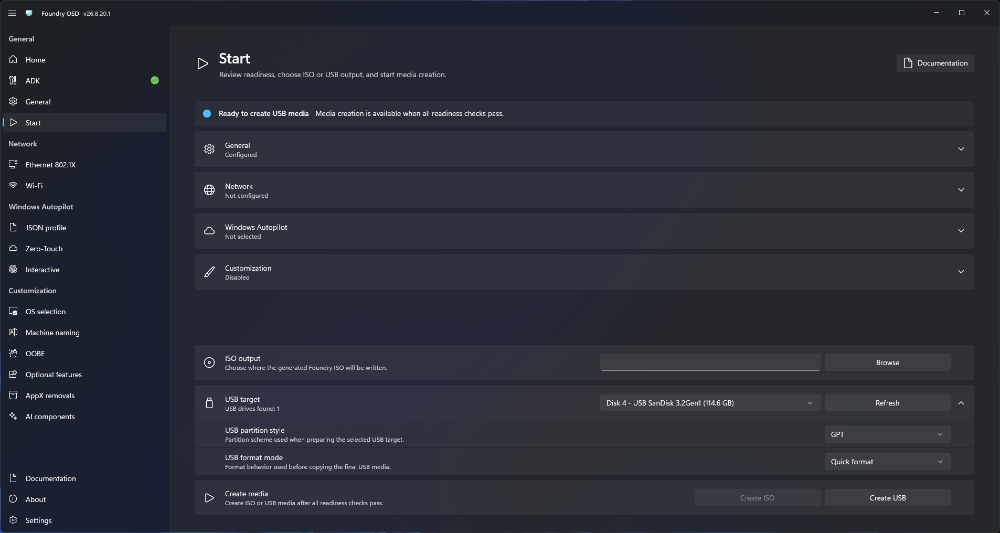

# Create a USB drive

Create bootable USB media for physical deployment.


The selected USB drive can be erased. Verify its identity, capacity, and contents before confirming creation.


## Create the drive

1. Connect the USB drive.
2. Open **Start** and refresh removable devices if necessary.
3. Select the correct USB target.
4. Choose the required layout and format options.
5. Resolve all blocking readiness items.
6. Select **Create USB** and confirm the destructive operation.
7. Keep the drive connected until verification and cleanup complete.

<figure>
  
  <figcaption>Verify the selected USB drive before confirming the destructive operation.</figcaption>
</figure>

## If the disk identity cannot be confirmed

Foundry checks that the connected drive still matches the one you confirmed before changing it. A missing, changed or ambiguous device identity, or a changed disk number, stops the operation.

Refresh the removable-device list, select the intended drive again, and confirm creation. If the warning remains, use a drive or connection that reports a distinct device identity. Keep the drive connected throughout creation; do not swap drives after confirmation.

## If boot files do not fit

Foundry checks that the prepared boot files fit the 2 GiB BOOT partition before erasing or formatting the drive. If they do not fit, reduce customizations or drivers, or [create an ISO](create-iso.md). A larger USB drive does not increase this BOOT partition size. See [capacity troubleshooting](../../troubleshooting/media-creation.md#boot-media-exceeds-a-size-limit) for other size warnings.

## Validate the drive

Safely eject the drive, boot representative hardware, and confirm that Foundry Connect and Foundry Deploy start correctly.

## Include custom images

[Custom Windows images](../customization/custom-windows-images.md) are stored under `Cache\OperatingSystems\Custom\` on the NTFS data partition, outside the FAT32 BOOT partition. This directory separates custom images from catalog downloads in the operating-system cache. Include at least one available library image when the feature is enabled, and allow enough space alongside other required data. After creating the media, you can add extra regular WIM files directly in that directory for manual selection in Deploy.
