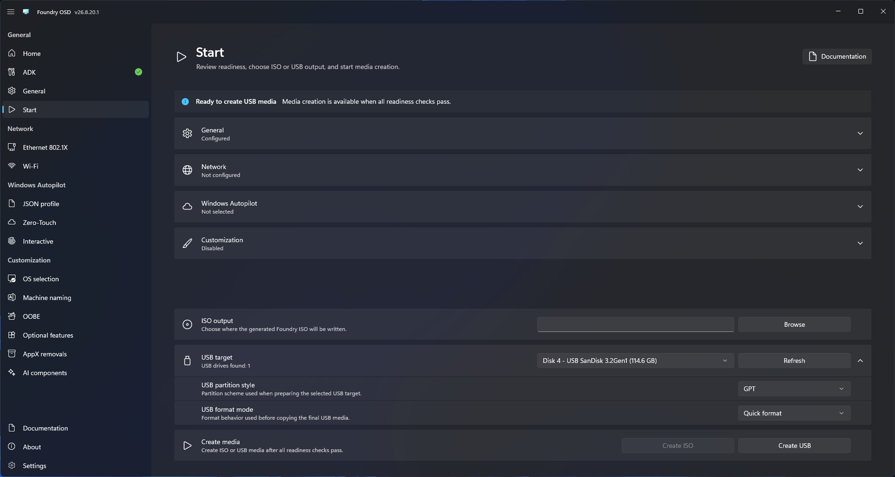

# Create a USB drive

Create a USB drive that starts physical devices and keeps the Windows images and driver packs it downloads, so that later deployments reuse them.

<figure>
  
  <figcaption>The <strong>USB target</strong> card, expanded on its two options, and the <strong>Create USB</strong> button.</figcaption>
</figure>

## Before you start

- No row of [Start](README.md) is marked **Needs attention**, and 20 GB are free on the Windows drive.
- The drive holds 16 GB or more. With a smaller drive selected, **Create USB** stays unavailable and no message is shown.
- The drive is a removable USB flash drive. Foundry OSD lists only disks connected through USB, and leaves out the system disk and any disk that Windows reports as not removable. A USB hard disk or SSD enclosure that Windows reports as a fixed disk is not listed.


Creating a USB drive erases every partition of the selected drive. Copy elsewhere anything you need from it first.


## Create the drive

1. Connect the drive, open **Start**, and select **Refresh** in the **USB target** card.
2. Select the drive in the list. An entry reads, for example, "Disk 4 - USB SanDisk 3.2Gen1 (114.6 GB)".
3. Expand the card and set the two options below.
4. Select **Create USB**. If the button reads **Update USB**, the drive already is a Foundry USB drive: see [Update a USB drive](update-usb.md).
5. If a dialog titled **Update Foundry OSD before creating boot media** opens, apply the update first or select **Create anyway**.
6. Read the **Format USB target** dialog. It names the disk number, the name and the size of the drive that will be erased. Select **Format and create USB** only if they are the ones you expect.
7. Keep the drive connected until the dialog reads "USB media was created successfully. Boot volume: X:. Cache volume: Y:.", with the two drive letters.


**Screenshot required**

- **File:** `foundry-osd-media-create-usb-01-confirmation.png`
- **Capture:** Show the **Format USB target** dialog over the **Start** page, with its message naming a demonstration disk and the **Format and create USB** and **Cancel** buttons.


| Option | Choices | Default |
| --- | --- | --- |
| **USB partition style** | **GPT** or **MBR**. Keep **GPT** for UEFI devices. Choose **MBR** only for a device that does not offer the GPT drive in its boot menu. With `arm64`, only **GPT** is offered. | **GPT** |
| **USB format mode** | **Quick format** or **Full format**. A full format writes the whole of both partitions and takes much longer. | **Quick format** |

Foundry OSD remembers both choices for the next drive.

## What Foundry creates on the drive

Two partitions, each with a drive letter in Windows:

- **BOOT**, FAT32, 2 GiB, for the boot files and the boot image. With **GPT** it is an EFI System Partition; with **MBR**, an active FAT32 partition.
- **Foundry Cache**, NTFS, the rest of the drive, for Foundry Connect, the custom images and post-installation content you included, and the Windows images and driver packs that deployments download.

The folders of the cache partition are listed in [What each media type carries](README.md#what-each-media-type-carries).

## Check the result

1. In File Explorer, check that two volumes named **BOOT** and **Foundry Cache** appear.
2. Eject the drive, start a test device from it, and check that Foundry Connect opens, then Foundry Deploy.

## Limits

- The boot files must fit the 2 GiB **BOOT** partition, whatever the size of the drive. Foundry OSD checks this before it erases anything. If they do not fit, reduce the drivers or [create an ISO](create-iso.md).
- Foundry OSD checks the identity of the drive again before it writes. If the drive was swapped or reconnected after you selected it, the operation stops and nothing is erased.
- A drive that Foundry OSD recognizes as a Foundry USB drive can only be updated. To create it again, for example to change the partition style, first delete its partitions with Windows Disk Management.

## Related

- [Update a USB drive](update-usb.md)
- [Start: create deployment media](README.md)
- [Media creation troubleshooting](../../troubleshooting/media-creation.md)
