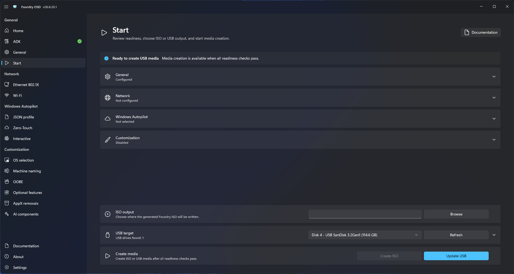

# Update a USB drive

Update existing Foundry USB media when configuration or runtime content changes.

## Before updating

- Confirm that the selected drive is Foundry deployment media.
- Confirm that required offline cache content is stored outside the boot partition that Foundry updates.
- Close applications that may be using files on the USB drive.
- Review the current configuration because the update uses the active Foundry OSD settings.

## Update the drive

1. Connect the existing Foundry USB drive.
2. Open **Start** and select the correct target.
3. Confirm Foundry recognizes the drive as existing Foundry media.
4. Resolve readiness items.
5. Select **Update USB**. Foundry refreshes the boot partition while preserving the cache partition.
6. Keep the drive connected until the update completes.
7. Test boot the updated media before production use.

<figure>
  
  <figcaption>Update recognized Foundry USB media without rebuilding its cache partition or re-downloading cached Windows sources.</figcaption>
</figure>
