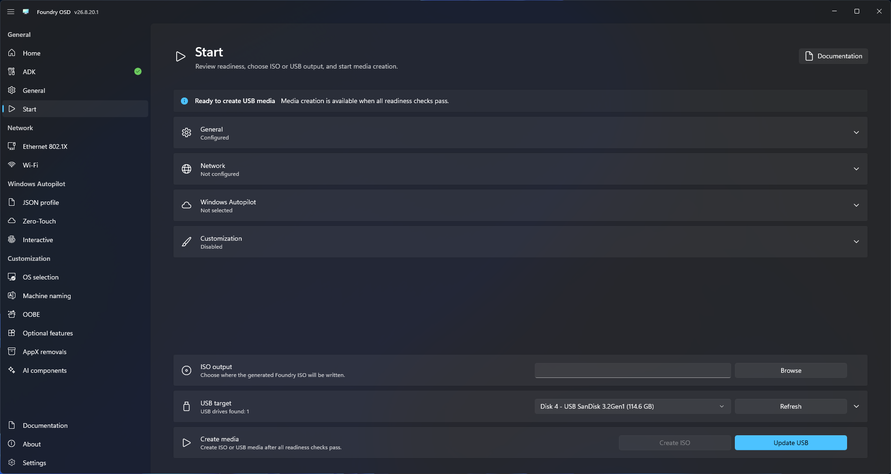

# Update a USB drive

Update a Foundry USB drive to apply your current options and the current Foundry applications without erasing the Windows images and driver packs it has already downloaded.

<figure>
  
  <figcaption>When the selected drive is a Foundry USB drive, the button reads <strong>Update USB</strong> and is highlighted.</figcaption>
</figure>


**Update USB** asks for no confirmation. Once the build is ready, the **BOOT** partition is formatted and written again. Check the selected drive before you select the button.


## Before you start

- No row of [Start](README.md) is marked **Needs attention**, and 20 GB are free on the drives listed in [Start](README.md#before-you-start).
- Close File Explorer windows and other programs that use the drive.
- Move away any file you copied to the **BOOT** volume yourself: it is erased.

## Update the drive

1. Connect the drive, open **Start**, and select **Refresh** in the **USB target** card.
2. Select the drive and check that the button reads **Update USB**. This label is the only sign that Foundry OSD recognized the drive.
3. To format **BOOT** completely, expand the **USB target** card and set **USB format mode** to **Full format**. The update then takes longer. **USB partition style** is ignored: an update never changes it.
4. Select **Update USB**.
5. If a dialog titled **Update Foundry OSD before creating boot media** opens, apply the update first or select **Create anyway**.
6. Keep the drive connected until the dialog reads "USB boot partition was updated successfully. Boot volume: X:. Cache volume: Y:.", with the two drive letters.

## How Foundry recognizes the drive

The drive must have an NTFS volume named `Foundry Cache` and its **BOOT** partition. If the cache volume was renamed, the button reads **Create USB**, and creating the drive erases everything, downloads included. If only **BOOT** was renamed or reformatted, the button still reads **Update USB** but the update stops with "Selected USB media is not a Foundry USB media.".

## What an update replaces and what it keeps

| Replaced | Kept |
| --- | --- |
| The whole **BOOT** partition: boot files and the boot image, with your current options | `Cache\OperatingSystems`, `Cache\DriverPacks` and `Cache\Firmware`: the downloads of earlier deployments |
| Foundry Connect, and the post-installation application with Domain Join, in `Runtime\` on the cache partition | The copy of Foundry Deploy downloaded by an earlier start, `Logs\`, and any file you copied to the cache partition |
| The custom images and post-installation content of the current configuration, added to the cache partition | Custom images and post-installation content written by earlier builds. They keep using space. |

New custom images and post-installation content are copied before **BOOT** is formatted, and Foundry OSD checks first that the cache partition has room for them.

## Check the result

Eject the drive, start a test device from it, and check that Foundry Connect opens, then Foundry Deploy, with the options you changed.

## Limits

- The boot files must fit the existing **BOOT** partition. Foundry OSD checks this before it formats. If they do not fit, reduce the drivers or [create an ISO](create-iso.md).
- An update cannot change the partition style or repair a damaged cache partition. Delete the partitions of the drive with Windows Disk Management, then [create the drive](create-usb.md) again.
- A cancelled or failed update can leave **BOOT** incomplete. Run the update again before you use the drive.

## Related

- [Create a USB drive](create-usb.md)
- [What each media type carries](README.md#what-each-media-type-carries)
- [Media creation troubleshooting](../../troubleshooting/media-creation.md) and [USB drive and device start](../../troubleshooting/media-creation/usb-drive-and-device-start.md)
