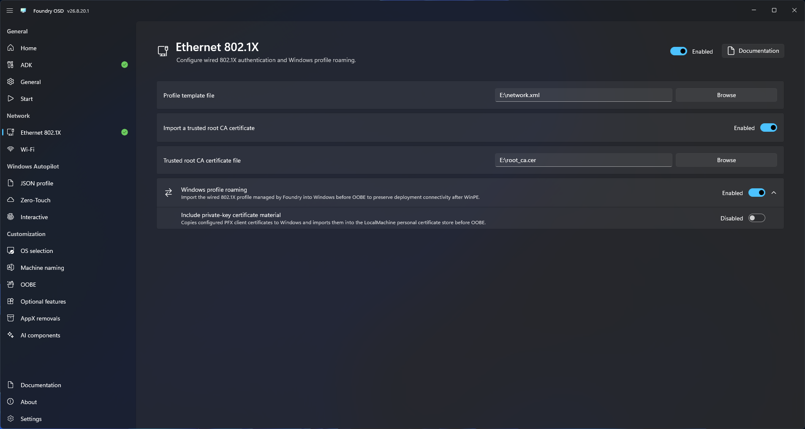

# Ethernet 802.1X

Use Ethernet 802.1X configuration when the wired deployment network requires authenticated access.

## Configure wired authentication

1. Open **Network > Ethernet 802.1X**.
2. Enable wired 802.1X provisioning.
3. Select or configure the required authentication profile.
4. Add the trusted root CA certificate required to validate the authentication service.
5. Review the configuration and return to **Start**.

<figure>
  
  <figcaption>Configure the wired authentication profile and trusted root certificate.</figcaption>
</figure>

## Validate the deployment path

Test with the switch port, VLAN, certificate chain, and target hardware used in production. A successful cable link does not guarantee authenticated network access.

If Foundry Connect remains at authentication or DHCP readiness, see [Network and Foundry Connect troubleshooting](../../troubleshooting/network.md).
