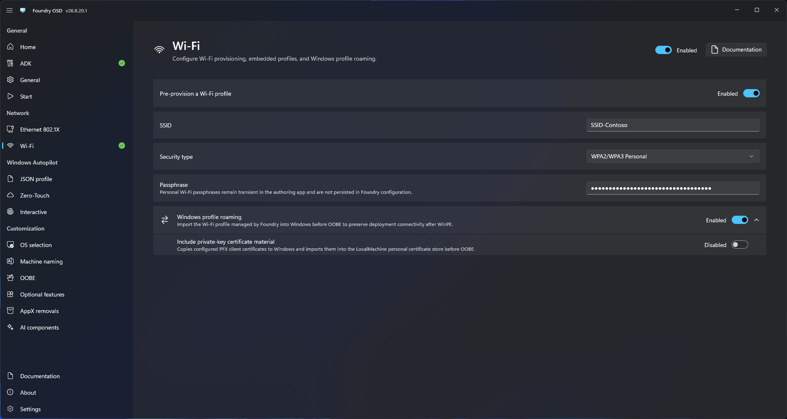

# Wi-Fi

Use the Wi-Fi page to prepare wireless connectivity for Foundry Connect.

## Configure a profile

1. Open **Network > Wi-Fi**.
2. Enable Wi-Fi provisioning.
3. Add or select the wireless profile required by the deployment environment.
4. Configure the authentication information requested by Foundry OSD.
5. Add a trusted root certificate when the enterprise network requires one.
6. Choose whether the Wi-Fi profile should roam into Windows before OOBE.
7. When certificate authentication is used, choose whether the PFX client certificate and its private key must also be copied into Windows.
8. Review the profile and return to **Start** to confirm readiness.

<figure>
  
  <figcaption>Configure the wireless profile and any required trusted root certificate.</figcaption>
</figure>


Wireless profiles can contain sensitive configuration. Restrict access to generated media and never use real credentials or secrets in screenshots.


## Provisioned profiles

Foundry Connect can display and use profiles included during media creation. When Wi-Fi provisioning is enabled, Foundry automatically switches to the Wi-Fi-capable boot-image path, stages the required Wi-Fi dependencies, and injects the resolved WinPE driver packages during media creation.

Availability still depends on a supported wireless adapter and any additional vendor or custom WinPE drivers required by the target hardware.

## Windows profile roaming

Enable **Roam network profiles to Windows** when the installed system must retain the Wi-Fi connection before OOBE. Foundry Deploy imports the profile into Windows during deployment.

For certificate-based profiles, **Include private-key certificate material** copies the configured PFX client certificate into the local-computer personal certificate store. Leave this disabled unless Windows requires the client certificate after WinPE. Plan certificate rotation and revocation before distributing media.

When roaming is enabled, a compatible Wi-Fi profile created from a passphrase entered manually in Foundry Connect can also be imported into Windows. Do not use a credential that must not persist on the deployed device.

## Validate before deployment

Test the media on representative hardware. Confirm that Foundry Connect can see the network, authenticate, obtain an IPv4 address, resolve required services, and report network readiness.
