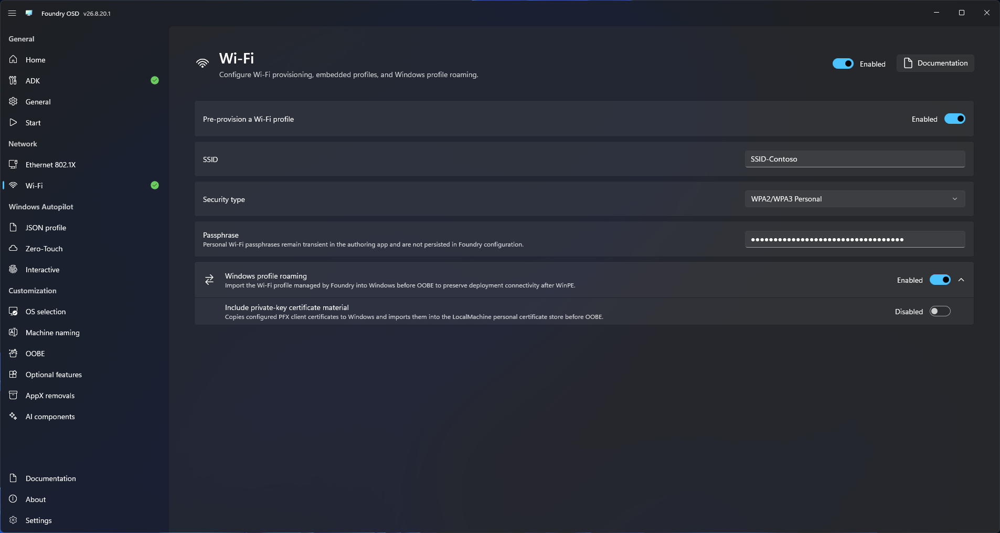

# Wi-Fi

The Wi-Fi page does two separate things. Its main switch adds Wi-Fi support to the boot image, so the technician can join a wireless network in Foundry Connect. **Pre-provision a Wi-Fi profile** also puts one profile on the deployment media, so the device connects without anyone typing a passphrase.

<figure>
  
  <figcaption>Wi-Fi support enabled, with a WPA2/WPA3 Personal profile and Windows profile roaming turned on.</figcaption>
</figure>

## Before you start

- **Enabling Wi-Fi changes how the media is built.** The standard Windows PE image has no Wi-Fi support. Foundry downloads a Windows 11 24H2 image for the architecture and language of the boot image, and builds the boot image from its Windows Recovery Environment (Windows RE). Media creation takes longer and needs disk space for that download, which later builds reuse.
- **Check the Wi-Fi adapter driver.** Foundry adds the latest Intel wireless driver package from its driver catalog. For any other adapter, put its driver in the **Custom driver folder** on the [General](../general.md) page.
- **For an enterprise network (802.1X), export the profile as XML** on a Windows computer that already connects to it:

  ```
  netsh wlan show profiles
  netsh wlan export profile name="Contoso-Corp" folder="C:\Temp"
  ```

  Nothing in Windows PE can ask for a user name and password: use a profile that authenticates by itself, with a certificate.

## Enable Wi-Fi

1. Open **Network > Wi-Fi**.
2. Turn on the switch at the top of the page, next to **Documentation**. It shows **Enabled** and unlocks the page.

Stop here if technicians join an open or passphrase network themselves. An enterprise network always needs an embedded profile.

## Embed a profile

1. Turn on **Pre-provision a Wi-Fi profile**.
2. In **SSID**, type the network name exactly as it is broadcast, including upper and lower case.
3. Choose the **Security type** and fill in what it asks for:

| Security type | What you provide |
| --- | --- |
| **Open** | Nothing. |
| **OWE (Opportunistic Wireless Encryption)** | Nothing. |
| **WPA2/WPA3 Personal** (default) | **Passphrase**, 8 to 63 characters. |
| **WPA2/WPA3 Enterprise** | The exported profile file. |
| **WPA3 Enterprise (WPA3ENT)** | An exported profile whose authentication is `WPA3ENT`. |
| **WPA3 Enterprise 192-bit (WPA3ENT192)** | An exported profile whose authentication is `WPA3ENT192`. |

For the three enterprise types, two more cards appear:

- **Advanced enterprise Wi-Fi**: select **Browse** and choose the exported `.xml` file. The **SSID** above must match the network in that file. For the two WPA3 Enterprise types, Foundry OSD reads the `authentication` value of the file and refuses a file that does not match.
- **Import a trusted root CA certificate**: turn it on if the profile needs a certificate. In **Trusted root CA certificate file**, select **Browse** and choose one file. A `.cer` or `.crt` file is added to the trusted root certification authorities of Windows PE. A `.pfx` file is imported as the client certificate with its private key: type its password in **PFX password**.


**Screenshot required**

- **File:** `foundry-osd-network-wifi-02-enterprise-profile.png`
- **Capture:** Show the Wi-Fi page with **Security type** set to **WPA2/WPA3 Enterprise**: the **Advanced enterprise Wi-Fi** card with a file selected, and the **Trusted root CA certificate file** card with its **PFX password** box. Use a demonstration SSID and file names.


To keep the connection in the installed Windows, turn on **Windows profile roaming**, with or without an embedded profile. See [Windows profile roaming](README.md#windows-profile-roaming) for what is imported and when.

## What the technician sees

Foundry Connect shows a **Wi-Fi** list and, for the embedded profile, a **Provisioned Wi-Fi** card. It connects that profile by itself only while the device has no Internet access, so a working cable is used first. See [Network readiness](../../foundry-connect/network-readiness.md).

## Check the result

- In Foundry OSD, **Start** reports neither "Network configuration is not ready." nor "Required media secrets are not ready."
- On a device with no cable, Foundry Connect shows **Network ready** and, below it, **Provisioned Wi-Fi ·** followed by the SSID.

## Limits

- One embedded profile per media.
- Enterprise profiles: one certificate file, not a root CA file and a client `.pfx` file together. From a `.pfx` file only the client certificate is imported, not its issuing CA. Foundry OSD checks neither the PFX password nor the content of a **WPA2/WPA3 Enterprise** profile: a mistake shows only in Windows PE.
- The **Passphrase** and the **PFX password** are not kept when Foundry OSD closes, and both can be recovered from the media. See [What goes on the media](README.md#what-goes-on-the-media).

## Related

- [Network](README.md)
- [Network readiness in Foundry Connect](../../foundry-connect/network-readiness.md)
- [Network and Foundry Connect troubleshooting](../../troubleshooting/network.md)
