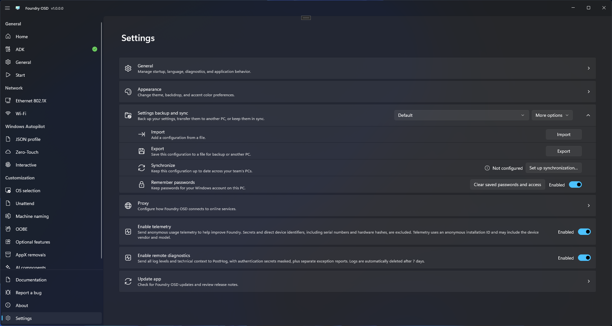

# Settings

Open **Settings** to adjust Foundry OSD, back up your deployment configurations, and manage connections and reporting. The sections below follow the order of the cards in the app.

## General

Use **General** to choose whether Foundry starts with Windows, change the application language, and open the application log folder.

The application language changes the Foundry interface. Choose the Windows PE and deployed Windows languages separately in your deployment settings.

### Export diagnostics

Choose **Export diagnostics** to create a support archive with sensitive information filtered out. Your original log files are unchanged.

Use **Advanced: export raw logs** only when a support contact requests it. Raw logs can contain passwords, identifiers, paths, and network details. Review the warning and destination before sharing them. See [Logs and support](../troubleshooting/logs-and-support.md) for help collecting and sharing diagnostic information.

## Appearance

Use **Appearance** to choose:

- A light, dark, or system-default theme.
- The window backdrop, such as Mica or Acrylic.
- The accent color.

These choices change the Foundry OSD interface and do not alter deployment media.

## Settings backup and sync

Use this card to save your deployment settings, transfer them to another PC, or keep them synchronized with your team.

Select a configuration from the list to apply it immediately. Expand the card to access:

| Action | Use it to |
| --- | --- |
| **Import** | Add a configuration from a `.foundryprofile` file. |
| **Export** | Save a protected copy for backup or another PC. |
| **Synchronize** | Share this configuration or connect to one your team already uses. |
| **Remember passwords** | Keep supported deployment passwords for your Windows account on this PC. |

**More options** contains **Rename**, **Duplicate**, and **Delete from this PC**. For a connected configuration, the card also provides **Automatic sync** and **Disconnect**. Use **Clear saved passwords and access** when you want to clear the current profile's passwords and synchronization access.

<figure>
  
  <figcaption>Select a configuration and expand Settings backup and sync to access its actions.</figcaption>
</figure>

See [Deployment profiles](deployment-profiles.md) for step-by-step instructions, the differences between remembering and sharing passwords, and help with connection files or conflicting changes.

## Proxy

Use **Proxy** when Foundry OSD needs a proxy to reach online services.


Proxy settings apply only to Foundry OSD. They are not copied to deployment media and do not configure Foundry Connect, Foundry Deploy, or Windows PE.


1. Choose a connection method:
   - **Use Windows settings** uses the proxy already configured in Windows.
   - **Manual proxy** lets you enter a server, port, and any addresses that should bypass the proxy.
   - **No proxy** connects directly.
2. For a manual proxy, enter an `http://` or `https://` server address and a port from 1 to 65535. Enable local-address bypass if needed, and separate bypass addresses or wildcard patterns with semicolons.
3. Choose how to authenticate: **Use current Windows credentials**, **No authentication**, or **Username and password**. Enter the username, password, and optional domain when required.
4. Choose **Test connection** to check the entered settings without saving them.
5. Choose **Apply** to save them for subsequent connections.

Foundry protects explicitly entered proxy credentials with Windows Credential Manager. Choosing a method that does not use them removes the saved proxy credential.

The connection test checks access to GitHub, Microsoft sign-in, and Microsoft Graph. It does not confirm account permissions, access to every download, or connectivity from deployment media. If those fail later, check the relevant network and account settings.

## Telemetry

**Enable telemetry** sends anonymous usage and workflow information to help improve Foundry. It is enabled by default and can be turned off independently of remote diagnostics.

Telemetry excludes names, passwords, network addresses, file paths, serial numbers, and hardware hashes. It can include the device vendor and model and an anonymous installation identifier. See [Telemetry and privacy](../reference/telemetry-and-privacy.md#anonymous-product-telemetry) for details.

Restart Foundry OSD after changing this option. The choice also applies to newly created deployment media; recreate media to change its reporting preference.

## Remote diagnostics

**Enable remote diagnostics** sends application logs and error reports to help investigate problems. It is enabled by default and applies immediately to new diagnostic records when changed.

Logs can contain operational details such as file paths, network information, and tenant context. Known authentication secrets are masked, but logs are not anonymous usage data. Review [Telemetry and privacy](../reference/telemetry-and-privacy.md#remote-error-diagnostics) before choosing whether to enable this option.

**Remote logs are retained for 7 days.** Turning this option off does not delete logs already received. Re-enabling it does not upload the local log history collected while it was disabled.

This choice also applies to newly created deployment media. Existing media is unchanged. Local log files remain available even when both reporting options are off.

## Update app

Use **Update app** to review the installed version, available updates, last check time, update source, and release notes.

Choose **Check for updates** to refresh the status. When an update is available, review its release notes and use the download and restart action. Install required compatibility or deployment fixes before creating new media.

<figure>
  
  <figcaption>Review the installed version, update status, and available update actions.</figcaption>
</figure>
